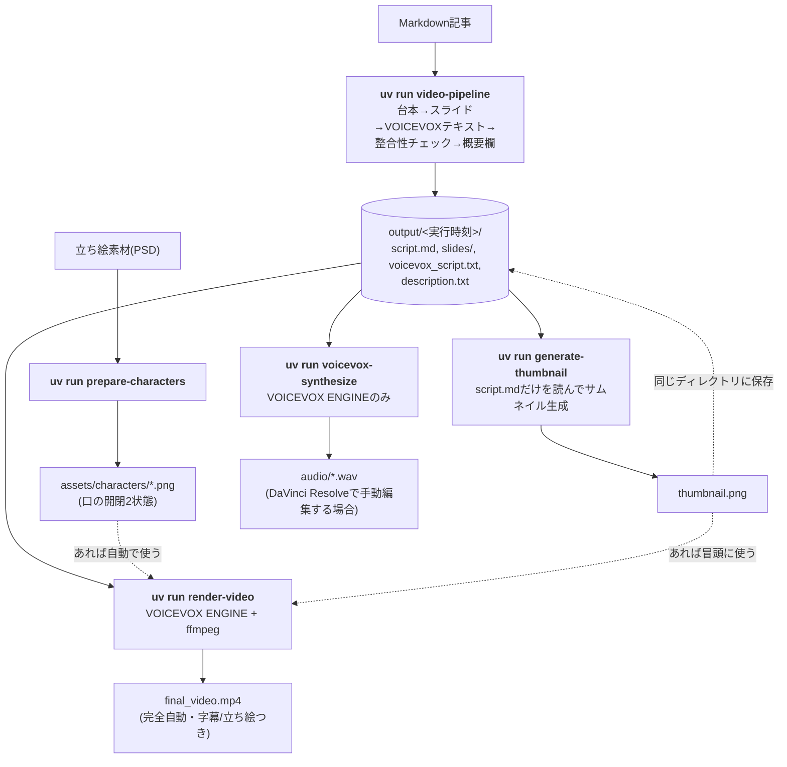
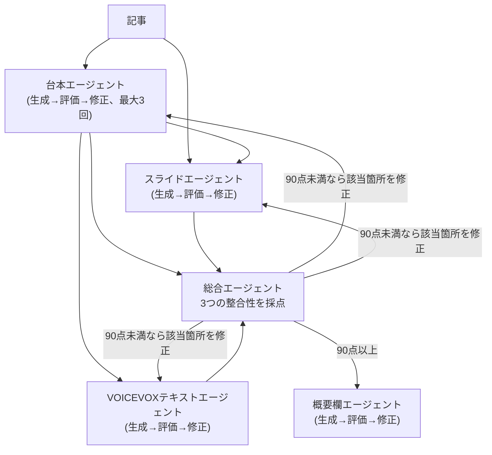
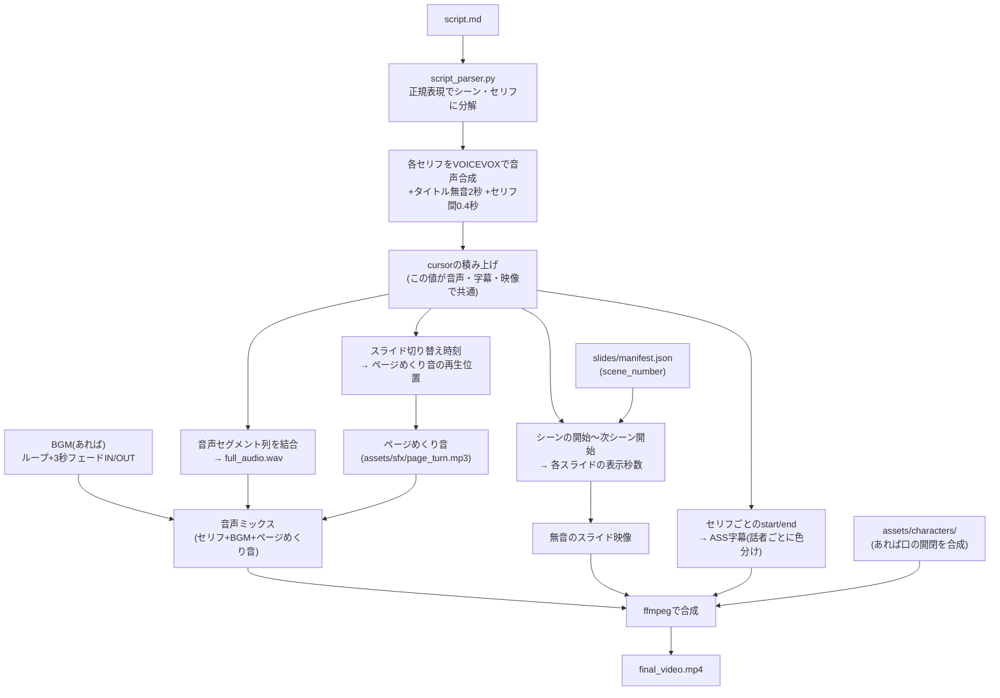

# video-pipeline

Markdown記事（Zenn記事など）から、VOICEVOX実況動画に必要な素材を半自動生成するパイプライン。

## クイックスタート

初めて使う場合、上から順に実行すれば動画が完成する。

```bash
# 1. セットアップ(最初の1回だけ)
uv sync
cp .env.example .env
# .env に ANTHROPIC_API_KEY を設定(必須)

# 2. 記事から台本・スライド・概要欄などを生成
uv run video-pipeline --input articles/sample.md

# 3. (任意・最初の1回だけ) 立ち絵素材(PSD)があれば口パク用に準備しておく
uv run prepare-characters --tsumugi-psd tsumugi.psd --zundamon-psd zundamon.psd

# 4. (任意) サムネイルを生成(GEMINI_API_KEYがあれば背景・文字をGeminiが丸ごと生成)
uv run generate-thumbnail

# 5. VOICEVOXアプリを起動しておき、ffmpeg-fullをインストールしておく
#    (brew install ffmpeg-full。詳細は「動画の自動組み立て」参照)

# 6. 動画を組み立てる(手順2の出力ディレクトリを対話的に選べる)
uv run render-video
```

`--input`や`--script`のようなパスは省略すると対話的に選べるので、
2回目以降は各コマンドを引数無しで実行するだけでよい（詳細は「実行方法」参照）。

手順6の代わりにDaVinci Resolveで手動編集したい場合は、
`uv run voicevox-synthesize`で音声だけ生成し、`output/<実行時刻>/slides/`の
PNG画像と合わせてタイムラインに並べる（詳細は「音声合成」参照）。

完成したら、`output/<実行時刻>/final_video.mp4`と`thumbnail.png`をYouTubeに
アップロードし、`description.txt`の内容を概要欄に貼る。**投稿前に必ず**
`description.txt`内の元記事URL・立ち絵クレジットのプレースホルダーを
実際の内容に差し替えること（詳細は「概要欄のクレジット表記について」参照）。

## 全体の流れ

まず`video-pipeline`が記事の内容（台本・スライド・概要欄など）をClaude APIで作る。
そのあとサムネイル・立ち絵・動画本体は、それぞれ**独立したコマンド**で仕上げる
（1つだけ作り直したい時に他のコマンドを巻き込まないようにするため）。



- **完全自動で動画まで作る場合**: `render-video`だけで良い（`generate-images`/`prepare-characters`は任意）
- **DaVinci Resolveで手動編集したい場合**: `voicevox-synthesize`で音声だけ作り、`slides/`のPNGと合わせてタイムラインに並べる

いずれの場合も、完成した動画をYouTubeにアップロードし、`output/<実行時刻>/description.txt` の内容を概要欄に貼る
（元記事URLをCLIで渡していない場合はプレースホルダーになっているので、実URLに差し替える）

## セットアップ

```bash
uv sync
cp .env.example .env
# .env に ANTHROPIC_API_KEY を設定
```

## `video-pipeline`内部のエージェント連携



台本エージェントは、冒頭0:00〜1:00を単体でショート動画としても成立する
「概要・メリット訴求パート」、残り約9分を詳細解説パートという構成で生成する。

## 実行方法

5つのCLI（`video-pipeline` / `generate-thumbnail` / `prepare-characters` /
`voicevox-synthesize` / `render-video`）は、
引数（パス指定の`--input`/`--script`系だけでなく、`--title`・`--article-url`・
`--generate-images`・`--base-url`のようなオプションも含む）を省略すると、
対話端末上で矢印キー選択できるメニューが出る。「自動でよいか／自分で指定するか」
を選び、指定する場合だけテキスト入力を求められる形にしているので、使わない
オプションのために毎回何かを入力する必要は無い。非対話環境（パイプ実行など）で
省略した場合は、ハングせず今まで通りのデフォルト動作にフォールバックする。
個別の引数を明示的に指定すればその値がそのまま使われ、対話プロンプトは出ない
（スクリプトからの呼び出しなど、これまで通りの使い方も可能）。

```bash
uv run video-pipeline --input articles/sample.md --title "機械学習ってなに？" \
  --article-url "https://zenn.dev/xxxxx/articles/xxxxx" \
  --generate-images
# または、全て対話的に選ぶ(記事選択→タイトル→URL→背景生成の有無、の順に聞かれる)
uv run video-pipeline
```

`--title` を省略した場合、記事の見出し1（`# 〜`で始まる行）を自動でタイトルに使う。
見出し1が記事に無ければ「解説動画」になる。

`--article-url` を省略した場合、概要欄の元記事リンク部分にはプレースホルダーが入るので、
投稿時に手動で差し替える。

`--generate-images` を付けるとGemini(Nano Banana系)で各スライドの背景イラストを
生成し、その上に文字を重ねて描画する。`.env`に`GEMINI_API_KEY`の設定が必要
（Claude用の`ANTHROPIC_API_KEY`とは別のキー）。文字は常にPillowで正確に描画する
ため、背景画像に数値・専門用語を描かせる必要はない（詳細は下記「スライド背景生成について」）。

実行するたびに `output/<yyyymmdd_hhmmss>/`（実行日時のディレクトリ）が新しく作られ、そこに成果物一式が保存される（ベースの `output` 部分は `--output-dir` で変更可）。

## 音声合成（VOICEVOX ENGINE連携）

VOICEVOXアプリを起動しておくと（実体はHTTPサーバとして動作し、デフォルトで
`http://127.0.0.1:50021` で待ち受ける）、`voicevox_script.txt`から音声を
一括生成できる。

```bash
uv run voicevox-synthesize --input output/20260731_153000/voicevox_script.txt
# または、output/*/から対話的に選ぶ
uv run voicevox-synthesize
```

出力先を省略すると、入力ファイルと同じ場所の`audio/`に保存される
（`--output-dir`で変更可、`--base-url`でVOICEVOXのURLも変更可）。

セリフ1行につき1つのWAVファイル（`001_つむぎ.wav`のように連番+話者名）を
生成し、DaVinci Resolveのタイムラインに上から順に並べやすくしている。
あわせて`audio/manifest.json`に、各ファイルと対応するテキストの一覧を書き出す。

話者ID（speaker_id）はVOICEVOXの`/speakers`エンドポイントから「つむぎ」
「ずんだもん」の名前で自動的に引き当てるため、ハードコードしていない
（VOICEVOXのバージョンや導入ライブラリによってIDが変わっても動作する）。
VOICEVOX上の登録名が「春日部つむぎ」のようにフルネームの場合も、
部分一致で解決するので台本上の短縮名（「つむぎ」）のままで問題ない。

## 動画の自動組み立て（字幕焼き込み込み）

VOICEVOXアプリと**ffmpeg**（要インストール。Macなら`brew install ffmpeg-full`。
`libass`(字幕焼き込み用)を含む必要があるため、軽量版の`brew install ffmpeg`
だと`ass`フィルタが無くエラーになる。詳細は下記トラブルシューティング参照）を
起動しておくと、台本・スライド・音声から色分け字幕つきの完成動画を1本のmp4に
組み立てられる。

```bash
uv run render-video \
  --script output/20260731_153000/script.md \
  --slides-dir output/20260731_153000/slides \
  --output output/20260731_153000/final_video.mp4

# または、output/*/から対話的に1回選ぶだけで上記3つのパスが自動的に決まる
uv run render-video
```

流れ:
1. `script_parser.py`が`script.md`を正規表現で決定的にパースし、
   「どのセリフがどのシーンに属するか」を確定させる
   （`voicevox_agent`のLLM抽出は経由しない。台本と音声・字幕を確実に一致させるため）
2. 各セリフをVOICEVOX ENGINEで直接音声合成し、長さを計測。セリフ間には
   自然な会話に見えるよう0.4秒の無音の"間"を挿入する
   (`video_assembler.PAUSE_BETWEEN_LINES_SECONDS`で調整可能)。話者+セリフ内容の
   ハッシュでキャッシュするため、同じ台本に対して`render-video`を再実行しても
   変わっていないセリフはVOICEVOXへ再合成しない
3. `slides/manifest.json`の`scene_number`をもとに、各スライドの表示時間
   （＝そのシーンの開始〜次のシーンの開始までの実時間。セリフ間の"間"も
   取りこぼさない）を計算。1つのシーンに複数のスライドが割り当てられていれば
   均等割り、対応するスライドが無いシーンは直前のスライドの表示を延長する
4. セリフごとのタイミングで**ASS形式**の字幕を生成する。話者ごとに
   スタイルを分け、つむぎ＝黄色系(`&H0000E5FF`)、ずんだもん＝緑系(`&H0055AA55`)
   で色分けする（`video_assembler.SUBTITLE_STYLE_COLORS`で変更可）。長いセリフは
   実際の字幕フォント(NotoSansJP-Bold, 64px)で1文字ずつ幅を測定し、画面の
   横幅(1760px = 1920px - 左右マージン80pxずつ)に収まるよう自動で複数行に
   折り返す（YouTubeの字幕のように2〜3行になる。ASS字幕はデフォルトでは
   自動折り返しされないため、これをしないと長いセリフが画面からはみ出す）
5. (任意) `assets/characters/`に立ち絵の口開閉2状態のPNGが揃っていれば、
   そのキャラクターが喋っている区間だけ口を開いた画像に切り替える
   オーバーレイを合成する(下記「立ち絵オーバーレイ」参照)
6. (任意) BGM・ページめくり音を音声にミキシングする(下記「BGM・効果音」参照)
7. ffmpegで (a)音声(セリフ+BGM+効果音)を結合 (b)スライド画像を表示時間通りに
   並べた無音動画を作成 (c) 動画+音声+字幕(+立ち絵)を1本のmp4に合成する

音声合成に渡す直前のテキストには、以下の補正も加えている(字幕表示には影響しない):
- 「（笑）」「（汗）」のような非言語的な注釈をVOICEVOXへ渡す前に取り除く
  （そのまま渡すと「わらい」のように読み上げられてしまう不具合の対策）
- 「空の」→「からの」のように、既知の読み間違いを補正する
  （「空の箱」が「そらの箱」と読まれてしまう不具合の対策。他にも「架空」→
  「かくう」、「誤分類」→「ごぶんるい」、「この値」/「その値」→「あたい」
  読みを補正している。`voicevox_client.READING_OVERRIDES`に追加すれば
  他の単語も補正できるが、**辞書の反復順序がそのまま適用順序になる**ため、
  「架空」のような具体的なパターンは「空の」のような短く汎用的なパターンより
  先に書くこと（逆順だと「架空の」が先に「空の」ルールに食われて「架からの」に
  壊れてしまう不具合が実際に発生した）。「値」は複合語（数値・戻り値等）で
  読みが変わるため、単独用法と判断できる「この値」「その値」のような
  完全なフレーズ単位で追加すること（「値」単体や「値が」のような断片は
  他の複合語を壊すリスクがある）

## BGM・効果音

```bash
# BGMファイルを置いておく(著作権の都合上、同梱していないので各自で用意する)
cp あなたのBGM.mp3 video_pipeline/assets/bgm/

uv run render-video --bgm video_pipeline/assets/bgm/あなたのBGM.mp3
# または、output/*/を選ぶのと同様に、assets/bgm/の中身から対話的に選べる
# (「BGMを使わない」という選択肢もある)
uv run render-video
```

- **BGM**: 動画より短ければ自動でループ再生する(ffmpegの`-stream_loop -1`で
  無限ループにした上で、動画の長さぴったりに切り詰める)。動画全体の
  最初と最後にだけ3秒のフェードイン/アウトをかける（ループの継ぎ目ごとには
  かけない。継ぎ目で音が途切れないことをピクセル単位ならぬサンプル単位の
  RMS解析で検証済み）
- **ページめくり音**: `assets/sfx/page_turn.mp3`（同梱）を、スライドが
  切り替わるタイミングで自動的に鳴らす。`--no-page-turn-sound`で無効化できる
- **音量**: BGM・ページめくり音はどちらもセリフの音声より小さくしている
  （`video_assembler.BGM_VOLUME`=0.25、`PAGE_TURN_VOLUME`=0.5。セリフは
  1.0のまま変更しない。ffmpegの`amix`フィルタで`normalize=0`を指定し、
  トラック数に応じて自動的に音量が下げられてしまうのを防いでいる）
- `--no-bgm`でBGMの対話選択自体をスキップできる（`assets/bgm/`に
  ファイルが無い場合は自動的にBGM無しで続行する）

### タイミングを一致させる仕組み

音声・字幕・スライド表示時間の3つがズレないよう、すべて同じ「cursor」の
積み上げ（タイトル区間の無音 + 各セリフの実測時間 + セリフ間の"間"）から
計算している。



以前は音声トラックにタイトル区間の無音を入れ忘れており、字幕・映像より音声が
2秒ほど早く進んでしまう不具合があった（実際に477.2秒の映像に対し音声が
474.88秒しかない、という形で発覚した）。また、音声結合用のファイルリストを
画像用と同じ関数で作っていたため、末尾のセリフの音声が誤って2回結合されてしまう
不具合もあった。どちらも修正済み。

日本語フォントはfontconfig経由の解決に頼らず、`assets/fonts/`に同梱した
静的なNoto Sans JP(Bold/Regular)を`fontsdir`オプションで直接指定している
（可変フォントだとfontconfigがウェイトを正しく解決できず文字化けする
事例があったため、字幕用には別途静的フォントを追加で同梱している）。

`--script`と`--slides-dir`はvideo-pipelineの出力からそのまま使うが、
音声合成自体は`render-video`が内部で直接行う（`voicevox-synthesize`や
`voicevox_script.txt`は経由しない）。これは字幕・シーン番号と音声を
確実に一致させるための設計で、`voicevox-synthesize`（DaVinci Resolveで
手動編集したい場合向け）とは独立した経路になっている。

## 立ち絵オーバーレイ（任意）

つむぎ・ずんだもんの立ち絵素材(PSD)を用意すると、喋っている方だけ口を開けた
状態になる立ち絵をスライドの上に自動で合成できる(つむぎ=画面左下、
ずんだもん=画面右下)。配布されている「立ち絵素材」PSDは、パーツごとの
レイヤーグループの中に複数のバリエーションが並んでいる形式が多いので、
`character_renderer.py`が口のレイヤーグループだけ差し替えて2枚(口を閉じた状態/
開いた状態)を合成する。

```bash
uv run prepare-characters \
  --tsumugi-psd 春日部つむぎ_立ち絵素材.psd \
  --zundamon-psd ずんだもん立ち絵素材.psd
```

`video_pipeline/assets/characters/`に`tsumugi_closed.png`・`tsumugi_open.png`・
`zundamon_closed.png`・`zundamon_open.png`が書き出され、以降`render-video`を
実行するたびに自動で読み込まれる（これらのファイルが無い場合は、立ち絵無しで
今まで通り動作する）。

デフォルトの口レイヤー名（つむぎ=「ほほえみ」/「わあ」、ずんだもん=「んー」/
「ほあー」）は、実際に確認した配布素材のレイヤー構成に基づく想定値。別の配布元の
PSDや別の絵柄だと口のレイヤー名が異なる場合があるので、`--tsumugi-mouth-closed`
のようなオプションで上書きできる（`uv run prepare-characters --help`参照）。

合成の仕組みは、ffmpegの`overlay`フィルタを2段階重ねている: (1)口を閉じた画像を
常時オーバーレイ(待機中のデフォルト表示) → (2)その上に、口を開いた画像を
そのキャラクターが喋っている区間(`enable='between(t,開始,終了)+...'`)だけ
重ねて表示する。実際に生成した動画で、話している区間と口の開閉が一致することを
口周辺のピクセル比較で検証済み。

キャラクターは`character_renderer.py`が書き出した元のサイズ(デフォルト480px)から、
動画本編では`video_assembler.CHARACTER_VIDEO_HEIGHT`(デフォルト300px)に
縮小してオーバーレイする（ffmpegの`scale`フィルタをoverlay前に挿入している）。
**以前はキャラクターが字幕やcode/diagramスライドの表示内容と重なる不具合が
実際に発生したため**、字幕と衝突しにくいサイズに縮小し、あわせて
code/diagramスライド側にも字幕・キャラクター表示分の下部余白
(`slide_image_builder._media_bottom_reserved_space()`。キャラクター素材が
無い環境では字幕分の余白だけを確保する)を確保するようにした。

`render-video`実行時に動画と同じディレクトリの`thumbnail.png`が使われる場合
（下記「サムネイル生成」参照）、そのイントロ区間だけは口を閉じた常時オーバーレイを
出さない（サムネイル自体に既にキャラクターが描かれているため、二重表示になるのを
防ぐため）。

## 出力ファイル

| ファイル | 内容 |
|---|---|
| `output/<実行時刻>/script.md` | ずんだもん×つむぎ形式の動画台本（シーン区切り・画面指示つき、冒頭1分は概要パート） |
| `output/<実行時刻>/voicevox_script.txt` | `[話者名] セリフ` 形式の読み上げ用テキスト |
| `output/<実行時刻>/slides/` | スライド画像一式(PNG、1枚=1スライド。表紙は`slide_00_title.png`) |
| `output/<実行時刻>/backgrounds/` | （背景生成有効時）Geminiで生成した背景イラストの元画像 |
| `output/<実行時刻>/description.txt` | YouTube概要欄用テキスト（概要文・目次・使用技術・元記事リンク・ハッシュタグ・VOICEVOX/立ち絵クレジット） |
| `output/<実行時刻>/thumbnail.png` | （`generate-thumbnail`実行後）YouTubeサムネイル画像（16:9, 1280x720） |
| `output/<実行時刻>/audio/` | （`voicevox-synthesize`実行後）セリフごとのWAV音声+manifest.json |
| `output/<実行時刻>/final_video.mp4` | （`render-video`実行後）色分け字幕つき（立ち絵素材があれば口の開閉つき）の完成動画 |

## 構成

```
video_pipeline/
├── config.py            # モデル名・ループ回数・スコア閾値
├── claude_client.py      # Claude API呼び出しの共通処理（テキスト/JSON）
├── image_generator.py    # Gemini(Nano Banana系)によるスライド背景生成
├── voicevox_client.py     # ローカルVOICEVOX ENGINEのHTTP APIクライアント(テキスト補正も含む)
├── character_renderer.py # 立ち絵PSDから口開閉2状態のPNGを合成(psd-tools)
├── article_assets.py     # 記事からコードブロック・mermaid図を決定的に抽出
├── code_renderer.py       # コードをシンタックスハイライト付き画像に描画(pygments)
├── diagram_renderer.py    # mermaid図をmermaid.ink経由でPNG画像に変換
├── script_parser.py       # script.mdをシーン・セリフに決定的にパース(正規表現)
├── interactive.py         # 矢印キー選択メニュー(questionary)。articles/やoutput/の選択に使う
├── video_assembler.py     # 台本+スライド+音声(+立ち絵)から字幕付き動画をffmpegで組み立て
├── io_utils.py            # ファイル入出力
├── loop.py                # 生成→評価→修正ループの共通ロジック
├── slide_image_builder.py # スライド内容(JSON、4レイアウト対応) -> PNG画像(Pillowで直接描画)
├── thumbnail_generator.py # サムネイル(16:9)を組み立て(背景+文字+立ち絵)
├── assets/fonts/          # Noto Sans JP(スライド用:可変フォント、字幕用:静的Bold/Regular)
├── assets/characters/     # prepare-charactersが書き出す立ち絵PNG(口開閉2状態×2キャラ)
├── assets/sfx/            # ページめくり音(page_turn.mp3、同梱)
├── assets/bgm/            # BGMファイルの配置場所(著作権の都合上、中身は同梱していない)
├── pipeline.py            # 全体のオーケストレーション(サムネイルは含まない)
├── main.py                # CLIエントリーポイント(video-pipeline)
├── generate_thumbnail.py  # CLIエントリーポイント(generate-thumbnail)
├── synthesize_audio.py    # CLIエントリーポイント(voicevox-synthesize)
├── render_video.py        # CLIエントリーポイント(render-video)
├── prepare_characters.py  # CLIエントリーポイント(prepare-characters)
└── agents/
    ├── script_agent.py        # 台本の生成・評価・修正
    ├── slides_agent.py        # スライド内容(background_prompt, scene_number含む)の生成・評価・修正
    ├── voicevox_agent.py      # VOICEVOX用テキストの生成・評価・修正
    ├── integration_agent.py   # 3つの横断的な整合性チェック
    └── description_agent.py   # YouTube概要欄（概要文・目次・使用技術・リンク・タグ）の生成・評価・修正
                                # +VOICEVOX/立ち絵クレジット欄を決定的に付け足す
    └── thumbnail_agent.py      # サムネイル用キャッチコピー(main_text/sub_text)の生成(単発呼び出し)
```

## 調整できるパラメータ（`config.py`）

役割ごとにモデルを分けている。評価・整合性チェックは元々「品質のゲート役」として
最も強いモデル(Opus)を割り当てていたが、5エージェント×最大3ループ分のコストが
嵩む（Opusは2026年8月時点でSonnet 5の紹介価格の2.5倍）ため、コスト優先で
デフォルトをSonnetに変更した。評価の質を優先したい場合は
`CLAUDE_MODEL_EVALUATE=claude-opus-4-8` を設定すれば元に戻せる。

- `MODEL_GENERATE`（環境変数 `CLAUDE_MODEL_GENERATE`）: 台本・スライドの生成/修正。デフォルト `claude-sonnet-5`
- `MODEL_EVALUATE`（環境変数 `CLAUDE_MODEL_EVALUATE`）: 評価・整合性チェック。デフォルト `claude-sonnet-5`
  （品質を優先するなら `claude-opus-4-8` に変更。コストは約2.5倍になる）
- `MODEL_EXTRACT`（環境変数 `CLAUDE_MODEL_EXTRACT`）: VOICEVOXテキストの機械的な抽出。デフォルト `claude-haiku-4-5-20251001`
- `MAX_REVISION_LOOPS`: 各エージェント（総合エージェントを含む）の生成→評価→修正ループの最大回数（デフォルト3。
  減らすとコストも下がるが、品質基準に届く前にループが打ち切られやすくなる）
- `SCORE_THRESHOLD`: この点数(0-100)以上で合格とみなす。総合エージェントの整合性スコアにも適用される（デフォルト90）
- `GENERATE_SLIDE_IMAGES`（環境変数）: スライド背景生成を有効にするか（デフォルトはオフ）
- `GEMINI_IMAGE_MODEL`（環境変数）: 背景生成に使うGeminiモデル。デフォルト `gemini-3.1-flash-image-preview`
  （Nano Banana 2。より高品質・高価な `gemini-3-pro-image-preview` に変更も可能）

### コストを抑えるためのヒント

- `render-video`・`voicevox-synthesize`・`prepare-characters`はAnthropic APIを
  呼ばない（VOICEVOX ENGINEとffmpeg/psd-toolsのみ使用）。動画の組み立てや
  立ち絵まわりだけを試したい時は、既存の`output/<実行時刻>/`に対してこれらの
  コマンドだけを再実行すれば追加のAPI費用はかからない。`video-pipeline`の
  再実行が必要なのは、記事の内容そのもの（台本・スライド内容）を作り直したい
  時だけ
- `--generate-images`（Gemini背景生成）はAnthropicとは別のGEMINI_API_KEYの
  課金になる。動画1本あたりスライド枚数分（10〜16回程度）呼び出すので、
  見た目より費用を優先するなら未使用でよい

## スライド背景生成について

`--generate-images` を有効にすると、`slides_agent`がほぼ全スライドに
`background_prompt`（英語、抽象的な情景の指示。文字・数字は含めない）を付け、
確定後に`image_generator.generate_slide_background()`がGemini APIで実際の
画像を生成して`output/<実行時刻>/backgrounds/`に保存する。

生成した背景は`slide_image_builder.py`がスライド全面に敷いた上で、可読性の
ために不透明度80%の白いスクリム(半透明パネル)を重ね、その上からタイトル・
箇条書き・数値などのテキストをPillowで直接描画する。つまり**背景の絵柄が
どうであれ、実際に表示される数値や専門用語は常に正確**という構造になっている
（NotebookLMのように画像自体に文字を焼き込む方式とは違い、文字とビジュアルの
生成経路を完全に分離している）。

複数スライドの絵柄がバラバラにならないよう、`slides_agent`が書いた
内容依存のプロンプトに対して、`image_generator.BACKGROUND_STYLE_SUFFIX`
（配色・タッチを固定した文言）をコード側で必ず付け足している。

`GEMINI_API_KEY`が未設定、またはAPI呼び出しが失敗した場合は警告を出して
その1枚の背景生成だけをスキップし、単色背景にフォールバックする
（パイプライン全体は止まらない）。

背景生成はほぼ全スライドに対して行われるため、`--generate-images`を使うと
Gemini APIの呼び出し回数・コストが動画1本あたりスライド枚数分（10〜16回程度）
発生する点は把握しておく。

## 概要欄のクレジット表記について

VOICEVOXの音声を使う場合、利用規約で決まった表記（「VOICEVOX:キャラ名」）を
概要欄に入れる必要がある。`description_agent.build_credits_block()`が
これを決定的に（LLMに書かせず）付け足すので、表記が毎回変わったり
抜け落ちたりしない。

立ち絵イラストのクレジットは、PSDファイル自体からは著作者情報を読み取れない
ため、`.env`の`TSUMUGI_ILLUSTRATOR_CREDIT`・`ZUNDAMON_ILLUSTRATOR_CREDIT`に
配布元ページやREADME記載の表記をそのまま設定する必要がある。未設定の場合は
プレースホルダーが入るので、**投稿前に必ず確認して差し替えること**。

## サムネイル生成

サムネイル生成は`video-pipeline`には含まれておらず、`generate-thumbnail`
という独立したコマンドになっている。サムネイルの文言や背景だけ作り直したい
時に、台本・スライドなど他のエージェントを無駄に動かさずに済むようにするため
（呼び出すエージェントは`thumbnail_agent`のみ、Claude APIは1回だけ呼ぶ軽量な設計）。

```bash
uv run generate-thumbnail --script output/20260731_153000/script.md
# または、output/*/から対話的に選ぶ
uv run generate-thumbnail
```

`output/<実行時刻>/thumbnail.png`（16:9, 1280x720）に保存される
（`--output`で変更可）。

- `thumbnail_agent.py`が台本から3つを1回だけ生成する: キャッチコピー
  (main_text/sub_text)に加えて、`visual_summary`（動画の核心的な内容を
  2〜3文で要約したもの。対比構造や具体的な数値を含む）
- 画像生成は2段階のフォールバック構成:
  1. **推奨**: `GEMINI_API_KEY`が使えれば、Geminiに背景・イラスト・文字を
     丸ごと生成させる（`thumbnail_generator.generate_thumbnail_with_gemini`）。
     `visual_summary`を渡すことで、比較を表す2つのパネルやアイコン・
     矢印といった図解イラストをGemini自身にデザインさせる（**最初は
     キャッチコピーの文字列だけを渡していたため、単に「文字+汎用的な
     背景」にしかならず見栄えが良くなかった**。要約を渡す方式に変更した）。
     文字と背景を一体で描かせるので、テキストとイラストのレイアウトが
     自然に噛み合う。通常のスライド背景生成より文字精度が重要なため、
     `GEMINI_THUMBNAIL_MODEL`（デフォルト`gemini-3-pro-image-preview`、
     Nano Banana Pro）を使う。1本の動画につき1回だけの生成なので、
     高価なモデルでもコスト影響は小さい
  2. Geminiが使えない、または生成に失敗した場合は、Pillowでテキストと
     キャラクター立ち絵を個別に重ねて描く（`build_thumbnail`、フォールバック。
     こちらは図解イラストまでは作れず、キャッチコピーの表示のみ）。
     テキストを画面上部・キャラクターを下部に固定配置することで、
     両者が重ならないようにしている（**以前はテキストを画面中央に配置しており、
     キャラクターの顔と重なってしまう不具合が実際に発生した**。実際に生成した
     画像で、文字とキャラクターの領域が完全に分離していることをピクセル差分で
     検証済み）
- `--no-gemini-fulltext`を付けると、Geminiが使える場合でも文字はGeminiに
  焼き込ませずPillowで別途重ねる（Geminiの文字精度に不安がある場合向け）
- `assets/characters/`に立ち絵素材（`prepare-characters`で準備したもの）が
  あれば、フォールバック方式の場合のみ、動画本編と同じ配置（つむぎ=左下、
  ずんだもん=右下）でサムネイルにも表示する（Geminiが丸ごと生成する場合は
  実際のキャラクター素材をそのまま使わせることはできないため、含まれない）

生成された`thumbnail.png`は、`render-video`実行時に**動画冒頭のタイトル区間
（2秒間）にもそのまま使われる**（YouTubeのサムネイルと動画の最初に見える画面を
一致させるため）。同じディレクトリに`thumbnail.png`があれば自動的に使われ、
無効にしたい場合は`--no-thumbnail-intro`を付ける、別の画像を使いたい場合は
`--thumbnail <パス>`で指定する。`generate-thumbnail`を実行していなければ
（`thumbnail.png`が無ければ）、従来通りスライドのタイトル画面が使われる。

注意点: ffmpegのconcatデマクサーは、先頭の画像だけ動画と異なる解像度だと
正しく扱えず、その画像が実質無視されてしまう不具合があったため、
`render-video`側でサムネイルを事前に動画と同じ解像度(1920x1080)に
リサイズしてから使うようにしている。

## 記事のコード・図をスライドに貼り付ける

台本のセリフが記事中の具体的なコードやmermaid図に言及している場合、それを
説明する文章をbulletsに書くのではなく、**記事に載っている実物**をスライドに
表示できる。`video-pipeline`実行時に自動で行われる（オプション不要）。

流れ:
1. `article_assets.py`が記事のMarkdownを正規表現で決定的にパースし、
   フェンス付きコードブロック(`python`などの言語指定つきコードブロック)と
   mermaid図(`mermaid`指定のコードブロック)を、直前の見出しとあわせて抜き出す
2. その一覧(`code_ref`/`diagram_ref`という番号付き)を`slides_agent`に渡し、
   台本が具体的に言及しているスライドでは"code"/"diagram"レイアウトを選び、
   該当する番号を参照させる（存在しない番号を創作することは禁止している）
3. スライド内容が確定した後、`code_ref`/`diagram_ref`を実際の画像に解決する:
   - コードは`code_renderer.py`がpygmentsでシンタックスハイライトした画像を
     Pillowで直接描画する(等紙フォントはJetBrains Mono、日本語コメントが
     混在してもNoto Sans JPで補完する)
   - mermaid図は`diagram_renderer.py`が公開サービス
     [mermaid.ink](https://mermaid.ink)にmermaid記法を送って画像を取得する
     (ローカルにNode.js/ブラウザを用意しなくて済む)
4. 参照番号が存在しない場合や、mermaid.inkへの接続に失敗した場合は、その
   スライドを自動的に"bullets"にフォールバックする(動画組み立てを止めない)

mermaid図のレンダリングは外部の公開サービスに依存するため、ネットワークが
使えない環境では失敗してスキップされる(このサンドボックス環境では
mermaid.inkに到達できず未検証。実際のネットワーク環境で確認してほしい)。

## トラブルシューティング

実際に開発中に遭遇したトラブルと対処法をまとめている。

### `ModuleNotFoundError: No module named 'video_pipeline'`

`video-pipeline`・`voicevox-synthesize`・`render-video`のいずれかを実行したときに
このエラーが出て、`uv run python -c "import video_pipeline"`は成功する場合、
インストール済みのコンソールスクリプト（`.venv/bin/`以下）だけが壊れている状態。

**すぐ動かす回避策**: コンソールスクリプトを経由せず、モジュールとして直接実行する。

```bash
uv run python -m video_pipeline.main --input articles/sample.md
uv run python -m video_pipeline.synthesize_audio --input output/<実行時刻>/voicevox_script.txt
uv run python -m video_pipeline.render_video --script output/<実行時刻>/script.md --slides-dir output/<実行時刻>/slides --output output/<実行時刻>/final_video.mp4
```

**根本的な直し方**: venvを作り直す。

```bash
rm -rf .venv uv.lock
uv cache clean
uv sync
uv run video-pipeline --help
```

**再発する・作り直してもすぐ壊れる場合**: プロジェクトの置き場所を疑う。
`~/Desktop`や`~/Documents`配下で作業していると、Macの「iCloud Drive: デスクトップと
書類のフォルダ」同期が原因で`.venv`内の大量の小さいファイルが同期対象になり、
不定期に退避（evict）されて壊れることがある（動いたり動かなかったりする、
コマンドによって成功・失敗がバラつく、という症状が特徴）。

```
システム設定 → Apple ID名 → iCloud → iCloud Drive → オプション
→「デスクトップと書類のフォルダ」がオンになっていないか確認
```

オンになっていた場合は、プロジェクトをiCloud同期の対象外の場所に移動する。

```bash
mkdir -p ~/dev
mv ~/Desktop/video-pipeline ~/dev/video-pipeline
cd ~/dev/video-pipeline
rm -rf .venv uv.lock
uv sync
```

### `warning: VIRTUAL_ENV=... does not match the project environment path`

以前に別の場所（例: 移動前の`~/Desktop/video-pipeline/.venv`）を`source .venv/bin/activate`
などで手動アクティベートしたままになっていると出る警告。`uv run`は正しく無視して
現在のプロジェクトの`.venv`を使うので実害はない。気になる場合はターミナルを
開き直すか、`deactivate`してから`uv run`を実行すると警告が消える。

### `話者「つむぎ」が見つかりません`

VOICEVOXアプリでの登録名が「春日部つむぎ」のようにフルネームだと、台本上の
短縮名「つむぎ」と完全一致しないために起きていた。`voicevox_client.resolve_speaker_id`
は完全一致→部分一致の順で探すよう修正済みなので、最新版なら発生しないはず。
それでも起きる場合はエラーメッセージに表示される「VOICEVOXに登録されている話者」
一覧を確認する。

### `[Errno 2] No such file or directory: 'ffmpeg'`

`render-video`はffmpegを外部コマンドとして呼び出すため、別途インストールが必要
（Pythonの依存関係(`uv sync`)には含まれない）。字幕焼き込みに`libass`が必要なので、
軽量版の`ffmpeg`ではなく`ffmpeg-full`を入れる（理由は次項参照）。

```bash
brew install ffmpeg-full
which ffmpeg   # パスが表示されればOK
ffmpeg -filters | grep ass   # ass / subtitles が表示されればOK
```

Homebrew自体が無い場合は先に https://brew.sh の案内に従ってインストールする。

### `[AVFilterGraph] No such filter: 'ass'` / `No option name near '...captions.ass:fontsdir=...'`

**根本原因はHomebrewのffmpegが軽量版になっていること。** 2026年以降、Homebrewの
`ffmpeg`フォーミュラ（`ffmpeg@8`）は主要コーデックのみの軽量版がデフォルトになり、
`libass`（字幕焼き込みライブラリ）が含まれていない。この場合`ass`/`subtitles`
フィルタ自体が存在せず、`No such filter: 'ass'`というエラーになる
（バージョンや状況によっては、クォートの書き方の問題に見える
`No option name near ...`という紛らわしいエラーが先に出ることもある）。

`ffmpeg -filters | grep ass` を実行して何も表示されなければ`libass`無しの
軽量版が入っている。**機能フル版に入れ替える**。

```bash
brew uninstall ffmpeg
brew install ffmpeg-full
ffmpeg -filters | grep ass   # ass / subtitles が表示されればOK
```

`ffmpeg-full`が正しくリンクされない場合は`brew link --overwrite ffmpeg-full`を試す。

### `Could not resolve authentication method. Expected one of api_key, ...`

`.env`に`ANTHROPIC_API_KEY`を設定していても、そのCLIのコード側で`.env`を
読み込む処理(`load_dotenv()`)が無いと、環境変数として認識されずこのエラーになる
（`generate-thumbnail`追加時に`main.py`にはあった`load_dotenv()`を入れ忘れていた
ことが原因で実際に発生した）。最新版なら修正済みのはずだが、もし別のコマンドで
同様のエラーが出た場合は、そのコマンドのPythonファイルに`load_dotenv()`の
呼び出しがあるか確認する。

### `output/<実行時刻>/slides/manifest.json が見つかりません`

`render-video`が要求する`slides/manifest.json`（各スライドの`scene_number`を
記録したファイル）は、それが導入された時点より前の`video-pipeline`実行結果には
存在しない。古い`output/`ディレクトリに対して`render-video`を実行しようとすると
このエラーになる。`video-pipeline`を再実行して新しい`output/<実行時刻>/`を
作り直してから`render-video`を実行する。

- (修正済み) code/diagramスライドの画像表示領域が、画面下部の字幕・
  キャラクター立ち絵と重なる余地があった。以前はキャラクター用の余白
  （340px）を無条件に確保していたため、キャラクター素材を使っていない
  環境ではその分だけ表示領域が不必要に狭くなっていた一方、字幕用の余白は
  そもそも確保していなかった。字幕は常時表示されるため無条件に260px、
  キャラクター素材がある場合はそちらとの大きい方(340px)を確保するよう
  修正した(`slide_image_builder._media_bottom_reserved_space`)

## 既知の制約・今後の拡張候補

- (修正済み) つむぎの口調が「言い得て妙」のような硬い言い回しになり、公式設定
  （埼玉県の高校に通う18歳のギャル、一人称「あーし」）と合っていなかった。
  `script_agent`の人物設定を具体化し、評価観点にも「ギャルらしいカジュアルさ」
  のチェックを追加した。あわせてずんだもんの設定も公式（ずんだ餅の精、
  一人称「ボク」、明るく元気、ちょっとドジ・不幸属性）に基づいて具体化した。
  これもプロンプトの調整であり生成結果を保証するものではない（再生成した
  台本で確認することを推奨する）

- (修正済み・要検証) 実際に生成した動画で、台本の掛け合いが「説明→疑問文で
  言い換え→そうです」という同じ型の繰り返しになり単調に感じられる、
  スライドが4レイアウトのうち"bullets"しか実際には使われない、という
  問題が実際に発生した。`script_agent`に掛け合いのリズムを崩す指示、
  `slides_agent`にstat/quote/comparisonを最低1枚以上使う必須条件を追加して
  対応したが、これはプロンプトの調整であり実際の生成結果を保証するものでは
  ない。再生成した動画で改善しているか都度確認することを推奨する

- スライド数が多い記事ではJSON応答が長くなり、`max_tokens`に到達して出力が
  途中で切れることがあった。`claude_client.py`がレスポンスの`stop_reason`を
  見て自動的にトークン上限を倍増しながら再生成するようにして対処している
  （`MAX_TOKENS_CEILING`まで。それでも切れる場合は警告を出しつつ不完全な
  内容のまま処理を続ける）

- 以前は`python-pptx`で`.pptx`を組み立てていたが、Mac上のPowerPointで開けない
  事例があったため、直接PNG画像を書き出す方式(`slide_image_builder.py`)に
  変更した。日本語フォントはOS依存を避けるためNoto Sans JPを同梱している
- スライドはNotebookLMのVideo Overviewを参考に、内容に応じて4種類のレイアウト
  （箇条書き/数値強調/引用/比較）を`slides_agent`が選んで生成する。
  配色やフォントサイズを変えたい場合は`slide_image_builder.py`の定数を編集する
- 概要欄エージェントは総合エージェントの整合性チェック対象には含めていない
  （確定した台本だけを見て作るため、台本と概要欄の食い違いはチェックされるが、
  スライド・VOICEVOXテキストとの整合性チェックは対象外）
- スライド背景(background_prompt)の妥当性は`slides_agent`の評価観点に軽く含めている
  程度で、総合エージェントの整合性チェック対象には含めていない
- `voicevox_agent`のプロンプトでは`"[話者名] セリフ"`(角括弧あり)の形式を
  指示しているが、実際には軽量モデル(MODEL_EXTRACT)が角括弧なしの
  `"話者名 セリフ"`形式で出力することがあった。`voicevox_client.py`の
  パーサーは既知の話者名（つむぎ/ずんだもん）をもとに両方の形式に対応している
- DaVinci Resolveでの編集・書き出しは対象外
  （ResolveのPython/Luaスクリプティングでタイムライン組み立てまで拡張する余地がある）
- `render-video`はscript.mdの見出し形式「### シーン<N>：〜」とセリフ形式
  「つむぎ「〜」」「ずんだもん「〜」」に強く依存する。script_agentのプロンプトが
  変わってこの形式が崩れると、`script_parser.py`がセリフを抽出できなくなる
- `render-video`実行時に生成される音声は`voicevox-synthesize`とは別経路
  （scene_numberとの整合性を優先したため）。同じ台本に対して両方を実行すると
  VOICEVOX ENGINEへの音声合成が二重に走る点は把握しておく
- 1つのシーンに複数スライドが割り当てられている場合、表示時間は均等割りに
  している（セリフの長さに応じた比例配分などはしていない）
- 字幕の折り返しは横幅だけを見て行っており、1つのセリフが3行以上になるほど
  長い場合でも行数の上限は設けていない（あまりに長いセリフは縦に伸び続ける）
- (修正済み) 以前は音声トラックにタイトル区間の無音(2秒)を入れ忘れていたため、
  字幕・映像より音声が2秒ほど早く進んでしまう不具合があった。また、音声結合用
  のファイルリストを画像結合と同じ関数(末尾を重複させて書き出す仕組み)で
  作っていたため、最後のセリフの音声が誤って2回結合される不具合もあった。
  どちらも修正し、セリフ間に0.4秒の"間"を入れる仕様も追加した
  （`video_assembler.PAUSE_BETWEEN_LINES_SECONDS`）
