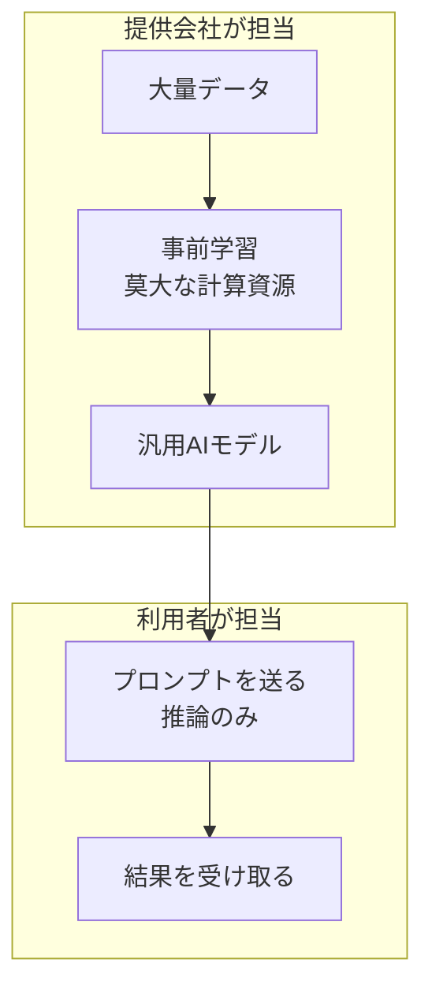
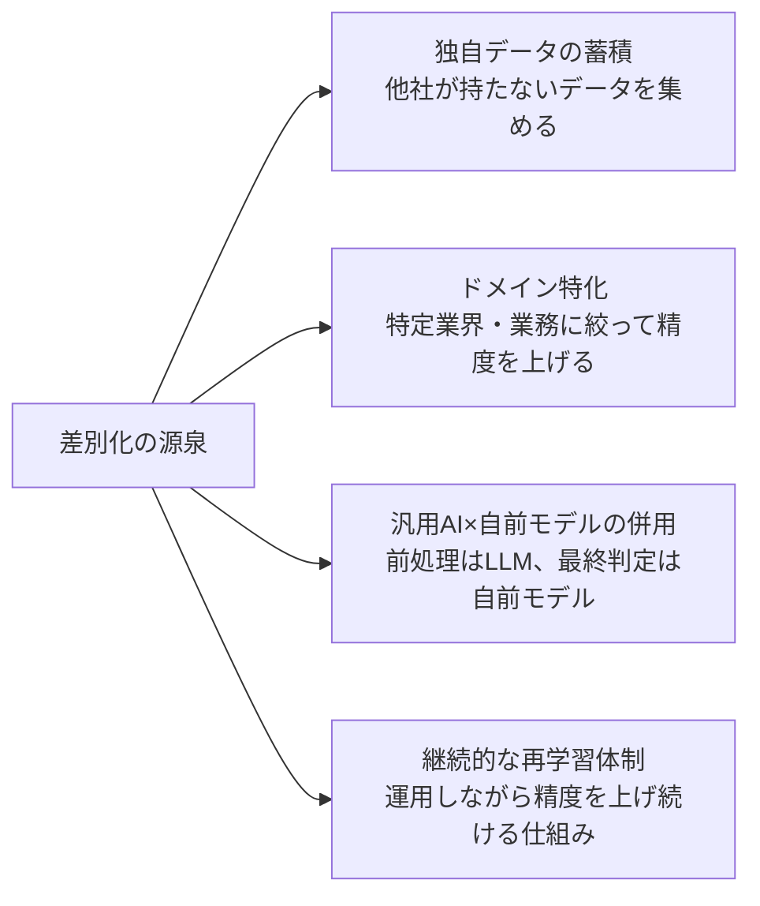
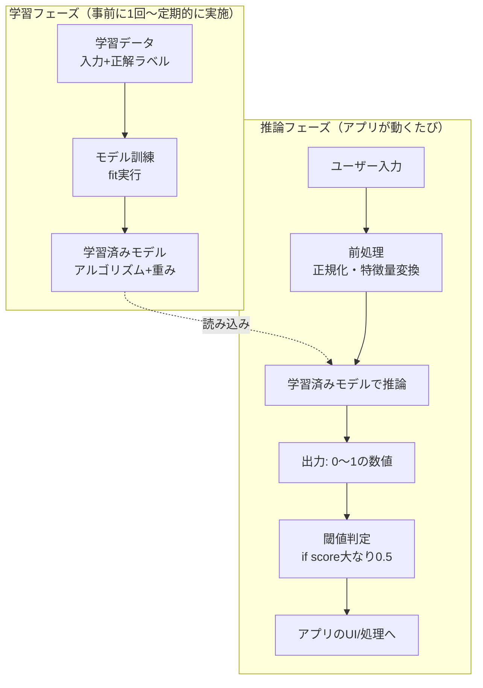
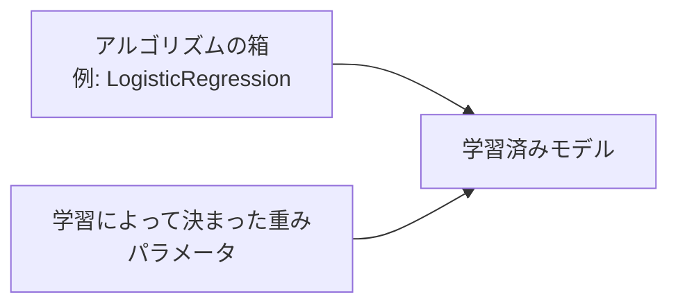
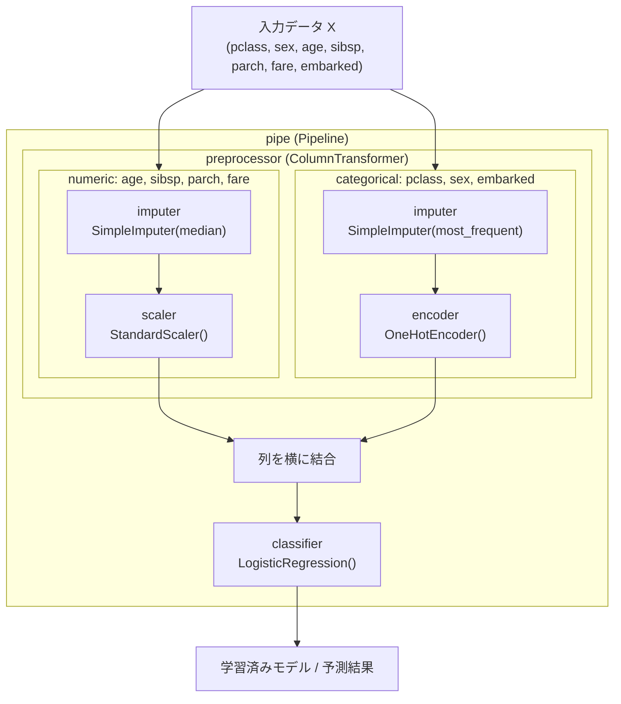
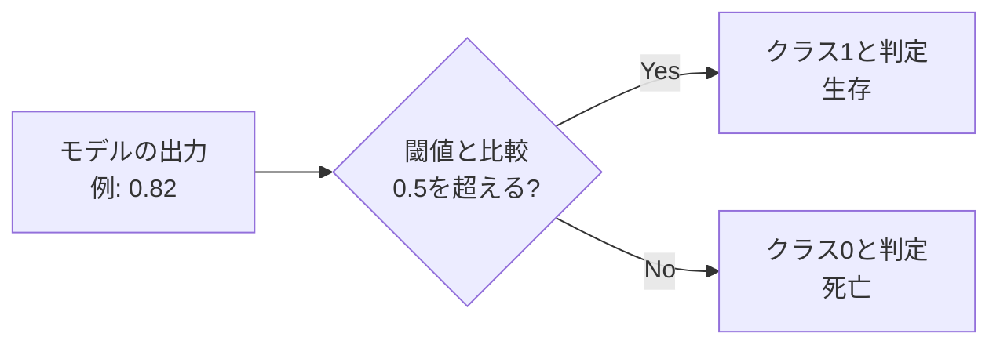
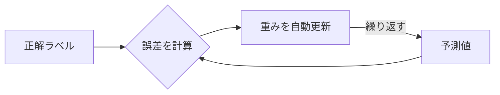
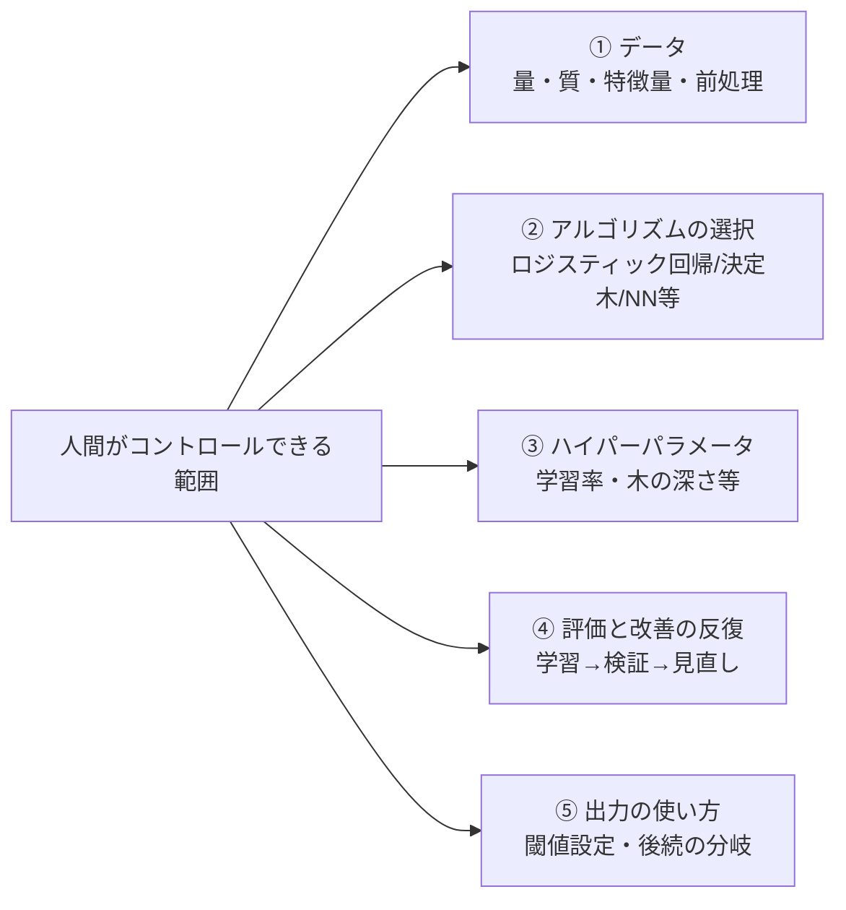
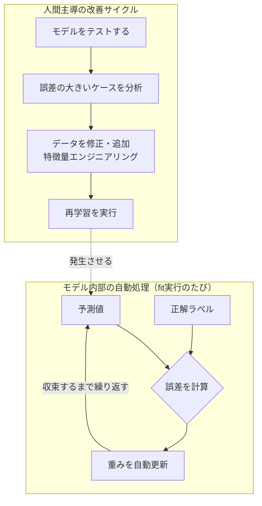
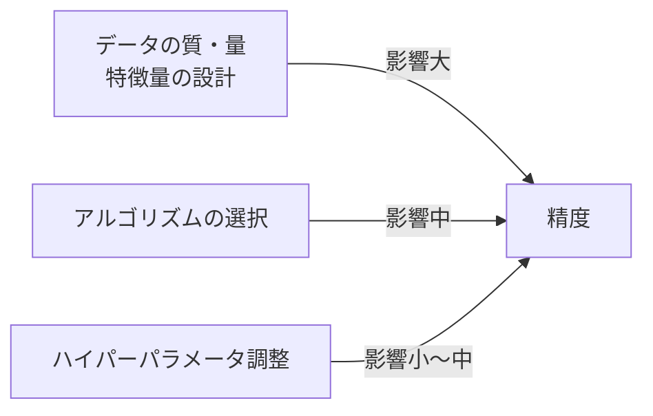

# 『汎用AIがあるのになぜ機械学習を学ぶのか』を図解と実践で理解する

## はじめに

汎用AIとビジネス課題を解決する設計を組み合わせる仕事をする中で、深く込み入った課題には機械学習の知識が必要だと感じてきました。そこでエンジニアとしての技術力を高めるため、機械学習の知識をバージョンアップすることにしました。

学習済みモデルを触り始めると、こんな疑問にもぶつかります。

- モデルって結局何が入っているの？
- 返ってくる数値って何を意味しているの？
- 精度を上げるには何をいじればいいの？

想定読者は、実装経験はあるけど機械学習は初めてという方です。この記事では「なぜ学ぶ意義があるのか」から「実際の仕組み」まで図解メインで整理します。今回は実務に近い「欠損値」や「カテゴリ変数」を含む**Titanicデータセット**（タイタニック号の乗客の生存予測）を使います。

## なぜ機械学習を学ぶ意義があるのか：汎用AI vs 自前モデル

### 汎用AIは「学習済みモデルを借りている」状態



汎用AIを使うとき、利用者は学習をしていません。提供会社が事前に学習を済ませたモデルを、API経由で「推論だけ」している状態です。

### 比較表

| | 汎用AI（LLM API） | 自前で作るMLモデル |
|---|---|---|
| 学習の主体 | 提供会社（利用者は不要） | 利用者（データ収集・学習が必要） |
| 学習難易度 | 不要（プロンプト設計のスキルで代替） | データ収集・前処理・アルゴリズム選定など学習コストが高い |
| 得意なこと | 自然言語・画像など汎用的な理解 | 特定タスクへの特化（分類・数値予測など） |
| 精度の傾向 | 幅広く「そこそこ」得意 | 特化タスクなら上回りやすい |
| 開発コスト | 低い（API呼び出しだけで動くものが作れる） | 高い（データ整備・学習・評価のサイクルが必要） |
| アプリ組み込み時のコスト | 呼び出すたびに課金（利用量に比例して増える継続コスト） | 学習に初期コストがかかるが、推論自体は自社サーバーで完結すれば低コスト・低レイテンシにできる |
| レイテンシ | モデルが大きく応答が遅めな場合がある | 軽量モデルなら高速・オフライン実行も可能 |
| データの扱い | 外部API送信が前提（プライバシー面で懸念あり） | 自社内で完結させやすい |
| 必要なデータ量 | 少量でも動く（プロンプト次第） | ある程度まとまった学習データが必要 |
| 説明可能性 | ブラックボックス性が高い | シンプルなモデルなら判断根拠を追いやすい |

### どちらが差別化になるか

**汎用AIをそのまま使うだけでは差別化になりにくい**のが実情です。汎用AIのAPIを使用したアプリは競合も似たような構造になるので、「AIを使っている」こと自体は強みになりません。差別化は主にプロンプトやUI/UXの工夫に依存し、模倣されやすいという弱点があります。

**自社モデルが差別化になりやすい**理由は、模倣に必要なものが多いからです。

- 競合が同等の精度を出すには、同じ質・量の学習データが必要（データ自体が競争優位になる）
- 自社の業務データやドメイン知識を反映させたモデルは、他社が簡単に再現できない
- 継続的に再学習してモデルを改善していくノウハウそのものが蓄積される

ただし、この優位性は永続的ではありません。LLM自体の性能が急速に向上しているため、競合が少量のファインチューニングだけで「十分良い」結果に追いついてくるスピードも早まっています。データによる差別化は「作れば安泰」ではなく、「LLMの進化スピードとの競争」だという前提を持っておく必要があります。

### 差別化する方法



- **独自データの蓄積**：自社サービスの利用ログなど、他社が持っていないデータを学習に使う
- **ドメイン特化**：汎用AIが苦手な「業界特有の判断基準」にモデルを特化させる
- **併用アーキテクチャ**：汎用AIで前処理（テキスト分類・要約）をし、その結果を自前の軽量モデルに渡して最終判定する。汎用AIの柔軟さと、自前モデルの再現性・コスト効率を両取りできる
- **継続的な再学習体制**：一度作ったモデルを放置せず、運用データで定期的に再学習し続ける仕組み自体が模倣しにくい資産になる

つまり機械学習を学ぶ意義は、模倣されにくい資産を自分の手で作れるようになることにあります。それは「汎用AIを使えば十分」という状況では手に入らない、**データとノウハウ**という資産です。

### 汎用AIを使うだけの立場でも学ぶ意義はあるか

機械学習を学ぶ意義は、自前でモデルを作る人だけの話ではありません。汎用AIを使う立場でも、データを構造化する力や出力を評価する力が必要になります。

- プロンプトに渡す情報の設計は、汎用AIの回答精度に直結します
- LLMの出力は本質的に確率的（probabilistic）です。この性質を理解していないと、なぜ間違えるのかを判断できません
- 出力を評価するための正解データ設計や評価指標という考え方は、機械学習の評価手法そのものです

実際、ソフトウェアエンジニアがLLMを学ぶ際にも機械学習の基礎スキル（データ操作・前処理・特徴量エンジニアリングなど）が重要だという指摘があります。LLMの出力が確率的な性質を持つことを理解する視点も、機械学習側から補われるものだとされています。教育分野の研究でも、LLMの仕組みと限界を学んだ学生はプロンプトの検証や回答の評価といった行動が改善したことが報告されています。

ただし、必要な深さは役割によって変わります。

- AIをそのまま使ってアプリを組む立場：仕組みの理解があれば十分なことが多いです
- AIの出力を業務判断に使う立場：評価指標や過学習の考え方まで理解しておくと、導入判断を誤りにくくなります
- 自前でモデルを作る・チューニングする立場：この記事で扱った「モデルの正体」「トレーニングの仕組み」まで深く理解する必要があります

つまり「データを構造化し評価する力」という点に限れば、AIを使うエンジニア全体に学ぶ意義があると言えます。

ここから先は、その「自前モデル」の中身を実際に見ていきます。

## 全体アーキテクチャ

まず大前提として、機械学習には2つの工程があります。「学習フェーズ」と「推論フェーズ」という、時間的に分離された工程です。



アプリが動くたびに学習し直しているわけではありません。学習は事前に済ませておきます。そして「学習済みモデル」というファイル（`model.pkl`など）を、アプリが読み込んで使うという分業になっています。

なお図中の「特徴量」とは、モデルが判断の手がかりとして使う入力データの各項目のことです（例：住宅価格予測なら「面積」「築年数」「駅からの距離」など）。前処理では、この特徴量を作ったり、スケールを揃えたりします。

## 「モデル」の正体

モデルは1つの物体ではなく、2つの要素の組み合わせです。



### Titanicデータの中身を見る

`sklearn.datasets.fetch_openml`でTitanicデータセットを取得すると、実際の乗客名簿がベースになった次のようなテーブルが手に入ります（`df.head()`のイメージで、値は一例です）。

| pclass | sex | age | sibsp | parch | fare | embarked | survived |
|---|---|---|---|---|---|---|---|
| 3 | male | 22.0 | 1 | 0 | 7.25 | S | 0 |
| 1 | female | 38.0 | 1 | 0 | 71.28 | C | 1 |
| 3 | female | 26.0 | 0 | 0 | 7.92 | S | 1 |
| 2 | female | 14.0 | 1 | 0 | 30.07 |  | 1 |
| 3 | male |  | 0 | 0 | 8.05 | S | 0 |

各列の意味は次のとおりです。

| 列名 | 意味 |
|---|---|
| pclass | 客室クラス（1〜3、数字が小さいほど上位） |
| sex | 性別 |
| age | 年齢（欠損値あり） |
| sibsp | 同乗している兄弟姉妹・配偶者の人数 |
| parch | 同乗している親・子供の人数 |
| fare | 運賃 |
| embarked | 乗船港（C/Q/S、欠損値あり） |
| survived | 生存有無（1=生存、0=死亡）＝今回予測したい目的変数 |

4行目のように`embarked`が空欄、5行目のように`age`が空欄の行が実際に存在します。この「欠損値」と、「pclass・sex・embarkedのような文字列のカテゴリ変数」の2つが、このままでは`LogisticRegression`に渡せない原因になります。

### 前処理: 欠損値補完とカテゴリ変数のエンコード

必要な処理は列の種類によって異なります。

- **数値列**（age, sibsp, parch, fare）：欠損値を埋めた上で、スケール（値の大きさ・範囲）を揃える（標準化）
- **カテゴリ列**（pclass, sex, embarked）：欠損値を埋めた上で、文字列を数値に変換する（One-Hotエンコーディング）

ここで使う4つのクラスの役割をまとめると、次のとおりです。

| クラス | 何をするか | 主な引数の意味 |
|---|---|---|
| `SimpleImputer` | 欠損値を指定した方法で埋める | `strategy="median"`：中央値で埋める（数値列向け）<br/>`strategy="most_frequent"`：最頻値で埋める（カテゴリ列向け） |
| `StandardScaler` | 各列の値を「平均0・標準偏差1」になるように変換する（標準化） | 引数なしで使用可能。列ごとの単位・桁の違いをなくし、値の大きい列（例：fare）が不当に強く扱われないようにする |
| `OneHotEncoder` | カテゴリ（文字列）を0/1の複数列に変換する | `handle_unknown="ignore"`：学習時に無かった未知のカテゴリが来ても、エラーにせず全て0として扱う |
| `LogisticRegression` | 前処理済みのデータから「生存する確率」を学習・予測する | `max_iter=1000`：学習を繰り返す最大回数の上限（デフォルトの100回では収束しないことがあるため増やしている） |

数値列とカテゴリ列で必要な処理が違うため、「どの列にどの処理を割り当てるか」を1つにまとめる`ColumnTransformer`を使います。

```python
from sklearn.datasets import fetch_openml
from sklearn.model_selection import train_test_split
from sklearn.pipeline import Pipeline
from sklearn.compose import ColumnTransformer
from sklearn.impute import SimpleImputer
from sklearn.preprocessing import StandardScaler, OneHotEncoder
from sklearn.linear_model import LogisticRegression
from sklearn.metrics import accuracy_score

# Titanicデータセットを取得（実データなので欠損値・カテゴリ変数を含む)
titanic = fetch_openml("titanic", version=1, as_frame=True)
df = titanic.frame

# cabin(船室番号)は欠損が多すぎるため今回は特徴量から除外
features = ["pclass", "sex", "age", "sibsp", "parch", "fare", "embarked"]
X = df[features]
y = df["survived"].astype(int)  # 1=生存, 0=死亡

X_train, X_test, y_train, y_test = train_test_split(X, y, test_size=0.2, random_state=0)

numeric_features = ["age", "sibsp", "parch", "fare"]
categorical_features = ["pclass", "sex", "embarked"]

# 列ごとに異なる前処理を割り当てる
preprocessor = ColumnTransformer(
    [
        # ("名前", 適用するパイプライン, 対象の列リスト) という3点セットを並べる
        (
            "numeric",
            Pipeline(
                [
                    (
                        "imputer",
                        SimpleImputer(strategy="median"),
                    ),  # 欠損値を中央値で補完
                    ("scaler", StandardScaler()),  # スケールを揃える
                ]
            ),
            numeric_features,
        ),
        (
            "categorical",
            Pipeline(
                [
                    (
                        "imputer",
                        SimpleImputer(strategy="most_frequent"),
                    ),  # 欠損値を最頻値で補完
                    (
                        "encoder",
                        OneHotEncoder(handle_unknown="ignore"),
                    ),  # 文字列を0/1の列に変換
                ]
            ),
            categorical_features,
        ),
    ]
)

# 前処理とアルゴリズムをひとまとめにする
pipe = Pipeline(
    [("preprocessor", preprocessor), ("classifier", LogisticRegression(max_iter=1000))]
)

# fitを実行した瞬間に「学習済みモデル」になる
pipe.fit(X_train, y_train)

baseline_accuracy = accuracy_score(pipe.predict(X_test), y_test)
print("学習直後(1回目)の精度:", baseline_accuracy)
# => 学習直後(1回目)の精度: 0.79...（実行環境やバージョンにより多少前後します)
```

`ColumnTransformer`に渡している`("numeric", ..., numeric_features)`と`("categorical", ..., categorical_features)`は、それぞれ「名前・適用するパイプライン・対象の列」という3点セットです。`numeric`側は`SimpleImputer(strategy="median")`で数値の欠損を中央値に置き換えてから`StandardScaler`でスケールを揃え、`categorical`側は`SimpleImputer(strategy="most_frequent")`で欠損を最頻値に置き換えてから`OneHotEncoder`で文字列を0/1の列に変換します。列ごとに違う処理を1つのオブジェクトにまとめているからこそ、`Pipeline`に組み込んだ後は`pipe.fit()`を1回呼ぶだけで、前処理からモデルの学習までがまとめて実行されます。

以下の図は、`pipe.fit(X_train, y_train)`を実行したときに内部で何が起きているかを表したものです。`numeric`と`categorical`はそれぞれ独立した経路で前処理され、`ColumnTransformer`の出力として横に結合されたあと、まとめて`LogisticRegression`に渡されます。



`preprocessor`という名前の箱の中に、`numeric`という枝と`categorical`という枝が並んで入っており、互いに影響し合うことはありません。それぞれの枝の中の処理（`imputer`→`scaler`、または`imputer`→`encoder`）は上から順番に実行され、最後に`ColumnTransformer`が両方の結果を1つのテーブルに戻します。それを受け取るのが一番外側の`pipe`の中の`classifier`（`LogisticRegression`）です。

### `ColumnTransformer`（`Pipeline`）を使うメリット

もし`ColumnTransformer`を使わず、`imputer`・`scaler`・`encoder`を個別に書くとどうなるか比較してみます。

```python
# 学習データに対して前処理をfit_transform(学習+変換)する
num_imputer = SimpleImputer(strategy="median")
X_train_num = num_imputer.fit_transform(X_train[numeric_features])
scaler = StandardScaler()
X_train_num = scaler.fit_transform(X_train_num)
# ...カテゴリ列も同様にimputer・encoderをfit_transamしていく...

# テストデータには「学習時に覚えた統計値」でtransform(変換)だけを行う必要がある
X_test_num = num_imputer.transform(
    X_test[numeric_features]
)  # fit_transformにするとバグ
X_test_num = scaler.transform(X_test_num)  # fit_transformにするとバグ
```

この書き方には2つの問題があります。

- `imputer`・`scaler`・`encoder`をバラバラに管理するため、テスト側で誤って`fit_transform`（学習し直し）を使ってしまうミスが起きやすい。これをやると「テストデータの統計値」を使って前処理してしまい、評価結果が不当に良く見える**データリーク**という深刻なバグになる
- 前処理オブジェクトが複数に分かれるため、本番アプリに組み込む際は`imputer.pkl`・`scaler.pkl`・`encoder.pkl`・`model.pkl`をすべて個別に保存・読み込みする必要がある

`ColumnTransformer`と`Pipeline`でまとめておくと、`pipe.fit(X_train, y_train)`を1回呼ぶだけで内部の前処理とモデルが正しい順番で連鎖的に学習されます。そして`pipe.predict(X_test)`を呼んだときは、学習時に覚えた統計値（中央値やスケールなど）を使って**変換だけ**が自動的に行われ、テスト側で学習し直されることはありません。保存も`pipe`を1つ`joblib.dump`するだけで済みます。

つまり`ColumnTransformer`を導入するメリットは、「コードが短くなる」ことよりも、**学習時と推論時で前処理がズレて精度が不当に良く/悪く見えてしまう事故を構造的に防げる**点にあります。

`.fit()`を実行する前は「空の箱」、実行した後が「学習済みモデル」です。重みの値は人間が手で書き込むものではなく、学習データから自動的に計算されます。前処理の中身は複雑になりましたが、「箱（アルゴリズム）＋重み（パラメータ）＝学習済みモデル」という構造自体は変わりません。

学習済みモデルは、テストデータだけでなく「新しく作ったデータ」を渡しても分類できます。たとえば「3等客室・22歳・女性・兄弟姉妹または配偶者が1人同乗・運賃7.25」という架空の乗客を1人作り、学習済みの`pipe`にそのまま渡してみます。

```python
import pandas as pd

new_passenger = pd.DataFrame(
    [
        {
            "pclass": 3,
            "sex": "female",
            "age": 22,
            "sibsp": 1,
            "parch": 0,
            "fare": 7.25,
            "embarked": "S",
        }
    ]
)

pipe.predict(new_passenger)
# => array([1])  1=生存と予測

pipe.predict_proba(new_passenger)
# => array([[0.35, 0.65]])  65%の確率で生存と判定
```

学習データに含まれていない架空の乗客でも、学習済みモデルに通すだけで「生存する確率」が返ってきます。これが「学習フェーズ」で作った重みを、「推論フェーズ」で使い回している状態です。

## 出力される数値の意味

二値分類モデル（「YES/NOのどちらか」を判定するタスク）の場合、出力は「0〜1の確率」になります。ここに閾値（判定の境界線となる基準値。一般的には0.5がよく使われる）を設定し、if文で場合分けするのがアプリ側の役割です。



Titanicの生存予測はもともと「生存(1)」か「死亡(0)」の二値分類です。先ほどは架空の乗客1人分でしたが、テストデータをまとめて渡した場合も同様に、複数件分の確率がまとめて返ってきます。

```python
pipe.predict_proba(X_test[:3])
# => array([[0.85, 0.15],
#           [0.32, 0.68],
#           [0.91, 0.09]])
```

`predict_proba`が返す配列の各行は「[クラス0（死亡）の確率, クラス1（生存）の確率]」というペアで、足すと1になります。（ここでの「クラス」は分類先のグループを指します。プログラミングにおける「クラス」とは別の意味なので注意してください。）二値分類でよく使われるのは、このうち片方（例：生存の確率）を「モデルの出力」として扱う方法です。ちなみに`predict`メソッドを使うと、確率ではなく閾値0.5で判定済みのクラスラベル（0か1）が直接返ってきます。

なお、「クラス0が必ず先頭に来る」という決まりがあるわけではありません。列の並び順は、学習時に`classifier.classes_`に記録された順序（ラベルを昇順に並べた順）に従います。今回のように0/1の整数ラベルなら昇順で0, 1になるため結果的に「クラス0が先頭」になりますが、これは「0/1を数値として昇順に並べたらそうなった」だけで、列の意味を仮定せずに確認したい場合は次のように調べられます。

```python
pipe.named_steps["classifier"].classes_
# => array([0, 1])  この並び順がpredict_probaの列順と対応する
```

たとえばラベルが文字列（"dead" / "survived"など）だった場合は、アルファベット順（"dead"が先）になるなど、ラベルの中身によって並び順が変わる点には注意してください。

注意点は2つあります。

- 回帰タスク（価格予測など）なら任意の数値、多クラス分類なら「各クラスの確率の配列」が返るなど、**タスクの種類によって出力の形は変わる**
- 閾値の0.5は絶対ではなく、**誤検知と見逃しのどちらを避けたいかで調整するもの**（例えば「生存者を見逃したくない」なら閾値を下げる、といった調整）

## トレーニングの正しいイメージ

「事象によって出る確率を人間が調整する」というのはよくある誤解です。実際は、予測と正解のズレ（誤差）が小さくなるように、アルゴリズムが自動で重みを更新していく処理です。



人間が直接触れるのは重みそのもの（パラメータ）ではなく、この更新の「進め方」を制御する**ハイパーパラメータ**（学習率や木の深さなど）です。パラメータは学習によって自動で決まる値です。ハイパーパラメータは学習前に人間が設定する値です。この違いを覚えておくと区別しやすいです。

## 人間がコントロールできる5つのレバー

精度に影響する要素を整理すると、次の5つに分けられます。



## 「データ改善」と「パターン学習」は別プロセス

ここで整理しておきたい誤解があります。「テストデータとの誤差を無くすようにデータを修正し、精度を上げる」というのは人間が行う作業です。一方で「モデルがパターンを学習する」というのは、モデル内部で起きる別の現象を指します。



「パターンを学習した」が指すのは下段（モデル内部の自動処理）だけです。データを直したり特徴量を追加したりする作業自体は、人間による**教材の質の改善**です。モデルが何かを学んでいるわけではありません。その改善済みデータで`.fit()`を実行して初めて、重みが自動更新される「パターン学習」が起こります。

Titanicデータセットなら、この「人間による改善」を人工的なノイズではなく**実データの特徴量エンジニアリング**として見せられます。誤分類したケースを見ていくと、`name`（氏名）列に含まれる敬称（Mr / Mrs / Miss など）や、家族構成（`sibsp`+`parch`）が生存率に影響していそうだと気づきます。これは実際のTitanic分析でもよく知られている観点です。

以下のコードは、「モデルの正体」で実行した`df`・`y`・`pipe`・`X_test`・`y_test`をそのまま使います。同じノートブック（同じセッション）で続けて実行してください。

```python
import numpy as np

# 1回目の学習の誤差を分析（人間が行う作業）
y_pred = pipe.predict(X_test)
print("1回目の精度:", accuracy_score(y_test, y_pred))

wrong_idx = np.where(y_pred != y_test.values)[0]
X_test.iloc[wrong_idx].head()
# ここで「年齢不明の乗客が多い」「家族構成の情報を使えていない」等に気づく
```

```python
# 誤分類の分析から得た気づきをもとに、特徴量を追加する（人間の作業）
# ※ df・y は「モデルの正体」で作成したものをそのまま使う
def add_features(df):
    df = df.copy()
    # 氏名から敬称(Mr/Mrs/Miss等)を抽出。年齢層や社会的地位の手がかりになる
    df["title"] = df["name"].str.extract(r",\s*([^\.]+)\.")
    # 兄弟・配偶者(sibsp)と親・子供(parch)を合算して「同乗家族の人数」を作る
    df["family_size"] = df["sibsp"] + df["parch"] + 1
    return df


df_fixed = add_features(df)

features_fixed = ["pclass", "sex", "age", "family_size", "fare", "embarked", "title"]
X_fixed = df_fixed[features_fixed]

# 同じrandom_state・test_sizeで分割しているため、行の対応関係は変わらない
X_train_fixed, X_test_fixed, y_train_fixed, y_test_fixed = train_test_split(
    X_fixed, y, test_size=0.2, random_state=0
)

numeric_features_fixed = ["age", "family_size", "fare"]
categorical_features_fixed = ["pclass", "sex", "embarked", "title"]

preprocessor_fixed = ColumnTransformer(
    [
        (
            "numeric",
            Pipeline(
                [
                    ("imputer", SimpleImputer(strategy="median")),
                    ("scaler", StandardScaler()),
                ]
            ),
            numeric_features_fixed,
        ),
        (
            "categorical",
            Pipeline(
                [
                    ("imputer", SimpleImputer(strategy="most_frequent")),
                    ("encoder", OneHotEncoder(handle_unknown="ignore")),
                ]
            ),
            categorical_features_fixed,
        ),
    ]
)

pipe_fixed = Pipeline(
    [
        ("preprocessor", preprocessor_fixed),
        ("classifier", LogisticRegression(max_iter=1000)),
    ]
)

# 特徴量を追加したデータで再学習(=ここで初めて「パターンを学習し直した」)
pipe_fixed.fit(X_train_fixed, y_train_fixed)

y_pred_fixed = pipe_fixed.predict(X_test_fixed)
improved_accuracy = accuracy_score(y_test_fixed, y_pred_fixed)
print("特徴量追加後の精度:", improved_accuracy)

# 学習前(1回目)と学習後(特徴量追加後)を並べて比較する
print(f"精度の変化: {baseline_accuracy:.3f} → {improved_accuracy:.3f}")
# => 精度の変化: 0.79... → 0.83...（実行環境やバージョンにより多少前後します)
```

こうして「学習前(1回目)の精度」と「特徴量追加後の精度」を並べて出力することで、データを直しただけで本当に精度が上がったのかどうかを確認できます。`accuracy_score`が改善したとすれば、それは「氏名から敬称を抽出した」「家族人数をまとめた」という**人間の特徴量エンジニアリング**の結果です。`pipe_fixed.fit()`自体は、誤差を小さくする自動更新を繰り返しているだけです。実データに残っている「使われていなかった情報（氏名・家族構成）」を掘り起こす作業そのものが、この記事で言う「データ改善」の実例になります。

## 精度向上の優先順位

実務では「データが8割、モデルが2割」と言われます。それほど、データの影響は大きいとされています。



理由はシンプルで、**モデルはデータに含まれる情報以上の精度を出せない**ためです。どれだけモデル（アルゴリズム）を新しくしても、材料であるデータが悪ければ限界があります。Titanicの例で言えば、`LogisticRegression`を`RandomForest`に変えるより先に、「敬称」や「家族人数」のような情報を特徴量として取り込む方が精度への影響が大きい、というのはよくあるパターンです。優先順位としては、まずデータを見直します。それでも足りなければ、モデルやハイパーパラメータを見直すという順番が基本になります。

なお、データが少ない状態で複雑なモデルを使うと**過学習**が起きやすくなります。過学習とは、学習データの細かいクセを丸暗記してしまう現象です。その結果、未知のデータへの精度が落ちてしまいます。「モデルを新しくすれば精度が上がる」と単純には言えないのは、この過学習のリスクがあるためです。

## まとめ

- 汎用AIは「学習済みモデルを借りている」状態であり、そのまま使うだけでは差別化にはつながりにくい。独自データを使った自前モデルこそが模倣されにくい資産になる
- モデル = アルゴリズム + 学習で決まった重み
- 出力は「タスクの種類」によって意味が変わる（二値分類なら確率）
- トレーニングは人間が確率を手動調整する処理ではなく、誤差を小さくする自動更新
- 精度向上は「データ→モデル→ハイパーパラメータ」の順で考えるのが効果的
- 実データ（欠損値・カテゴリ変数を含むTitanicデータセット）を使うと、「データ改善」が人工的な操作ではなく、特徴量エンジニアリングという具体的な作業として体感できる

### 感想

機械学習自体は5年以上前にも一度勉強したことがありました。今回`scikit-learn`のパイプラインや`ColumnTransformer`に改めて触れてみて、当時と比べて書き方が格段に効率化されていることに驚きました。

汎用AIを使ったアプリ開発を続けている中でも、今回扱ったような前処理やデータの構造化のスキルは欠かせません。汎用AIだけでは難しい、量の多い作業の処理・業界特化・低コスト・オフラインで動くアプリケーションを作れるようになるためにも、機械学習の学習は今後も続けていきたいと思います。

### もっと本格的に勉強したい方へ

本記事はあくまで「機械学習を学ぶ意義」と「モデルの仕組み」を図解でつかむことを目的にしています。実際に手を動かしながら本格的に学びたい方には、下山輝昌・三木孝行・伊藤淳二 著[『Python実践 機械学習システム100本ノック 第2版』](https://www.amazon.co.jp/dp/XXXXXXXXXX?tag=あなたのアフィリエイトID)（秀和システム）（PR）がおすすめです。実際のビジネス現場を想定した100の例題を解くことで現場の視点と応用力を身につける問題集で、データの加工・可視化から機械学習モデルの構築・評価、分析レポート作成までを一通り扱います。今回のTitanicの例で触れた「欠損値処理」や「特徴量エンジニアリング」を、実際のビジネスデータに近い規模でより実践的に身につけたい方に向いている一冊です。

## 用語集

| 用語 | 説明 |
|---|---|
| 特徴量 | モデルが判断の手がかりに使う入力データの各項目（例：面積、年齢など） |
| 前処理 | 生データをモデルが扱いやすい形に整える作業（標準化、欠損値処理など） |
| 標準化 | 特徴量ごとに値のスケール（大きさの基準）を揃える前処理 |
| 欠損値補完 | データに存在しない値（欠損値）を、中央値や最頻値などで埋める処理 |
| One-Hotエンコーディング | カテゴリ変数を0/1の複数列に変換し、モデルが扱える数値に変える処理 |
| パラメータ（重み） | 学習によって自動的に決まる、モデル内部の数値 |
| ハイパーパラメータ | 学習前に人間が設定する、学習の進め方を制御する値（学習率など） |
| 二値分類 | 入力を2つのグループのどちらかに分けるタスク |
| 多クラス分類 | 入力を3つ以上のグループに分けるタスク |
| 回帰 | クラスではなく、連続した数値そのものを予測するタスク |
| クラス | 分類先のグループ（プログラミングの「クラス」とは別の意味） |
| 閾値 | 確率をもとにクラスを判定する際の境界となる基準値（多くは0.5） |
| 過学習 | 学習データの細かいクセを丸暗記してしまい、未知データへの精度が落ちる現象 |
| パイプライン | 前処理・学習など複数の処理を1本の流れとしてまとめる仕組み |
| ColumnTransformer | 特徴量の列ごとに異なる前処理を割り当て、1本のパイプラインにまとめる仕組み |
| confusion_matrix | 実際のクラスと予測したクラスの対応関係を件数でまとめた表 |

## 参考文献

- [Data Collection and Quality Challenges in Deep Learning: A Data-Centric AI Perspective (arXiv)](https://arxiv.org/pdf/2112.06409) — 機械学習の取り組みが実態としてアルゴリズムに偏りすぎている一方、データ準備にこそ比重を置くべきという指摘
- [From AI table stakes to AI advantage: Building competitive moats (McKinsey)](https://www.mckinsey.com/capabilities/quantumblack/our-insights/from-ai-table-stakes-to-ai-advantage-building-competitive-moats) — 独自データの蓄積が競合に再現しにくい優位性につながっている事例分析
- [Is Proprietary Data Still a Moat in the AI Race? (Insignia Business Review)](https://review.insignia.vc/2025/03/10/ai-moat/) — データによる優位性がLLMの進化スピードによって縮まりやすいという反対側の視点
- [LLMs and Machine Learning for Software Engineers (Medium)](https://medium.com/@mattchinnock/llms-and-machine-learning-for-software-engineers-a7634fab109a) — LLMを学ぶソフトウェアエンジニアにもデータ操作・前処理・特徴量エンジニアリングといった機械学習の基礎スキルが重要という指摘
- [Software Engineering in the LLM Era (Towards Data Science)](https://towardsdatascience.com/software-engineering-in-the-llm-era/) — LLMの出力が本質的に確率的であり、その理解が実務上重要であるという指摘
- [Teaching Students to Question the Machine (arXiv)](https://arxiv.org/pdf/2604.01955) — LLMの仕組みと限界を学んだ学生は、プロンプトの検証や回答の評価行動が改善したという研究結果
- [OpenML: Titanic dataset](https://www.openml.org/search?type=data&status=active&id=40945) — `fetch_openml("titanic", version=1)`で取得できるデータセットの詳細
