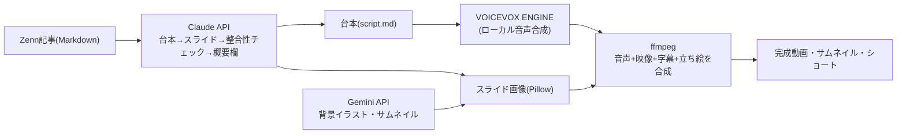
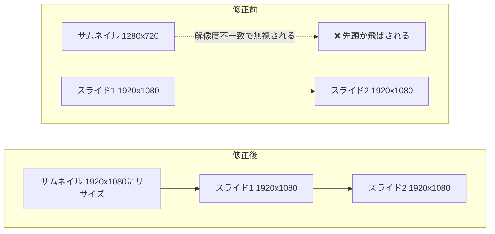
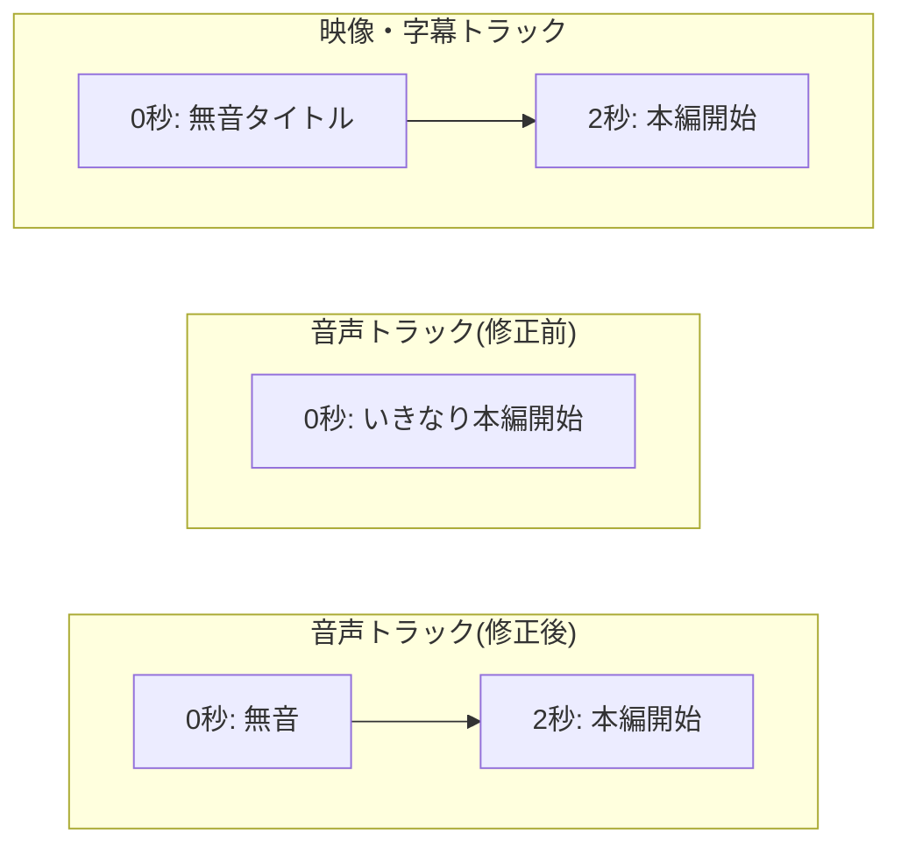
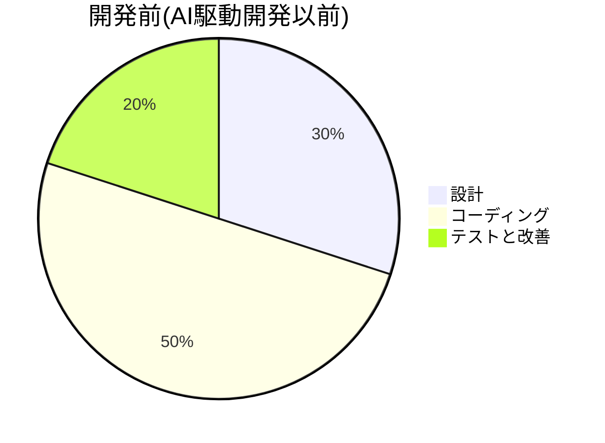
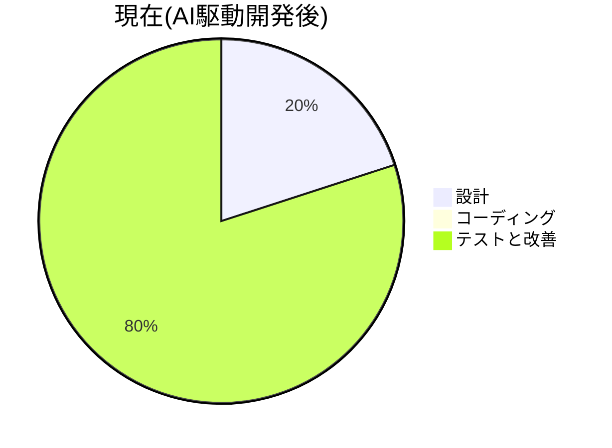

# 動画制作64時間→15分。Claudeとエージェントパイプラインを作ってYouTube運用を仕組み化した話

## 「もうYouTube更新できてないな」と気づいた日

エンジニアの仕事が忙しくなってきて、気づいたらYouTubeの更新が止まっていました。Zennの記事も、気がつけば時事ネタのキャッチアップだけになっていました。「これは記事にする価値があるな」と思って書くようなものが減っていました。

一方で、YouTube動画とショート動画を1本作るのに**これまで64時間**（8時間/日 × 土日2日 × 4週間）かけていました。当時の作業手順は以下の通りです。

1. 台本を考えます
2. VOICEVOXで1行ずつ読み上げさせます
3. DaVinci Resolveでスライドと音声を並べます
4. Canvaでショート用に文言を入れます……

平日は本業で埋まっています。土日だけで作業すると、1本仕上げるのに1ヶ月かかります。これでは更新が止まるのも当然でした。

そこで、Zenn記事から動画・サムネイル・YouTubeショートまでを一気通貫で生成するパイプラインを作りました。この記事は、その制作過程の記録です。

## Before / After

| | Before(手動) | After(このパイプライン) |
|---|---|---|
| 台本作成 | 自分で構成を考えて書く | Claudeが記事から生成・自己採点・修正 |
| 音声 | VOICEVOXで1行ずつ読み上げ | 全セリフを自動合成、間も自動調整 |
| スライド | PowerPoint/Canvaで作成 | Pillowで自動描画（4レイアウト+実物のコード/図） |
| 立ち絵・字幕 | 無し | 話者ごとに口パク・色分け字幕を自動合成 |
| BGM/SE | 無し | フェードイン/アウト付きで自動ミックス |
| サムネイル | Canvaで手動 | Geminiが背景・文字含めて丸ごと生成 |
| ショート動画 | Canvaで冒頭を切り出して手動編集 | シーン境界を検出して自動生成 |
| **所要時間** | **64時間**（8h×土日2日×4週間） | **15分未満**（再生成含む） |

再生成が必要になっても15分程度で回せるので、「なんか違うな」と思ったら気軽にやり直せます。これが地味に大きいポイントでした。手動だと1回作り直すのにまた何時間もかかるので、妥協して公開することが多かったからです。

## 全体アーキテクチャ

1つのAPIで完結させず、役割ごとに最適なツールを組み合わせています。

- **Claude**: 台本・スライド内容・VOICEVOX用テキスト・概要欄をそれぞれ「生成→評価→修正」のループで作ります。評価担当のエージェントが90点未満と判定したら、フィードバックをもとに該当箇所だけ直して再評価します
- **Gemini**: スライドの背景イラストと、サムネイル・ショートの背景+文字を丸ごと生成します
- **VOICEVOX ENGINE**: ローカルで起動したエンジンにHTTPで話者IDとテキストを渡して音声合成します
- **ffmpeg**: 音声の結合・字幕の焼き込み・立ち絵の口パクオーバーレイ・BGMミックス・最終合成をすべて担当します

## なぜ比較的スムーズに開発できたのか

今回は、AI駆動開発が比較的スムーズに進みました。理由は**「完成形」が最初から明確だった**ことだと思っています。自分自身が普段作っている動画そのものがゴールなので、「これで合っているか」を判断する基準が最初から自分の中にありました。

実際の開発の進め方は動画を生成→アップロードしてClaudeに見てもらう→どこがおかしいかを具体的に伝える→直す、というループの繰り返しでした。

「キャラクターと文字が被っている」「音声が途中で途切れている」「つむぎの口調が公式設定と違う」といった指摘を1つずつ入れていくことで、精度を上げていきました。ゴールが曖昧なまま「いい感じに作って」と頼むより、はるかに手戻りが少なかったです。

## つまずいたところ集

「AIにコードを書かせれば終わり」ではありません。**何が起きているのかを疑い検証し直す**という作業の繰り返しでした。

### ffmpegのconcatデマクサーが、解像度が違う画像を無視する

サムネイルを動画の冒頭に使う機能を作ったとき、なぜかサムネイルが表示されずいきなり2枚目のスライドから始まる不具合が起きました。

原因はffmpegのconcat（連結）デマクサーの挙動でした。**先頭の画像だけ他と解像度が違うと、実質その画像を無視してしまう**という仕様です。サムネイルは1280x720、本編のスライドは1920x1080。

scaleフィルタを挟んでも直らず、結局「事前に動画と同じ解像度にリサイズしてから渡す」という力技で解決しました。

### 音声だけが2秒早く進んでいた

字幕・スライドの切り替わり・音声の再生タイミングがすべてズレる不具合がありました。原因は動画の冒頭2秒は無音のタイトル画面のはずなのに、**音声トラックにはその2秒の無音を入れ忘れていた**ことでした。字幕とスライドは「2秒後から本編が始まる」という前提で計算していたのに、音声だけ0秒から喋り始めていたのです。

実際に477.2秒の映像に対して音声が474.88秒しかない、という差分から発覚しました。音声・字幕・映像タイミングをすべて同じ「基準時刻の積み上げ」から計算するように直して解消しました。

### VOICEVOXの読み間違い

読み間違いが頻発しました。例えば「架空の乗客データ」が「かからの乗客データ」と読まれます。「空の箱」も「そらの箱」と読まれます。日本語は同じ漢字でも文脈によって読みが変わるので、TTSにはよくある問題です。

読み替え辞書を作って対処しました。単純に「値」を「あたい」に全置換すると「数値」「戻り値」まで壊れる、といった別の不具合も踏みました。結局「この値」「その値」のような、単独用法と判断できる完全なフレーズ単位でしか安全に置換できないという結論になりました。

### キャラクターが公式設定と違っていた

VOICEVOXの「春日部つむぎ」は公式に「埼玉の高校に通う18歳のギャル、一人称は『あーし』」という設定です。生成された台本では「言い得て妙」のような硬い言い回しを喋らせてしまっていました。キャラクター設定をちゃんと調べて台本エージェントのプロンプトに反映し直しました。地味ですが、こういう「キャラクターの一貫性」はVOICEVOX系コンテンツでは軽視できない部分だと思います。

### ショート動画の切り出しで、BGMが誤爆の原因になった

ショート動画は「冒頭60秒あたりのセリフの切れ目で切る」という方式で作っていました。BGMを使っていると、セリフとセリフの間の無音がBGMの音でかき消されて検出できませんでした。結局60秒ぴったりで切れてセリフが途中で終わる、という不具合が起きました。

無音検出という「推測」に頼るのをやめました。動画生成時に「シーン1は何秒から何秒まで」という正確な境界をJSONで保存しておき、ショート生成時はそれを読むだけにする方式に変えて解決しました。台本の構造そのものから正確な情報が取れるなら、それを使うべきだったという教訓です。

## AI駆動開発で時間の使い方はどう変わったか

完成のクオリティを上げているのは、結局のところ開発者自身の「こだわり」だということが分かりました。AI駆動開発では、コーディングそのものや「どう書くか」を考える時間はそれほど取っていません。その代わり、改善・こだわり・「どの作業をやってどれを切るか」という取捨選択に時間を使うようになりました。

自分の感覚では、AI駆動開発が無かった頃は設計30%・コーディング50%・テストと改善20%くらいの配分でした。今は設計20%・コーディング0%・テストと改善80%くらいの印象に変わってきています。

これはあくまで個人の感覚なので、客観的なデータも探してみました。

- Vella and Blincoeは2026年に発表したソフトウェア工学分野の縦断調査で、AIコーディングアシスタント導入後の開発者の時間配分の変化を追跡しました。その結果、コードを書く作業に費やす時間が減ったと回答した参加者が82%に達したと報告しています[^1]
- METRが実施したランダム化比較試験では、経験豊富な開発者がAIツールを使うと**自己認識では20%速くなったと感じていました**。しかし**実際には19%遅くなっていた**という結果が出ています[^2]。感覚と実態がズレることがある、という点は自分自身も注意したいところです
- Faros AIの2026年のテレメトリ分析では、チーム単位でのコード関連タスクの完了数が210%増えました。一方で企業全体で見ると生産性向上が測定できないケースが多いと報告しています。理由として、コーディングが速くなった分だけレビューや検証の工程がボトルネックになりました。その結果、**時間の使い道がテスト・検証側に移動している**ことが挙げられています[^3]

自分の実感（テスト・改善に80%）は、最後のFaros AIの指摘（ボトルネックがレビュー・検証側に移動する）と方向性は一致しています。ただし具体的な割合まで一致するかどうかは分かりません。「コーディングは速くなったが、その分の時間は検証・改善に吸収される」という傾向自体は複数の調査で共通して見られる印象です。

## 結果はどうだったか

<!-- TODO: 公開後のデータが揃ったらここに記入する -->
<!-- 再生数・視聴維持率・登録者数への影響などを、投稿から一定期間経過後に追記予定 -->

（データ計測中です。効率化はできましたが、伸びるかどうかは別の実験なので正直に追記します）

## まとめ

- 動画制作を64時間→15分未満に効率化しました
- 役割ごとに最適なツール（Claude/Gemini/VOICEVOX/ffmpeg）を組み合わせる設計にしました
- 実際に踏んだ不具合はどれも「診断・検証」の話で、コーディングそのものではありませんでした
- 「完成形が明確だったこと」が開発をスムーズにした一番の要因だったと感じています
- 時間の使い方は、コーディングから改善・検証・取捨選択の方に大きく移った印象です

効率化はできましたが、これで本当に再生数が伸びるかは別の話です。続報はデータが揃ったら書きます。

[^1]: Annie Vella and Kelly Blincoe. "The Impact of AI Coding Assistants on Software Engineering: A Longitudinal Study." 2026.
[^2]: METR. "Measuring the Impact of Early-2025 AI on Experienced Open-Source Developer Productivity." 2025.
[^3]: Faros AI. "Are AI coding assistants really saving time, money and effort?" 2026.
