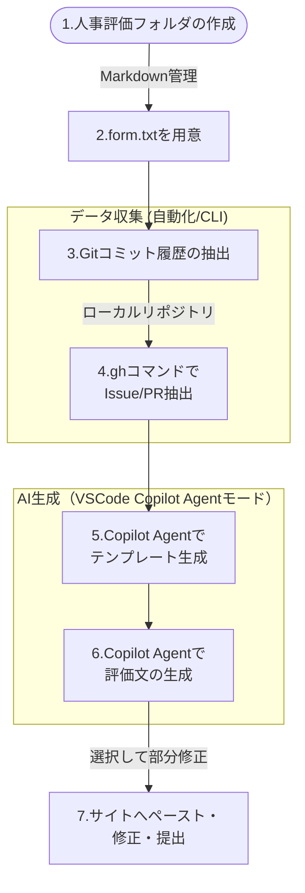

# 自己評価をGitHub Copilotで半自動化したら、忘れていた貢献まで掘り起こされた

## はじめに：「自己評価、来月末までに提出してください」

毎年この時期になると、エンジニアのTeamsに静かな絶望が漂います。

「自己評価、来月末までに提出してください」

本業のコードは書けます。設計もレビューもできます。でも「この半年間の自分の貢献を、評価者（上司）が判断しやすい形で言語化してください」というタスクには、異常なほど手が止まります。

理由は明快です。**人間の記憶は、アーカイブではなくキャッシュだから**です。

半年前にこっそり直した型定義の整理、リリース直前に発見して修正したバグ、レビューで何度も指摘した設計の一貫性——これらは、記憶の彼方に消えています。残るのは「なんとなく頑張った」という感覚だけ。

そして人は、**感覚で評価票を書きます**。

今期、自分はそれをやめました。そして、AIを使うこと自体が「評価される行動」になりつつある時代に、その判断は結果的に正しかったと思っています。


## 「AI活用」が評価項目になる時代が来た

少し背景の話をさせてください。

MetaはこのAI活用を人事評価に正式に組み込みました。2025年は「AI-fueled wins（AIで生んだ成果）」を自己報告ベースで記録する移行期間として位置づけ、2026年からは「AI-driven impact」が正式な評価項目として社員の査定・ボーナス・株式報酬に直接影響する制度を本格運用しています。評価対象となるのはツールの使用頻度ではなく、「AIを活用してどんな成果を出したか」という具体的な貢献です。

「アメリカの大企業の話でしょ」と思う方もいるかもしれません。ただ、リモートワーク、OKR、アジャイル開発——これらはいずれもGAFAMが先行し、数年で日本企業にも波及してきました。AI活用の評価組み込みも、同じ道をたどる可能性が高いです。

https://newspicks.com/news/16355920/body/

実際、日本でもその兆候はすでに出ています。カオナビが2025年6月に実施した調査によると、**4割の人事担当者がすでに生成AIを業務に活用**しており、2026年時点では大企業の3割以上が人事業務に生成AIを取り入れているという報告もあります。「AIを使いこなす」ことは、もはや評価者の目に映るスキルになりつつあります。

https://www.kaonavi.jp/news/detail/pr20250626/

つまり、自己評価の作成にAIを活用することは——**「手抜き」どころか、まさに評価されるべき行動そのもの**になってきているのです。

:::message
**この記事の位置づけ**
本記事で紹介するのは、「AI活用の成果」を評価票に書くためのワークフローではなく、「自己評価の作成プロセスそのもの」をAIで効率化する方法です。ただ、そのプロセスを通じて「AIを業務に使いこなした」という事実が生まれること自体、上記のトレンドの中では意味を持つかもしれません。
:::


## 発想の転換：「書く」のではなく「集める」

自己評価を書くときの本当のコストは「文章を書くこと」ではありません。
「自分が何をやったかを思い出すこと」と「それを過小・過大なく言語化すること」です。

逆に言えば、この2つをAIに任せられれば、自分がやることは「事実確認」と「最終承認」だけになります。

使ったツールはVSCodeのGitHub Copilot（Claude Sonnet 4.6）です。会社でAI活用が推奨されていることもあり、迷わず使いました。

インプットに使ったのは以下の2種類のデータです。

- **自己評価フォームのテキスト**（フォーム画面からコピー）
- **ghコマンドで抽出した完了済みIssue・PRとGitコミット履歴**

これらは全部「動かぬ証拠」です。気分や感情が入り込む余地がありません。

:::message
**セキュリティについて**
AIに渡すデータには個人名・顧客名・サービス名などの固有名詞が含まれます。社内のAI利用ポリシーを事前に確認し、必要に応じてマスキングしてから使用してください。GitHub CopilotはEnterprise契約であればデータがトレーニングに使われない設定が可能です。
:::


## ワークフロー全体像



全ファイルはテキスト・Markdown形式で管理します。エンジニアらしく、評価作業もリポジトリで完結させます。


## Step 1：人事評価フォルダを作る

まず作業用フォルダを作ります。

```
hr-evaluation/
├── form.txt              # 自己評価フォームの画面からコピーしたテキスト
├── template_prompt.md    # Copilotが生成したテンプレートプロンプト
├── draft.md              # Copilotが生成した評価文（編集用）
└── log/
    └── git_impl.txt      # git log・ghコマンドで抽出した内容
```

このフォルダをVSCodeで開いておくと、後でCopilotが`log/`フォルダごとコンテキストとして参照できて便利です。


## Step 2：Gitコミット履歴を抽出する

ローカルリポジトリで以下のコマンドを実行します。

```bash
git log \
  --author="your.name@example.com" \
  --since="2026-01-01 00:00:00" \
  --until="2026-06-30 23:59:59" \
  --pretty=format:"%ad | %h | %s" \
  --date=short \
  --all \
  -p \
  | grep -Ev "(Merge|WIP|wip|typo|fix typo|whitespace)" \
>> hr-evaluation/log/git_impl.txt
```

出力例：

```
2026-06-21 | a3f1c2e | APIレスポンスのキャッシュ戦略を実装

diff --git a/src/api/cache.ts b/src/api/cache.ts
index 1a2b3c4..5d6e7f8 100644
--- a/src/api/cache.ts
+++ b/src/api/cache.ts
@@ -12,6 +12,20 @@ export const fetchUser = async (id: string) => {
+  const cached = await redis.get(`user:${id}`);
+  if (cached) return JSON.parse(cached);
+  const user = await db.user.findUnique({ where: { id } });
+  await redis.set(`user:${id}`, JSON.stringify(user), 'EX', 300);
+  return user;

2026-06-18 | b2d0e1f | ユーザー一覧のN+1クエリを解消

diff --git a/src/api/users.ts b/src/api/users.ts
index 2b3c4d5..6e7f8a9 100644
--- a/src/api/users.ts
+++ b/src/api/users.ts
@@ -8,7 +8,10 @@ export const getUsers = async () => {
-  const users = await db.user.findMany();
-  return users.map(u => ({ ...u, posts: await db.post.findMany(...) }));
+  return await db.user.findMany({
+    include: { posts: true },
+  });
```

マージコミットやWIPなどのノイズを除外することで、**実際の仕事の記録**だけが残ります。

`-p`オプションを付けることで、各コミットの差分コード（どのファイルのどの行を変更したか）も一緒に取得できます。コミットメッセージだけでは伝わりにくい実装の詳細をCopilotに渡せるため、より根拠のある評価文が生成されます。

また`--since`・`--until`には時刻まで指定するのがポイントです。日付だけだと境界日の取り込みが意図通りにならないことがあります。

複数リポジトリにまたがって作業している場合は、それぞれで実行してファイルに追記してください。


## Step 3：ghコマンドで完了Issue・PRを抽出する

GitHub CLIを使って、自分が関わったIssueとPRを抽出します。

```bash
# 自分がAssigneeのクローズ済みIssueを抽出
gh issue list \
  --assignee "@me" \
  --state closed \
  --limit 100 \
  --json number,title,closedAt,labels \
  | jq -r '.[] | "- #\(.number) \(.title) [\(.closedAt[:10])]"' \
>> hr-evaluation/log/git_impl.txt

# 自分がAuthorのマージ済みPRを抽出
gh pr list \
  --author "@me" \
  --state merged \
  --limit 100 \
  --json number,title,mergedAt,additions,deletions \
  | jq -r '.[] | "- #\(.number) \(.title) [\(.mergedAt[:10])] +\(.additions)/-\(.deletions)"' \
>> hr-evaluation/log/git_impl.txt
```

出力例：

```
- #142 ユーザー認証フローのリファクタリング [2026-06-30] +320/-180
- #138 パフォーマンス計測用ダッシュボード追加 [2026-06-12] +210/-30
- #121 オンボーディングドキュメントの整備 [2026-04-03] +95/-10
```

**PR行数（追加・削除）の情報**があると、AIが貢献の規模感を判断しやすくなります。


## Step 4：VSCodeとCopilot Agentモードで評価文を生成する

ここからがCopilotの出番です。今回使ったのは **Agentモード**です。複数ファイルをまたいだ読み取りと生成を一度の指示でこなせるため、「複数のログファイルを統合して文章を生成する」用途に向いていました。

### プロンプトテンプレートの生成

Agentモードのチャット欄で`form.txt`を指定した状態で、以下のように指示します。

```
#file:form.txt
このファイルの評価フォームの項目をもとに、
自己評価文を生成するためのプロンプトテンプレートを作成してください。
後でログファイルのデータを渡す前提で、
そのデータから根拠のある評価文を出力できる構造にしてください。
```

するとCopilotが、自分の評価フォームにフィットしたプロンプトテンプレートを生成してくれます。**フォームの形式は会社によって全然違うので、ここをAIに合わせてもらうのが地味に大きなメリットです。**

Agentモードはファイル操作も行えるため、生成されたテンプレートを`template_prompt.md`として保存するよう指示することもできます。

### 自己評価文の生成

プロンプトテンプレートと`log`フォルダを指定して、以下のように指示します。

```
#file:template_prompt.md #folder:log
logフォルダの内容をもとに、自己評価をdraft.mdに生成してください。
```

**フォルダごと渡せるのはAgentモードの強みです。** ログファイルが複数に分かれていても、個別に`#file:`指定する手間がありません。今回は`git_impl.txt`1ファイルですが、リポジトリが複数ある場合にファイルを分けて管理しても、フォルダを渡すだけで済みます。

するとCopilotが各評価項目に沿って、**エビデンス付きの自己評価文**を生成してくれます。

### 出力の部分修正

生成された評価文に間違いがあった場合は、**該当箇所をカーソルで選択してからAgentモードで修正指示**を出します。

```
この部分の日付が誤っています。正しくは2026年4月です。
```

文章全体を再生成するのではなく、選択範囲だけを対象に修正が走るため、余計な変更が入りません。「確認して、選択して、直す」のサイクルがファクトチェック作業と自然に組み合わさり、手が止まらずに進みました。


## 出力されたものと、その「驚き」

返ってきた評価文を読んで、正直少し驚きました。

**自分では完全に忘れていた貢献を、AIが掘り起こしてきたのです。**

具体的には、4月に行った型定義ファイルの整理が「チームへの貢献」として取り上げられ、こんな文章になっていました。

> 「型定義ファイルをfeature別に分割・整理したことで、新規参加メンバーのコードリーディングコストを下げる環境整備に貢献した」

たしかにやりました。でも自分の評価票に書くつもりはまったくありませんでした。「地味な整理作業だし」と思っていたから。

でも振り返ると、これはPR2本・レビュー往復を含めて1週間かけた仕事でした。しかもその後の新人オンボーディングがスムーズだったのは、あの整理があったからだと今更ながら気づきました。

**「大した話じゃない」は、疲弊した人間の感覚が作り出した錯覚でした。**

AIが「トリガー」になって、忘れていた記憶と意味が戻ってくる——この体験は、思っていた以上に価値がありました。


## ファクトチェックと「自分の言葉」への変換

AIが出してきた評価文は、そのまま提出できるものではありません。やることは2つです。

### ① ハルシネーションの確認

Gitログ・Issue・PRを根拠にしているため、大きな事実誤認はほぼありませんでした。ただし「レスポンスタイムを大幅に改善」のような定量化は、AIが文脈から類推した「推測値」のことがあります。根拠のない数値は削除か、自分で確認した実測値に差し替えます。

```markdown
## ファクトチェックリスト
- [ ] コミット日付・件数は正確か
- [ ] 「採用された」「改善された」などの結果は事実か
- [ ] 数値化されている部分に根拠はあるか
- [ ] 自分が主体でないタスクが含まれていないか
```

### ② トーンの個人化

AIが出す文章は、どこか「模範解答感」があります。そのまま出すと評価者に「テンプレっぽい」と感じられる可能性があります。

私がやったのは、各セクションの冒頭1〜2文だけを自分の言葉に書き直すことです。事実や構造はAIのまま活かし、**語り口だけ自分のものにする**。これだけで「自分の評価票」になります。


## 結果：作業時間の内訳

| フェーズ | 時間 |
|---|---|
| フォルダ・ファイルの準備 | 30分 |
| Gitログ・Issue・PRの抽出 | 30分 |
| プロンプト調整・評価文の生成 | 30分 |
| ファクトチェック・修正 | 1時間 |
| 評価サイトへの転記・最終調整 | 30分 |
| **合計** | **約3時間半** |

例年の自己評価作業は8〜10時間かかっていました（それでも「ちゃんと書けた気がしない」という後味の悪さ付き）。

今期は4時間で、しかも**根拠があるという確信**があります。


## この方法の本質的なメリット

時短だけが目的ではありません。この方法の本当のメリットは2つあります。

**① バイアスの排除**

人間が記憶で評価票を書くと、直近の仕事が過大評価され、半年前の地味な貢献は消えます。GitログとIssueは時系列で並んでいるので、AIはその偏りなく半年間全体を俯瞰して評価できます。

**② 評価者にとっても使いやすい**

根拠が明記された評価票は、評価者（上司）の側でも判断しやすくなります。「なんとなく頑張った」という文章より、「#142のPRでXXをリファクタリングし、YYの改善に貢献した」と書いてある評価票の方が、評価者はコメントしやすいです。

AIを使うことは「手抜き」ではなく、**評価者にとっても価値のある材料を揃えること**です。

そして冒頭で触れたように、Metaをはじめとするテック企業が「AI活用の成果」を評価項目に組み込む流れが広がりつつある今、「AIを使って業務を効率化した」というこのプロセス自体が、評価票に書ける実績の一つになり得ます。自己評価をAIで作るという行為は、もはや後ろめたさとは無縁です。


## まとめ

今回のワークフローを整理します。

1. **人事評価フォルダを作成**（`form.txt`・`log/`フォルダを用意）
2. **`git log`・`gh`コマンドでコミット履歴・Issue・PRを抽出**し`log/git_impl.txt`に格納
3. **Copilot AgentモードでテンプレートをAIに生成させる**（`form.txt`を渡す）
4. **プロンプトテンプレートと`log`フォルダを渡して評価文を生成**
5. **誤りをカーソル選択してAgentモードで部分修正**
6. **ファクトチェック → 自分の言葉に仕上げて提出**

そもそもこのワークフローを作ろうと思ったのは、自己評価を第三者目線で自動生成してくれる仕組みがあれば、評価する側もされる側も楽になると感じたからです。自分の貢献を自分で言語化するのは、どうしても主観や記憶の偏りが入ります。それをなくしたかった。

GitHubのようなバージョン管理サービスとAIを連携することで、コミット回数・具体的な実装内容・PRの規模といった動かぬ履歴をもとにした、誠実な評価文が生成できます。感覚ではなく証拠に基づくため、思い込みや自己過小評価が自然と排除されます。評価者にとっても、根拠のある評価票は判断しやすく、フィードバックもしやすいはずです。

そして、このアプローチには自己評価の作成以上の可能性があると思っています。コミット履歴やIssueの内容を分析すれば、自分がどんな技術領域に強いか、どんな課題解決を得意としているかが浮かび上がってきます。今後はこの方法を応用して、自身のスキルの洗い出しやキャリア構築の参考にもしていきたいと考えています。


## 付録：使用ツール・コマンド一覧

| ツール | 用途 |
|---|---|
| VSCode + GitHub Copilot（Claude Sonnet 4.6） | 評価文の生成・編集（Agentモード） |
| `git log` | コミット履歴の抽出 |
| `gh issue list` / `gh pr list` | Issue・PR一覧の抽出 |
| `jq` | JSONの整形 |
| Markdown / テキスト | 全ファイルの管理形式 |

:::message
GitHub CLIのインストールは`brew install gh`（Mac）または[公式ドキュメント](https://cli.github.com/)を参照してください。`gh auth login`で認証が必要です。
:::
