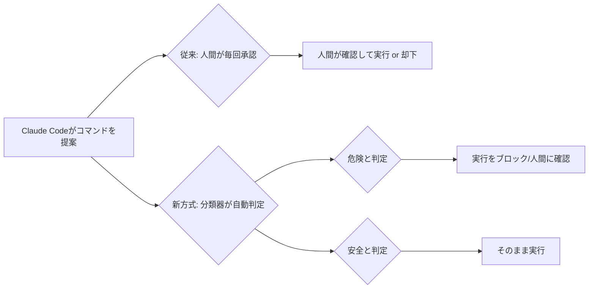
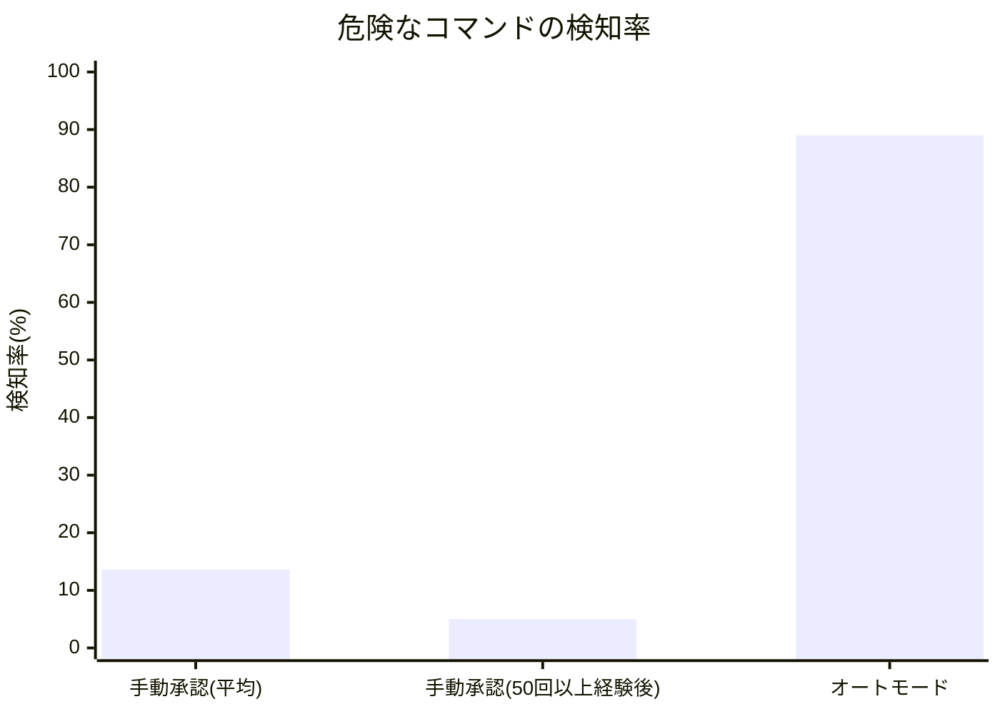
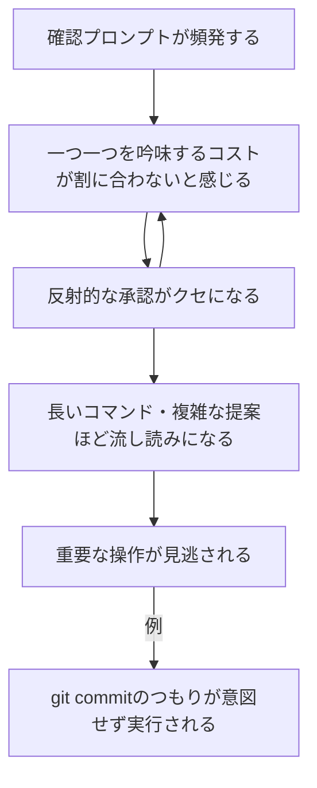

# Claude Codeがオートモード標準化、設定は済んでますか？
## Claude Codeのオートモードが標準化されます

2026年8月14日から、Claude Codeの「オートモード」がPro・Max・Teamプランでデフォルト有効になります。これまでコマンド実行のたびに人間が承認していた仕組みが、専用の分類器（クラシファイア）による自動判定に置き換わるという変更です。

参考記事：[Claude Codeで「コマンド実行のたびに人間に判断を求める」という動作を改善するオートモードがデフォルトで有効化される予定 - GIGAZINE](https://gigazine.net/news/20260810-claude-code-auto-mode/)

便利になる変更ですが、ここで一度立ち止まって考えたいことがあります。**そもそも今の「人間による都度承認」は、本当に安全装置として機能していたのでしょうか？** Claude Codeでコーディングを進めているとき、こんな経験はないでしょうか。

- 承認ダイアログが何度も出てくるうちに、途中から中身を読まずにクリックしている
- コマンドが長いと、最後まで読まずに承認してしまう
- 「コミットしない」つもりだったのに、`git commit` を含む提案をそのまま承認してしまい、実際にコミットされていた

実はこれ、Anthropicが今回のオートモード標準化にあわせて公開したデータで、構造的に起きて当然の現象だったことがわかりました。データを削除してしまうなどの取り消しできない操作だけは自分の目で確認するように設定する必要があります。

## 結論：やることは3つ、まず1つ目だけでも5分でできる

先に、済ませておきたい設定をまとめます。詳しい理由やデータは後半で解説します。

1. **`~/.claude/settings.json` に `ask`/`deny` ルールを追加する**（最優先・5分）：`git commit`や`rm`など取り消し困難な操作を、オートモードでも必ず確認が出るように固定する
2. **`CLAUDE.md` に要約ルールを追加する**：長いコマンドを読み飛ばさず、実行前に一言要約させる
3. **`Stop`フックでdiffを自動表示する**：長時間セッションでも変更量を強制的に可視化する

やり方は「オートモード×最小限の人的チェックというハイブリッド構成」セクションにそのままコピペできる設定を載せています。「なぜこれが必要なのか」を知りたい方は、このまま読み進めてください。

## オートモードの仕組み

図にすると、次のような流れです。



この変更の背景には、人間による都度承認が安全装置として十分に機能していなかったというAnthropic自身の調査結果があります。

## データ1：承認率97%は「よく確認している証拠」ではなかった

[Anthropicの発表](https://claude.com/blog/auto-mode-default-in-claude-code)によれば、Claude Codeの権限確認プロンプトのうち **97%がユーザーによって承認されている** とのことです。

一見「多くの提案が安全に作られている証拠」に見えますが、Anthropicの解釈は逆でした。Claude Codeは1日に数十〜数百件ものセキュリティ判断をユーザーに求めており、確認そのものが負担になって重要なコマンドほど見落とされやすくなっています。承認率の高さは、むしろ多くのユーザーが中身を確認せず反射的に承認しているサインだ、というのがAnthropicの見立てです。

## データ2：人間の検知率は13.6%、しかも長時間作業ではさらに低下する

この仮説を検証するため、Anthropicは有償テスター1,053人を対象に実験を行いました。通常の承認待ちプロンプトの中に、危険なコマンド（実行はされないテキストのみ）を1つ紛れ込ませ、テスターがそれに気づけるかを測定したものです。

結果は次の通りです。

| 条件 | 危険なコマンドを検知できた割合 |
|---|---|
| 人間による手動承認（セッション全体平均） | **13.6%** |
| 人間による手動承認（50回以上プロンプトを経験した後） | **約5%** |
| オートモード（分類器による自動判定） | **89%** |



注目すべきは、確認プロンプトを50回以上経験すると、人間の検知率が **13.6%→約5%まで下がる** という点です。これはまさに「最初は真面目にコマンドを読んでいたのに、途中から惰性でクリックするようになる」という、冒頭で挙げた体感とぴったり一致します。

出典：[Auto mode is now the default in Claude Code for Pro, Max, and Team plans - Anthropic](https://claude.com/blog/auto-mode-default-in-claude-code)

## データ3：プロンプトインジェクション攻撃への耐性でも差が出た

第三者機関のTrajectory Labsが実施した検証でも、同様の傾向が確認されています。プロンプトインジェクション攻撃とは、悪意のある指示をコマンドやファイルの中に紛れ込ませて、AIに意図しない操作をさせようとする攻撃のことです。[Simon Willisonのレポート](https://simonwillison.net/2026/Aug/8/auto-mode/)によれば、Claude Sonnet 5、Claude Fable 5、Claude Opus 5（いずれもClaude Code上）と、GPT-5.6 Sol（Codex上）に対して、72種類のこうした攻撃を試みたテストが行われました。

- Codex + GPT-5.6 Solで自動承認モードを有効にした場合：**攻撃のブロック率94.17%**（5.83%は攻撃が成功してしまった）
- Claude Codeのオートモード：**攻撃のブロック率100%**（すべての攻撃を未然にブロック）

人間が一つずつ確認する方式よりも、Claude Codeのオートモードのように専用の仕組みで自動判定する方が、悪意のある攻撃に対しても高い防御力を発揮できることを裏付けるデータです。

## オートモード×最小限の人的チェックというハイブリッド構成

ここまでのデータは「人間が毎回確認する」方式と「オートモードにすべて任せる」方式を比較したものでした。ここで一つ疑問が生まれます。オートモードの方が優れているというデータを見ておきながら、なぜ一部だけ人間の確認に戻すことを提案するのか、という点です。

ポイントは「確認の量」です。Anthropicのテストで人間の検知率が下がっていたのは、1日に数十〜数百件という**大量の**確認を求められ続けたことが原因でした。オートモードの分類器も、実は同じ発想で動いています。すべてのコマンドを人間に見せるのではなく、危険と判定したものだけを人間に確認させることで、対象を絞り込んでいます（前掲の図を参照）。

つまり、これから紹介する設定は「オートモードの判断を疑って人間の確認を増やす」ものではなく、**「自分のプロジェクトで特に取り消しが困難な、ごく少数の操作」だけを、分類器の判断とは別に、自分の意思で確認対象に加えておく**という位置づけです。あくまで確認対象を最小限に絞ることが前提であり、リストを増やしすぎれば、今回のデータが示した「大量の確認による見落とし」を自ら再現してしまいます。

なお、この「オートモード＋最小限のask設定」という組み合わせ自体の効果を測定したデータは、今回参照した記事の中にはありません。あくまで、Anthropicが示した「確認の量が多いほど見落としが増える」という知見から導かれる、論理的な提案であることは補足しておきます。

### 設定1：本当に取り消せない操作だけを「必ず聞かれる」ように指定する

Claude Codeの権限ルールには `allow` / `ask` / `deny` の3種類があり、優先順位は **deny → ask → allow** の順です。重要なのは、`ask` に指定したコマンドは **オートモードやbypassPermissionsモードでも必ず確認プロンプトが出る** という点です。

ホームディレクトリの `~/.claude/settings.json`（全プロジェクト共通の個人設定）に、次のように追記しましょう。

```json
{
  "permissions": {
    "ask": [
      "Bash(git commit *)",
      "Bash(git push *)",
      "Bash(rm -rf *)"
    ],
    "deny": [
      "Bash(git push --force *)",
      "Bash(git push --force-with-lease *)"
    ]
  }
}
```

- `ask`：本当に取り消しが困難な操作だけに絞って列挙します。ここに入れておけば、オートモードが有効でも自動実行されず、確認ダイアログが出ます。上記の`git commit`や`rm -rf`はあくまで一例で、デプロイコマンドやDB操作など、自分のプロジェクトで元に戻せない操作があれば同じように追加しましょう。ただし数を増やしすぎないことが重要です
- `deny`：force pushなど「基本的に自分でも打ちたくない」操作は、そもそも実行自体を禁止してしまいます

チーム開発でこのルールを全員に強制したい場合は、個人設定ではなくプロジェクト直下の `.claude/settings.json`（Gitにコミットされる共有設定）に同じ内容を書けば、チームメンバー全員に適用されます。設定を変えたら、Claude Code内で `/permissions` と入力すると、現在有効なルールと読み込み元のファイルを一覧で確認できます。

### 設定2：絞り込んだ確認対象こそ「要約させてから」判断する

`ask`の対象を最小限に絞っても、そのコマンドが長ければ結局読み飛ばしてしまう可能性があります。せっかく絞り込んだ数少ない確認対象の質を上げるため、Claude Codeに実行前の要約を求める指示をプロジェクトの `CLAUDE.md`（Claudeへの永続的な指示ファイル）に書いておきましょう。

```markdown
# CLAUDE.md
## コマンド実行前のルール
- git commit / git push / rm を含むコマンドを実行する前は、
  必ず「何をするコマンドか」「元に戻せるか」を1行で要約してから提案すること
- 要約なしに長いコマンドをそのまま提案しない
```

これにより、長いコマンド文字列を自分で読み解く負担が減り、「要約を読んで判断する」というシンプルな確認フローに置き換えられます。

### 設定3：長時間セッションでは「区切りポイント」を機械的に作る

`ask`に指定した操作以外は自動実行されるため、長時間の連続セッションでは変更が積み上がっていることに気づきにくくなります。Claude Codeの `Stop` フック（1タスク完了時に発火する仕組み）を使い、一定の節目で差分サマリーを表示させましょう。`~/.claude/settings.json` に次を追加しましょう。

```json
{
  "hooks": {
    "Stop": [
      {
        "hooks": [
          {
            "type": "command",
            "command": "git diff --stat"
          }
        ]
      }
    ]
  }
}
```

これで、Claudeが一区切りの作業を終えるたびに変更ファイル数と行数の統計が自動表示されます。「今どれだけの変更が積み上がっているか」を都度可視化することで、`ask`で拾いきれなかった変更にも気づきやすくなります。

### まず何から始めればいいか

3つとも設定できるのが理想ですが、優先順位をつけるなら次の順番がおすすめです。

1. **設定1（ask/denyルール、対象は最小限に）**：5分でできて効果が一番大きい。まずこれだけでもやる
2. **設定2（CLAUDE.mdへの要約ルール）**：既存プロジェクトに1ファイル追加するだけ
3. **設定3（Stopフック）**：長時間の自動実行を多用する人向け

いずれの設定も、`ask`リストを増やしすぎないことが前提です。増やせば増やすほど、今回のデータが指摘した「大量の確認による見落とし」を、規模を小さくして繰り返すことになります。

## なぜ人間の確認は形骸化するのか：認知科学的な背景

ここまでの設定は「なぜ効くのか」を知らなくても使えますが、背景を知っておくと応用が効きます。

これはClaude Code特有の問題ではなく、セキュリティ分野で以前から知られている「**アラート疲れ（Alert Fatigue）**」「**自動化バイアス（Automation Bias）**」と同じ構造です。

セキュリティ運用センター（SOC）に関する研究でも、以下のような共通パターンが報告されています。

- アラートの量が多すぎると、分析担当者が一つ一つを吟味するコストを払わなくなり、重要な脅威を見逃す確率が上がる
- 誤検知（オオカミ少年状態）が続くと、ツールそのものへの信頼が低下し、確認作業がさらに雑になる
- 疲労や燃え尽き（バーンアウト）が、継続的な高負荷の確認作業によって引き起こされる

つまり、「同じような確認を繰り返し求められる」状況では、人間の注意資源は必ず摩耗していきます。Claude Codeの権限プロンプトも、構造的にはこれと同じ問題を抱えていたと言えます。



## まとめ

- Claude Codeのオートモードが2026年8月14日から標準化される。すべてを人間が確認する運用は「機能していなかった」ことがデータで示されたため、確認プロセスを整理し、絶対に任せてはいけない操作だけを承認対象として残す
- Claude Codeの権限プロンプトは97%が承認されているが、これは「安全性の証」ではなく「確認の形骸化」のサインだった
- 人間による危険コマンドの検知率は平均13.6%、確認プロンプトを50回以上経験すると約5%まで低下する
- オートモード（分類器による自動判定）は同条件で89%を検知し、プロンプトインジェクション攻撃も含めて人間の手動承認より高い信頼性を示した
- これはClaude Code固有の問題ではなく、セキュリティ分野で以前から知られる「アラート疲れ」「自動化バイアス」と同じ構造
- 取り消し困難な操作を防ぐには、`ask`/`deny`ルールを最小限に絞って追加するのがおすすめです。ただし対象を増やしすぎると、同じ「大量の確認による見落とし」を自ら再現してしまう点には注意しましょう

## 参考リンク

- [Claude Codeで「コマンド実行のたびに人間に判断を求める」という動作を改善するオートモードがデフォルトで有効化される予定 - GIGAZINE](https://gigazine.net/news/20260810-claude-code-auto-mode/)
- [Auto mode is now the default in Claude Code for Pro, Max, and Team plans - Anthropic](https://claude.com/blog/auto-mode-default-in-claude-code)
- [Auto mode is now the default in Claude Code - Simon Willison's Weblog](https://simonwillison.net/2026/Aug/8/auto-mode/)
- [Anthropic is turning Claude Code's auto mode on by default - TechCrunch](https://techcrunch.com/2026/08/09/anthropic-is-turning-claude-codes-auto-mode-on-by-default/)
