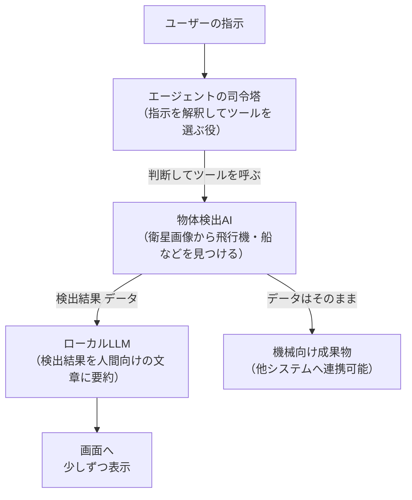
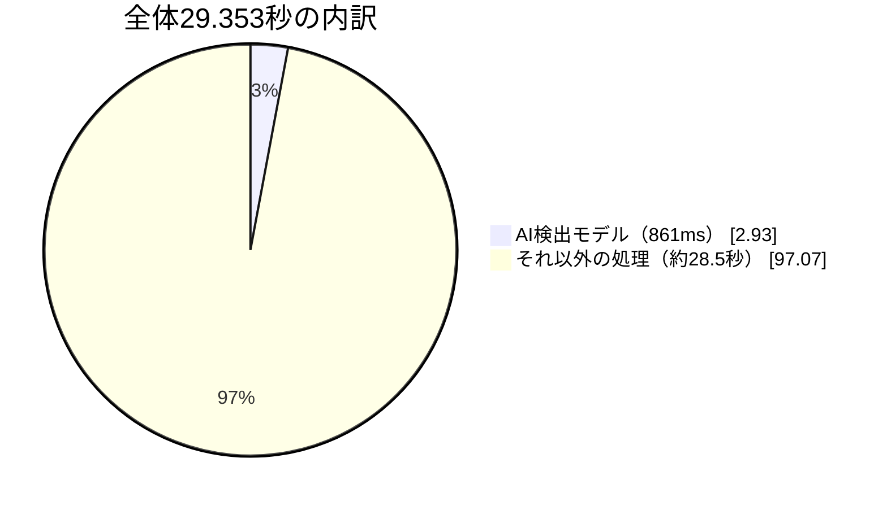
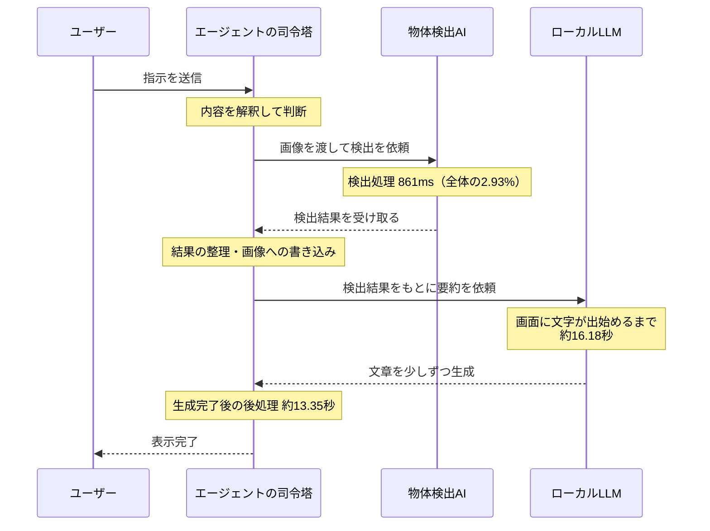
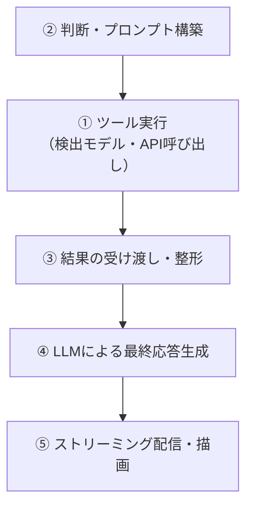

# 検出処理はわずか3%。衛星向けAIエージェント論文から学ぶ『本当のボトルネック』

## 結論から言います

「AIエージェントが遅い」と感じたとき、多くの人はまずLLMやモデルの推論速度を疑います。

しかし2026年8月に公開されたある論文では、衝撃的な数字が出てきました。

> **AIエージェントの全体処理時間29.3秒のうち、AI検出モデルの処理時間はわずか861ミリ秒（2.93%）**

残りの**97%は、AIモデルではない部分**で消費されていました。

この記事では、衛星搭載AIを題材にしたその論文 [*SAT-Edge-Agent: Hardware-in-the-Loop Edge-Agent Orchestration for Onboard Satellite Intelligence*](https://arxiv.org/abs/2608.03728)（He & Xu, 2026）を、LangGraphやLLMエージェントを開発する私たちの目線で読み解きます。衛星の話は正直「掴み」でしかなく、本質は**AIエージェントを組んでいる人全員に関係のある話**です。

> 「LangGraph」「AutoGen」というのは、AIに「考えて」「ツールを使って」「答えを返して」という一連の作業をやらせるための開発フレームワーク（土台となるライブラリ）です。この記事では詳しい使い方には触れませんが、「AIに複数のステップを自動でやらせる仕組み」くらいの理解で読み進めて大丈夫です。

## そもそもこの論文は何をした研究か

タイトルだけ見ると「衛星」「宇宙」というワードで身構えてしまいますが、中身は意外と身近です。

やっていることをひとことで言うと、

> **市販の安いエッジコンピューター上で、「画像を見て判断し、ツールを呼び出し、結果を返す」というAIエージェントを動かし、どこに時間がかかっているかを実測した**

という、地に足のついた計測研究です。宇宙で実際に飛ばしたわけではなく、地上に置いた実験用のボード（小型コンピューター）で確かめたものです。論文ではこれを「HIL（Hardware-in-the-Loop）」と呼んでいますが、ざっくり言うと「シミュレーションや机上の計算ではなく、本物の機械を実際に動かして時間を測った」という意味だと捉えてください。

### システム構成

構成をシンプルに図にすると、次のようになります。

登場する用語を簡単に補足します。

| 用語 | 意味 |
|---|---|
| エージェントの司令塔（論文ではFastAPI + LangGraph） | ユーザーの指示を受け取り、「今何をすべきか」を判断してツールを呼び出す部分。FastAPIはPythonでAPI（プログラム同士のやり取り窓口）を作るための道具、LangGraphはAIに複数ステップの作業をやらせるための道具です |
| 物体検出AI（論文ではYOLOスタイルのOBB検出） | 画像の中から「これは飛行機」「これは船」のように物体を探し出すAI。YOLOはその代表的な手法の名前です |
| ローカルLLM | インターネット上のサービスではなく、自分の手元のマシン上で動く言語モデル（ChatGPTのようなAI）のこと |
| 少しずつ表示（論文ではSSE配信） | AIの回答を一気に表示するのではなく、生成されたところから順番に画面に流し込んでいく仕組み。ChatGPTの回答が少しずつ表示されていくのと同じ仕組みです |

ポイントは、**「機械が読むためのデータ」と「人間が読む要約文」を明確に分離している**設計です。物体検出の結果はそのまま他のシステムに渡せる正式な成果物として扱い、AIが作る要約文はあくまでオプションの付加価値、という位置づけです。これはAIエージェントを設計するときの一つの型として覚えておいて損はありません。

## 実験内容

固定した2つのワークロードを、それぞれ20回ずつ実行しています。

| ワークロード | 内容 | 試行回数 |
|---|---|---|
| 単一画像 | 画像1枚を検出 | 20回（20/20成功） |
| 直列2画像 | 画像2枚を順番に検出 | 20回（20/20成功） |

## 衝撃の数字：検出処理はたった3%

実測結果がこちらです。

| 指標 | 単一画像 | 直列2画像 |
|---|---|---|
| **エージェント全体の平均処理時間** | 29.353秒 | 60.937秒 |
| 全体の遅い方から5%のライン（P95） | 31.166秒 | 66.882秒 |
| **AI検出モデルの平均処理時間** | 861ミリ秒 | 1,511ミリ秒 |
| **検出処理が全体に占める割合** | **2.93%** | **2.48%** |
| 画面に最初の文字が出るまで | 16.18秒 | 28.79秒 |
| その後、文章が生成され終わるまで | 13.35秒 | 33.39秒 |

※「遅い方から5%のライン（P95）」とは、20回試したうちの遅い方から数えて上位5%あたりに位置する数値のことです。平均だけでなく「運が悪いとどれくらい待たされるか」の目安になります。

出典：論文 Table 6, Table 7（[arXiv:2608.03728](https://arxiv.org/abs/2608.03728)）

割合にすると、こうなります（単一画像ワークロードの場合）。

つまり、単一画像の処理では**29秒のうち約28.5秒がAI検出モデル以外の処理に使われている**ことになります。

さらに、時間軸で見るとどこで詰まっているのかがよくわかります。エージェントがリクエストを受け取ってから完了するまでの流れをタイムラインにすると、次のようになります。

この図からわかるとおり、AI検出モデルが働いている時間（青い部分）はごく一瞬で、それ以外の「判断」「受け渡し」「文章の生成」「後処理」に多くの時間が使われています。

論文自身も、この「AI検出モデル以外」の内訳をはっきりとは分解できていません。ただし、残りの時間がエージェントの判断・結果の受け渡し・画像への書き込み・文章生成の配信などに分散していて、すべてを言語モデルの生成時間のせいにはできないと述べています。これは誠実な姿勢だと思います。「文章の生成が遅いから全部AIのせい」と決めつけていない点は見習いたいところです。

## これは衛星特有の話なのか？

ここが今回一番伝えたいポイントです。**いいえ、これは衛星に限った話ではありません。**

同じ指摘は、通常のクラウド環境で動くLLMエージェントの世界でも繰り返し語られています。いくつか裏を取ってみました。

### 他の研究・記事でも同じ現象が報告されている

| 出典 | 指摘内容 |
|---|---|
| [Near-Zero Latency Multi-Agent Systems](https://medium.com/@balazskocsis/near-zero-latency-multi-agent-systems-why-your-orchestration-layer-matters-more-than-your-llm-224f4f9c2791)（Medium, 2026） | システムが重い・遅い・運用コストが高いと感じるとき、原因はAIモデルそのものではなく、「AIに何をどの順番でやらせるか」を制御する土台部分にあることが多いという指摘。判断を毎回すべてAIに投げてしまう作りだと、本来決まりきった処理でもその都度AIとのやり取りが発生し、待ち時間が積み重なってしまう |
| [The Hidden Bottlenecks in LLM Inference](https://www.digitalocean.com/community/conceptual-articles/bottlenecks-llm-inference-optimization)（DigitalOcean, 2026） | 「AIの計算部分だけを速くすれば良い」と考えがちだが、実際には文章の入力準備・形式チェック・通信の振り分け・記録用のログ出力・画面への表示処理など、AIの計算前後にある地味な処理の積み重ねが、体感速度を大きく左右すると指摘 |
| [Reducing Latency of LLM Search Agent](https://arxiv.org/pdf/2511.20048)（arXiv:2511.20048） | AIが「考える」フェーズと「ツールを使う」フェーズが順番待ちの関係になっていること自体が、エージェントの遅さの根本原因だと分析。AIが考え終わるまでツールを使えず、ツールの結果が返るまで次の判断もできない、という一つずつ順番に進む構造が遅延を積み上げていく |

まとめると、業界内でも「**AIエージェントの遅さの正体は、モデルそのものではなく、判断・受け渡し・待機の直列構造にある**」という認識は共通しています。SAT-Edge-Agentの論文は、それを衛星というちょっと変わった舞台で、実測データとしてはっきり裏付けた点に価値があると言えます。

## 自分たちの開発現場への教訓

ここからは実務目線での話です。もし普段LangGraphやAutoGenなどのフレームワーク、あるいは自作の仕組みでAIエージェントを開発しているなら、一度自分のシステムでも同じ計測をしてみることをおすすめします。

具体的には、以下を分けて計測すると、この論文と同じ構造が見えてくるはずです。

①がAI検出モデル本体、②〜⑤がボトルネックの疑いが強い部分です。この論文が示唆するように、多くの場合ボトルネックは①ではなく②〜⑤に潜んでいます。もし「LLMを速いモデルに変えたのに全然速くならない」という経験があるなら、それはまさにこの構造が原因かもしれません。

## この論文が「言っていないこと」にも注目

技術記事としてバズる論文ほど話を盛りがちですが、この論文はむしろ逆で、「言っていないこと」を明確に線引きしている点が誠実です。

- 検出モデル自体の精度（どれだけ正しく物体を見つけられたか）は評価していない → 「新しい検出アルゴリズムの提案」ではない
- 地理座標（緯度経度）の算出は新しい測位技術ではなく、もともとデータセットに付属している情報をそのまま転記しているだけ
- 消費電力・エネルギー効率の計測は、本実験とは別の日に別条件で行った予備的な参考値にすぎず、正式な電力効率の主張はしていない
- 実際に宇宙で動作させたわけではなく、「宇宙空間で実際に使える」という証明や、宇宙特有の放射線に耐えられるという証明は一切していない

この「盛らない誠実さ」も、エンジニアとして参考にしたい書き方だと思います。

## まとめ

- 衛星向けAIエージェントの実測実験で、AI検出モデルの処理時間は全体のわずか**2.93**%だった
- 残り97%は、AIエージェントの判断・ツール呼び出しの受け渡し・文章の生成・画面への表示など、「AIモデルの周りの処理」に費やされていた
- この傾向は衛星特有ではなく、**LangGraphやAutoGenなど一般的なAIエージェント開発でも共通して指摘されている**現象
- モデルを高速化・軽量化する前に、まず自分のエージェントの「モデル以外の部分」の処理時間を計測してみる価値がある

「AIモデルを変えれば速くなる」と思い込む前に、一度自分のエージェントのタイムラインを分解してみてください。案外、ボトルネックはもっと地味なところに潜んでいます。

## 参考文献

- He, L., & Xu, J. (2026). *SAT-Edge-Agent: Hardware-in-the-Loop Edge-Agent Orchestration for Onboard Satellite Intelligence*. arXiv:2608.03728. https://arxiv.org/abs/2608.03728
- Kocsis, B. (2026). *Near-Zero Latency Multi-Agent Systems: Why Your Orchestration Layer Matters More Than Your LLM*. Medium. https://medium.com/@balazskocsis/near-zero-latency-multi-agent-systems-why-your-orchestration-layer-matters-more-than-your-llm-224f4f9c2791
- DigitalOcean. (2026). *The Hidden Bottlenecks in LLM Inference and How to Fix Them*. https://www.digitalocean.com/community/conceptual-articles/bottlenecks-llm-inference-optimization
- *Reducing Latency of LLM Search Agent via Speculation-based Algorithm-System Co-Design*. arXiv:2511.20048. https://arxiv.org/pdf/2511.20048
