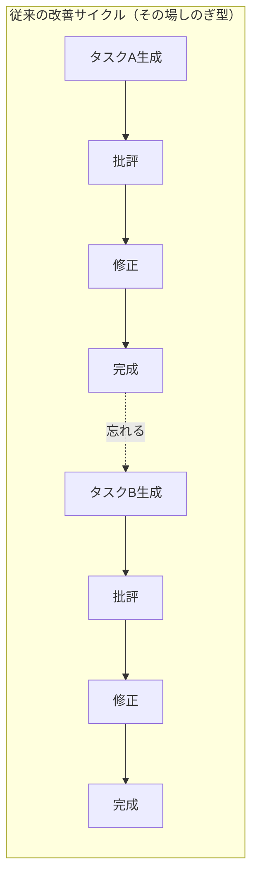
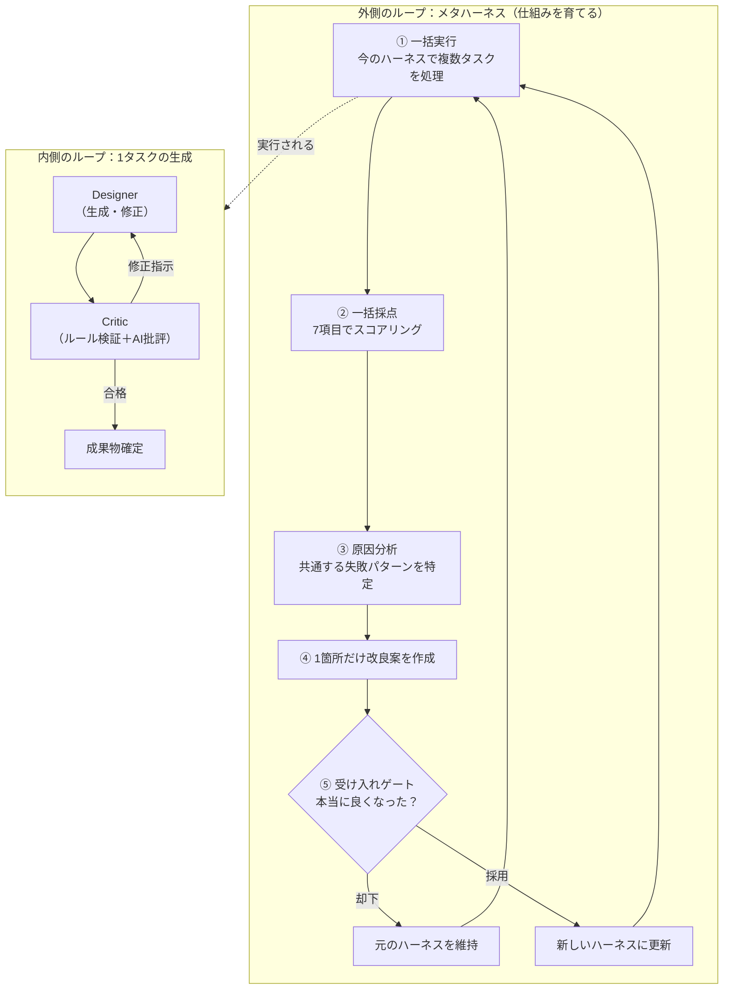
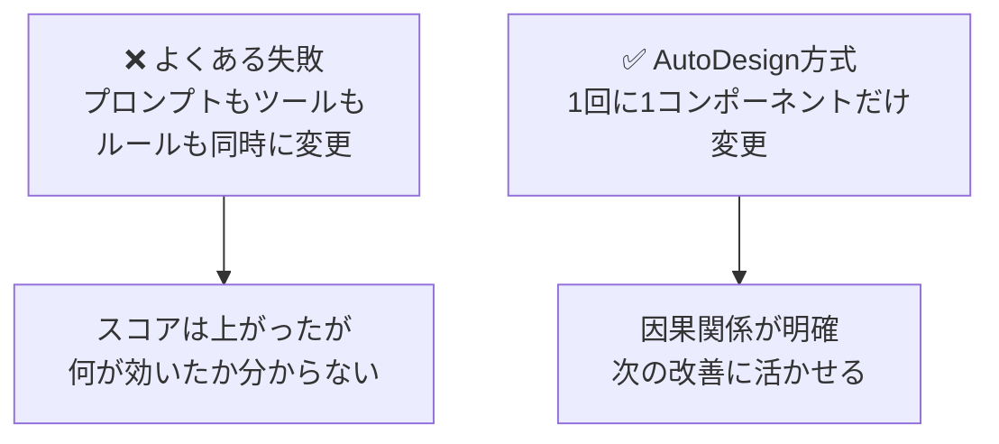
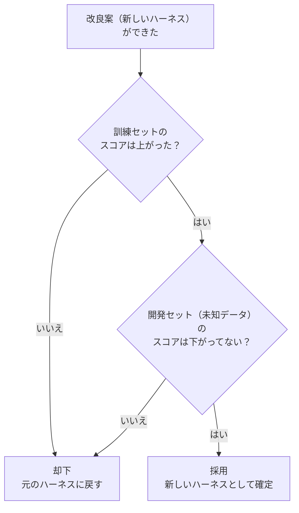
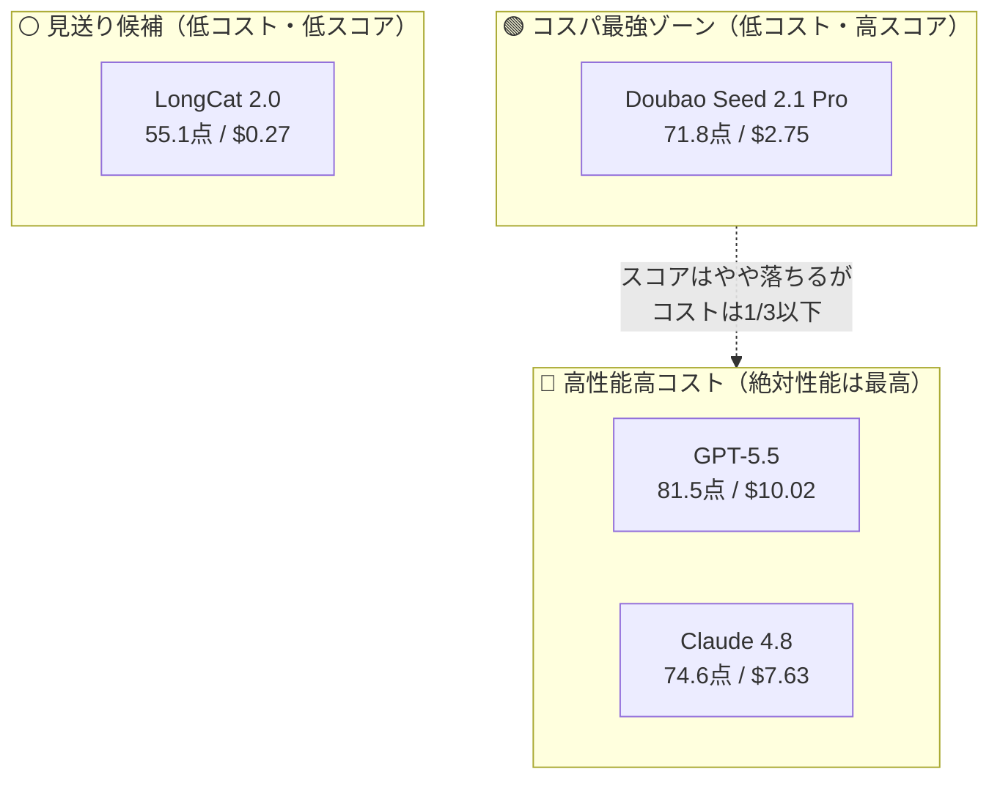
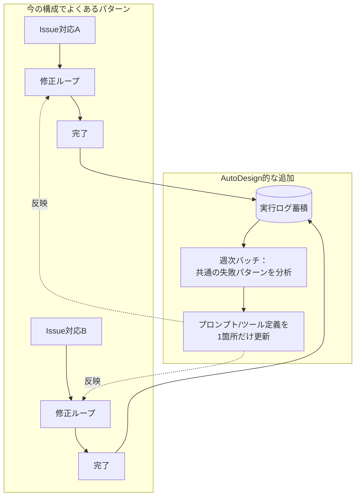

# AIエージェントは「賢いモデル」より「賢い仕組み」で決まる - AutoDesign論文を実務目線で読む
## はじめに

「同じClaude CodeやGPT-5.5を使っているのに、なぜかあのチームのAIエージェントだけ成果物のクオリティが高い」

そんな経験、ありませんか？

2026年8月に公開された論文 **「AutoDesign: Meta-Harness Optimization for Long-Horizon Agentic Design」**（[arXiv:2608.13560](https://arxiv.org/abs/2608.13560)）は、この「差」の正体を構造的に説明してくれる論文です。

一言でいうと、この論文が言っていることはこうです。

> **モデルの性能を上げるのではなく、モデルの「周りの仕組み（ハーネス）」自体を自動で育てていけば、安いモデルでも高いモデルでも大幅に成果物の質が上がる**

しかも、そのために使っているのは特別なモデルではなく、Claude CodeやCodexといった、私たちが普段使っているコーディングエージェントです。つまり「賢いAIを使う」話ではなく、「**AIの使わせ方を、AI自身に改善させ続ける仕組み**」の話です。

自分でLangGraphなどを使ってAI開発エージェントを組んでいる方には、特に刺さる内容だと思うので、なるべく専門用語を噛み砕きながら解説していきます。

:::message
この記事は論文の内容を要約・翻訳・図解したものです。数値や引用は原著論文に基づいています。詳細な検証や再現実験は行っていないため、正確な数値や実装詳細は原著論文を参照してください。
:::

## この記事でわかること

- なぜ「モデルを賢くする」だけでは頭打ちになるのか
- AutoDesignが採用した「ハーネスを自動で育てる」という発想
- 実務のAIエージェント開発にそのまま使える3つの設計パターン
- 安いモデルでもこの手法が効く理由（コスパの話）

## 何を解決する研究なのか（お題：論文をポスターにする）

この論文の実験対象は「**学術論文1本を、そのまま学会発表用ポスター（画像1枚）に自動変換する**」というタスクです。

一見ニッチに見えますが、これは実は多くの実務エージェント開発と同じ構造を持つ「難しいタスク」です。

- 長い文書（論文）から重要な情報を抜き出す（要約・抽出）
- 抜き出した情報を、決まったフォーマット（ポスター）に落とし込む（生成）
- レイアウト崩れ・情報の欠落・誤字脱字がないか確認する（検証）
- ダメならどこを直すか判断して直す（修正）

これはそのまま「**議事録から資料を自動生成する**」「**要件定義書からコードを自動生成する**」といった実務エージェントの構造と同じです。だからこそ、この論文の知見は汎用的に使えます。

## 既存手法の壁：「その場しのぎ」の改善で止まっている

まず、この論文が乗り越えようとした壁を理解しましょう。

多くのAIエージェントは、こういう改善サイクルを持っています。

1. 生成する
2. AI（批評役）がチェックする
3. 指摘に従って直す
4. 良くなるまで2〜3を繰り返す

これ自体は間違っていません。ただし論文はここに重要な指摘をしています。

> 人間のクリエイターは、成功や失敗の経験を積み重ねて「腕」を上げていく。しかし多くのAIシステムは、フィードバックを**その場限りの信号**として扱い、次のタスクには引き継がれない。

つまり、**「今日直したこと」が「明日別のタスクをやるときの糧」になっていない**、というのが問題意識です。

これを図にすると、こうなります。

タスクAでどれだけ試行錯誤しても、その学びはタスクBには一切引き継がれません。毎回ゼロからのスタートです。

## 従来手法とAutoDesignは何が違うのか（比較表）

細かい仕組みに入る前に、「結局何が変わって、何が良くなったのか」を先に一覧で押さえておきましょう。

| 観点 | 従来の代表的な手法 （Self-Refine, Reflexion など） | AutoDesign |
|---|---|---|
| **直す対象** | 今回の出力そのもの（この1枚のポスター） | 出力を作る「仕組み」自体（ポスターの作り方） |
| **学びの引き継ぎ** | されない。次のタスクはゼロから | される。複数タスクの結果を毎回集約して蓄積 |
| **1回に直す範囲** | 決まっていない（プロンプトもツールも同時に変えがち） | 5部品のうち**1箇所だけ**に限定 |
| **過学習への対策** | 基本的になし | 「訓練セットで改善・開発セットで悪化なし」を両方満たすまで不採用 |
| **人の関わり方** | 都度、人が結果を見て手動で調整することが多い | 自動でループを回しつつ、任意で人が方向修正を差し込める |
| **効果の検証範囲** | その場のタスク1件のみ | 複数タスクの平均スコアで判断 |

表にすると分かる通り、従来手法が「**1枚の絵を上手く描く方法**」だとすると、AutoDesignは「**絵の描き方そのものを、描けば描くほど上達させる仕組み**」を作った、という違いです。

ここからは、この違いを生んでいる具体的な仕組みを、図を使って見ていきます。

## AutoDesignの発想：「二重ループ」で仕組み自体を育てる

AutoDesignは、この問題を「**2つのループを入れ子にする**」ことで解決しています。

- **内側のループ（Inner Loop）**：1つのタスクの中で、生成→批評→修正を繰り返す（従来と同じ）
- **外側のループ（Outer Loop）**：複数のタスクの結果をまとめて振り返り、「仕組み（ハーネス）」自体を1箇所だけ改良する（ここが新しい）

図で見るとこうです。

ポイントは、**外側のループが直接「ポスター」を直しているのではなく、「ポスターを作る仕組み」を直している**という点です。

たとえるなら、生徒（内側のループ）にテストを解かせて、点数が低かった箇所の傾向を見て、**先生が教え方（外側のループ）そのものを変える**イメージです。1人の生徒の答案を消しゴムで直すのではなく、クラス全体の授業のやり方を改善する、という発想です。

## なぜ「1箇所だけ」しか直さないのか

外側のループでは、システムを次の5つの部品に分解しています。

| 部品 | 役割 |
|---|---|
| Context & Memory | 論文からの情報抽出、プロンプト、再利用可能な資産 |
| Tools & Specifications | 使えるツールと、レイアウトなどの仕様 |
| Execution Runtime | 生成・レンダリング・検証・書き出しの実行環境 |
| Orchestration | タスクの割り振り、試行回数の上限、候補選択のルール |
| Evaluation & Feedback | ルールベースの検証と、AIによる視覚批評 |

そして重要なルールがあります。

> **1回の改良サイクルでは、この5つのうち1つだけしか変更してはいけない**

これは地味に見えて、実務的にはとても重要な設計判断です。理由はシンプルで、**「何を直したから何が良くなったのか」を後から追跡できるようにするため**です。

もし「プロンプトも直しました、ツールも変えました、検証ルールも足しました」を同時にやってしまうと、スコアが上がっても下がっても「結局どれが効いたのか」が分からなくなります。これは実務のプロンプトチューニングやエージェント改善でも、非常によくある失敗パターンではないでしょうか。

## 一番重要な工夫：「受け入れゲート」で過学習を防ぐ

外側のループで一番よく設計されていると感じたのが、この「**受け入れゲート（Acceptance Gate）**」です。

改良案ができたら、それを**2種類のデータセット**に対して試します。

- **訓練セット**：改良の元になった、既に見たことがあるタスク群
- **開発セット**：改良には一切使っていない、初めて見るタスク群

そして、改良案を採用するかどうかの条件はこうです。

> **訓練セットのスコアが「上がった」　かつ　開発セットのスコアが「下がっていない（維持でもOK）」**

これが無いと何が起きるか。「見たことがある問題にだけ強くなり、初めて見る問題には逆に弱くなる」という**過学習**が起きます。実務でよくある「特定のテストケースだけ通るようにプロンプトをチューニングしていたら、本番で全然違う失敗をした」というやつです。

開発セットは、改良を作る側（プランナー役のAI）には一切見せません。「答えを知らない抜き打ちテスト」として使うことで、公平な効果測定をしています。これは機械学習の「訓練データ／検証データを分ける」という古典的な考え方を、プロンプトエンジニアリングやハーネス設計の世界に持ち込んだ形とも言えます。

## 結果：安いモデルほど伸びしろが大きい

この仕組みを実際に7種類のモデル構成に適用した結果が、これです（論文 Table 4「Effect of attaching DesignHarness」より、PosterBench-mini 10論文での検証）。

| モデル | ハーネス無し | ハーネス有り | 伸び幅 |
|---|---|---|---|
| DeepSeek V4 Pro（安価） | 34.7点 | 54.3点 | **+19.6** |
| LongCat 2.0（$0.27/枚） | 43.3点 | 55.1点 | +11.9 |
| GLM 5.2（安価） | 50.3点 | 64.3点 | +14.0 |
| Kimi K2.7 | 57.2点 | 70.1点 | +12.9 |
| Doubao Seed 2.1 Pro | 54.0点 | 71.8点 | +17.8 |
| Claude 4.8 | 69.5点 | 74.6点 | +5.0 |
| GPT-5.5 | 75.9点 | 81.5点 | +5.6 |

*出典: 論文 Table 4（PosterBench-mini, 10-paper subset）。7構成の平均では54.99点→67.39点（+12.4%）の改善が報告されている。*

なお、100論文規模の本評価（PosterBench Main Track, Table 1）でも、AutoDesign（DesignHarness × Claude Code × Claude 4.8）は78.32点を記録し、商用のClaude Designを7.45点、OpenDesignを8.87点上回っています。

ここから読み取れる実務的な示唆は2つあります。

1. **安いモデルほど、仕組みによる底上げ効果が大きい**（DeepSeekは+19.6点も伸びている）
2. ただし**絶対スコアでは高価なモデルが依然として上**（GPT-5.5が最終的に最も高い）

つまり「仕組みが良ければモデルは何でもいい」わけではなく、「**仕組みへの投資は、モデルのグレードに関わらず全部乗せで効いてくる**」というのが正確な理解です。コスト重視ならDoubao Seed 2.1 Proあたりが、コストと性能のバランスが良い「お得ゾーン」として紹介されています。

*出典: 論文 Figure 8（PosterBench-mini 10論文でのコスト対効果比較）。*

## 自動採点だけでなく、人手評価でも裏付けられている

ここまでのスコアはAI（VLM）による自動採点でしたが、この論文は「自動採点が甘くなっていないか」を確認するために、**人間によるブラインド評価**も別途実施しています（論文 Section 5.3, Figure 9）。

条件は次の通りです。

- 11人のボランティアレビュアーが参加
- どの手法で生成されたポスターかを伏せた状態（システムブラインド）で、2枚のポスターを見比べて「どちらが良いか／互角か」を判定
- 100論文 × 4システムの全ペアで実施し、合計936件の回答（うち933件が有効な順位判定）を収集
- 統計的な強さの推定にはBradley–Terryモデル（スポーツの実力比較などにも使われる手法）を使用

結果は以下の通りです。

| システム | ランダムな相手に勝つ確率（Bradley–Terry推定） |
|---|---|
| **AutoDesign** | **64.0%**（95%区間: 55.2–77.8%） |
| Claude Code（素のエージェント） | 51.7% |
| OpenDesign | 43.4% |
| Claude Design（商用） | 40.9% |

*出典: 論文 Figure 9(a)。*

さらに、AutoDesignと各手法の直接対決（頭一頭比較）では、Claude Codeに対して44%対21%、Claude Designに対して55%対20%でAutoDesignが優勢という結果も報告されています（Figure 9b、残りは「ほぼ互角」の判定）。

つまり「AIによる自動採点だけが良かった」わけではなく、**人間が見てもAutoDesignの成果物の方が好まれる傾向**が、独立した評価設計で確認されている、というのがこのデータの客観性を支えるポイントです。

## 実務のエージェント開発にどう活かすか

ここからが本題です。自分でAIエージェントを開発している方向けに、この論文から持ち帰れる設計パターンを3つにまとめます。

### パターン1：「1タスクの評価ループ」と「複数タスクの改善ループ」を分ける

多くの自作AIエージェントは、内側のループ（1タスクを合格点まで直す）だけを実装しがちです。例えば「実装→テスト→スコアリング→90点になるまで修正」というループです。これ自体はとても実用的ですが、AutoDesignの視点を加えるなら、こういう問いを持てます。

> 「今日90点まで頑張って直したこのIssue対応のノウハウは、来週の別のIssue対応に引き継がれているか？」

引き継がれていないなら、それは「内側のループ」しか無い状態です。複数のタスク実行ログを定期的にまとめて振り返り、プロンプトやツール定義そのものを更新する「外側のループ」を、月次や週次のバッチ処理として追加するだけでも、この論文の考え方を部分的に導入できます。

### パターン2：改善は「1箇所だけ」に絞る

プロンプトを改善するとき、つい「ついでにこれも直しておこう」をやりがちです。しかし効果測定の再現性を上げたいなら、**1回のリリースで変更する対象を1つに絞る**というルールを自分に課すだけで、デバッグしやすさが大きく変わります。

### パターン3：「見たことのないデータ」で効果を検証する

プロンプトを直したら、直すきっかけになった失敗ケースだけでなく、**それとは別の未使用ケースでも悪化していないか**を必ず確認する、というのは今日からでも真似できる習慣です。

## まとめ

- AIエージェントの成果物の質は、モデルそのものだけでなく「**モデルの周りの仕組み（ハーネス）**」に大きく左右される
- AutoDesignは、1タスクの試行錯誤（内側のループ）と、複数タスクを振り返って仕組み自体を改良する（外側のループ）を分離した
- 改良は5つの部品のうち**1箇所だけ**に絞り、**訓練データで改善・未見データで悪化なし**の両方を満たしたときだけ採用する「受け入れゲート」で過学習を防いでいる
- この仕組みは安いモデルほど伸び幅が大きく、既存のClaude CodeやCodexといった手持ちのツールと組み合わせて使える

「賢いモデルを追いかける」フェーズは、そろそろ「賢い仕組みを設計する」フェーズに移りつつあるのかもしれません。自作のAIエージェントに「振り返って自分自身を改善する仕組み」を足せないか、一度考えてみる価値はありそうです。

## 参考文献

- Luo, Y. et al. "AutoDesign: Meta-Harness Optimization for Long-Horizon Agentic Design." arXiv:2608.13560, 2026. https://arxiv.org/abs/2608.13560
