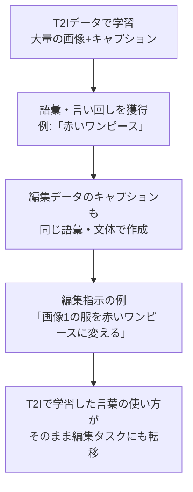
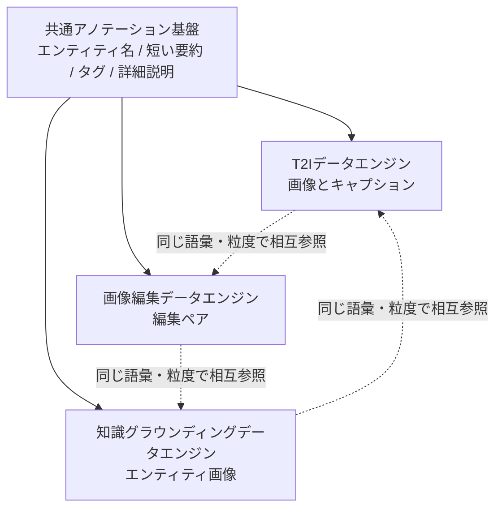
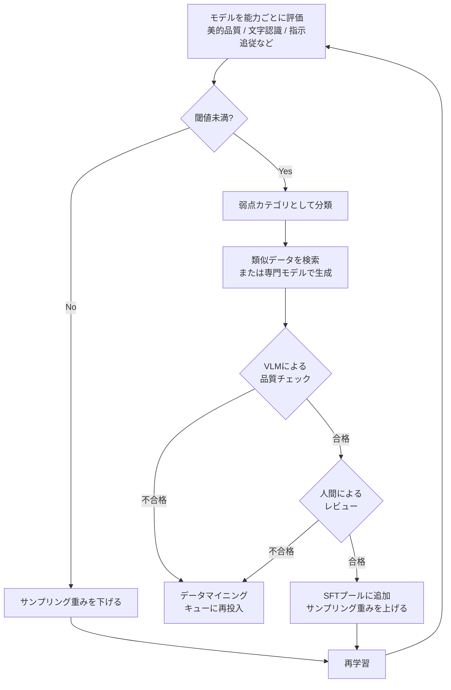

# 画像生成AIの"データの作り方"が変わった話 ― Alibabaの「能力駆動型データ基盤」を読む
## はじめに

「モデルのアーキテクチャを工夫する」よりも「学習データの作り方・与え方を工夫する」ほうが効くーーそう言われても、正直ピンとこない人が多いのではないでしょうか。

今回紹介するのは、Alibaba GroupがarXivに投稿した論文 **「From Corpora to Co-Evolving Capabilities: Capability-Centric Data Design for Generalist Image Generation」**（[arXiv:2608.18076](https://arxiv.org/abs/2608.18076)）です。

この論文がやっていることを一言でいうと、**「タスクごとにデータセットを作る」のをやめて、「AIに獲得させたい能力ごとにデータの供給網を設計する」**という発想の転換です。

T2I（テキストから画像生成）用のデータと、画像編集用のデータを別々に作るのではなく、両方が言葉の使い方・粒度を共有しながら育っていく仕組みを作ることで、4.4億枚のT2Iコーパス、1.2億組の編集ペア、2,700万組の画像-エンティティペアという巨大なデータ基盤を、単なる寄せ集めではなく「相互に転移可能な」形で構築しています。

本記事では、この論文の考え方を、モデル構造の詳細には深入りせず「データ設計・運用の仕組み」に焦点を当てて解説します。

## この記事で得られること

- 「タスク別データ」と「能力別データ」の違いが具体的にイメージできるようになる
- なぜタスクごとにデータを分けて作ると非効率になるのかがわかる
- 「能力ギャップ駆動フィードバックループ」という、評価結果を学習データの改善に直結させる仕組みが理解できる
- 大規模な画像生成モデルの話に限らず、自分のRAGシステムやファインチューニングにも応用できる考え方が持ち帰れる

## 従来の作り方と何が違うのか

| | 従来のデータ構築 | この論文の「能力駆動型」データ構築 |
|---|---|---|
| データの単位 | タスクごとに独立したデータセット（T2I用、編集用をそれぞれ別々に構築） | 「能力」を軸にデータを設計し、共通のアノテーション形式でタスク間の相互参照を可能にする |
| キャプションの作り方 | データセットごとにバラバラなルール・粒度 | エンティティ名・短い要約・詳細説明などを**共通フォーマット**で全データセットに付与 |
| 学習の進め方 | 固定のデータ配合で一律に学習することが多い | 解像度・データ品質・タスク構成を、能力の獲得順序に合わせて5段階で変化させるカリキュラムを組む |
| 弱点への対応 | 学習後の評価は最終チェックにとどまりがち | 評価結果から弱点カテゴリを特定し、そこを狙ってデータを追加収集・生成する仕組みが学習プロセスに組み込まれている |
| 編集データの由来 | 主に元画像を人工的に加工した合成データ | 合成データに加え、SNSやECサイトに実在する「同じ人物・商品の別カット」を発掘し、より自然な変換ペアとして活用 |

## 「能力別データ」とはどういうことか

一番わかりにくいのが「タスク別からから能力別へ」という部分だと思うので、具体例で補足します。

例えば同じ1枚の画像に対して、以下のような複数の注釈を**共通の設計図に沿って**付けておきます。

- エンティティ名（何が写っているか）
- 短い一行タグ
- 中程度の説明文
- 詳細な長文キャプション

こうしておくと、T2I用のモデルは長文キャプションを、編集用のモデルは短いタグを、知識グラウンディング用のモデルはエンティティ名を、**同じ元データから使い分けられます**。

この論文で特に効いているのが、**画像編集の指示文をT2Iのキャプションと同じ語彙・同じ文体で書く**という工夫です。まずは全体の流れを図で見てみましょう。

つまり「画像1の服を赤いワンピースに変える」という編集指示の「赤いワンピース」という表現が、T2Iキャプションで使われているのと同じ言い回しで書かれているため、T2Iで学習した言葉の使い方が、そのまま編集タスクにも転移します。

つまり、データを1つの巨大なファイルにまとめるということではなく、**「複数のデータセットが同じ"言語・粒度の設計図"を共有している」状態を作る**、というのがこの論文のやり方です。

## 全体像をMermaidで整理する

3つの専門データエンジン（T2I／編集／知識グラウンディング）が、共通のアノテーション基盤を介して相互に転移し合う構造を図にすると、以下のようになります。

さらにこの3つのエンジンから供給されたデータは、そのまま学習に使われるのではなく、モデルの評価結果に応じて継続的に選別・追加されていきます。この「能力ギャップ駆動フィードバックループ」が、この論文のもう一つの柱です。

ポイントは、新しく検索・生成されたデータが**そのまま学習に使われるわけではない**という点です。VLMによる自動チェックと人間によるレビューという2段階のフィルターを通過したものだけが、本番の学習データセット（SFTプール）に加えられます。また、弱点が解消されないカテゴリは次のサイクルでもサンプリングの重みを上げ続け、解消されたカテゴリは重みを下げる、という調整も継続的に行われます。

## 出典データで見る規模感

この基盤によって実際に構築されたデータ規模は以下の通りです（[arXiv:2608.18076](https://arxiv.org/abs/2608.18076) より）。

| データ種別 | 規模 |
|---|---|
| T2I（テキスト画像生成）コーパス | 約4.4億枚 |
| 画像編集ペア | 約1.2億組 |
| 画像-エンティティペア（知識グラウンディング） | 約2,700万組 |
| 知識グラフ由来の高顕著性エンティティ | 約300万件（Wikidataの1億件以上から抽出） |

このデータ基盤を使って学習された3B・6BパラメータのMM-DiTモデルは、画像編集の実世界ベンチマークであるCPI-Bench（[arXiv:2608.14546](https://arxiv.org/abs/2608.14546)）において、5点満点中 CPI-General 3.95〜3.96点、CPI-Practical 3.91〜3.92点というスコアを記録しています。

## 実務にどう活かせるか

Alibaba規模の計算資源やデータ資源をそのまま真似することは現実的ではありませんが、**考え方**としては転用できる部分が多くあります。

### 1. 複数タスクで使うデータには共通の注釈フォーマットを設計する

社内向けのRAGシステムなどでは、「FAQ対応用データ」「要約用データ」「検索用データ」を用途ごとに個別に整備しがちです。これを「文書を正確に理解する能力」「文脈から必要な情報を抽出する能力」のような能力軸で捉え直し、共通のスキーマ（エンティティタグ・短い要約・詳細説明など）で注釈しておくと、あるタスク用に作った高品質なデータを別タスクの学習・評価データとしても再利用しやすくなります。

### 2. 評価結果を「弱点カテゴリの特定」と「追加データの優先度調整」に直結させる

本番運用中のシステムの失敗ケースをただログに残すだけでなく、
1. 失敗パターンをカテゴリ分けする
2. そのカテゴリに絞って追加データ・Few-shot例を作る
3. 改善できたカテゴリは優先度を下げ、まだ弱いカテゴリは優先度を上げる

というサイクルを明示的に設計に組み込むことで、場当たり的な改善から一歩進んだ、継続的な改善プロセスを作ることができます。

### 3. 生成・収集したデータは自動チェック＋人間レビューの2段階を通す

AIによる自動生成データをそのまま学習・運用に使うのではなく、VLM（あるいはLLM）による自動品質チェックと、人間による最終レビューを経てから採用する、という2段階のフィルター構造は、規模の大小を問わず再現しやすい実践的な仕組みです。

## まとめ

この論文の一番の価値は、真新しいモデルアーキテクチャの提案ではなく、**「データをどう設計し、どう運用サイクルを回すか」というエンジニアリングの視点**にあります。

- タスク単位ではなく能力単位でデータを設計し、共通のアノテーション形式でタスク間の転移を可能にする
- 評価結果を「弱点の可視化」と「データの優先度調整」に直結させ、学習を継続的に改善するループを組み込む
- 新規データは自動チェックと人間レビューの2段階を経てから採用する

これらは画像生成モデルに限らず、RAGシステムやファインチューニングを含む幅広いAI開発の現場で応用できる考え方だと思います。

---

**参考文献**
- Wang et al., "From Corpora to Co-Evolving Capabilities: Capability-Centric Data Design for Generalist Image Generation", arXiv:2608.18076
- Zhou et al., "CPI-Bench: A Comprehensive, Practical and Intelligent Benchmark for Real-World Image Editing", arXiv:2608.14546
