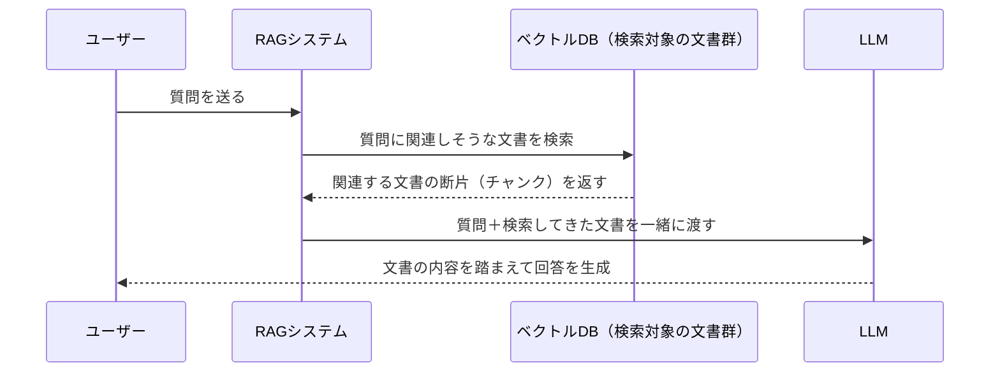
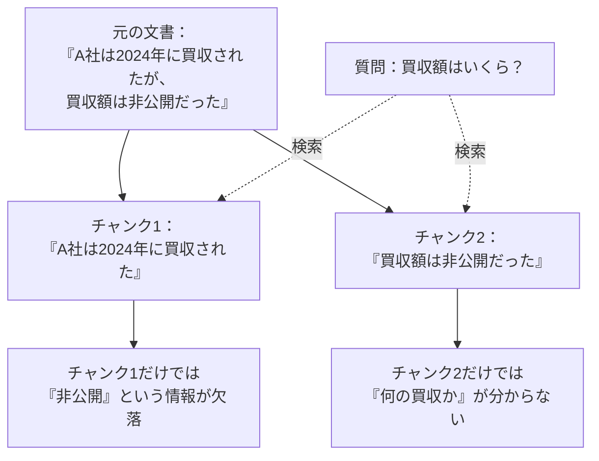
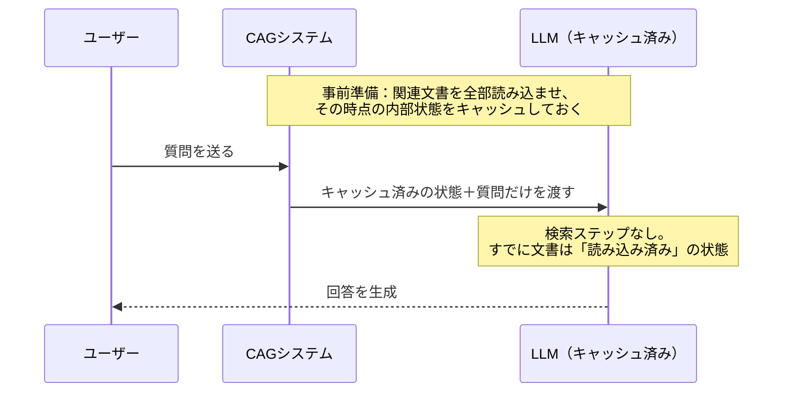
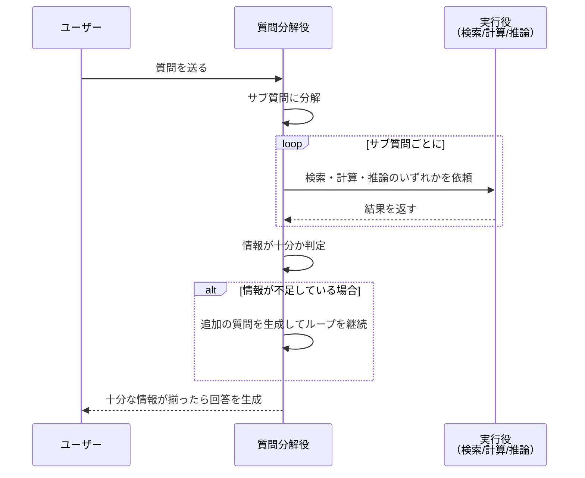
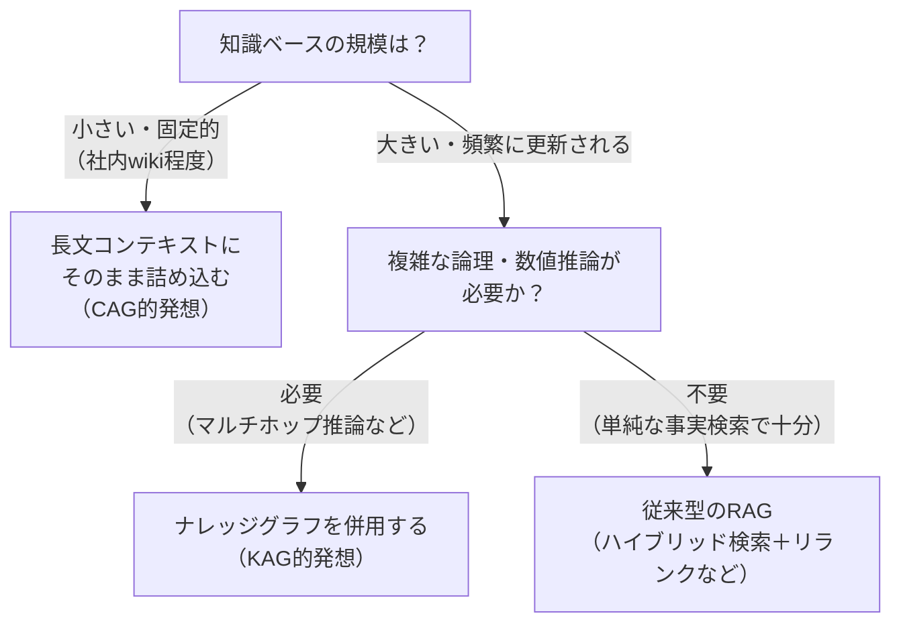

# RAGはもう古い？ 歴史から学ぶRAG→CAG→KAGの進化

## はじめに

先日、RAGについて調べ直していると、「RAGはもう古い」という論調が広がっていることに衝撃を受けました。

「え、RAGってまだ新しい技術じゃなかったっけ」と一瞬戸惑ったのですが、よく調べてみると、RAGが提唱されたのは2020年。もう5年以上前の話です。その間にCAG、KAGといった後継の技術が次々と登場し、さらに2026年には長文コンテキストの一般化という別の変化まで重なって、状況はかなり複雑になっていました。

これは一度、歴史の流れに沿ってちゃんと整理しておいた方がよさそうだ。そう思ってまとめたのがこの記事です。

「RAGって聞いたことはあるけど、ちゃんと説明はできない」という人はもちろん、「最近のRAG周りの状況についていけていない」という人にも、道しるべになる記事を目指します。読み終わる頃には、以下のことが説明できるようになっているはずです。

- RAGがなぜ必要とされたのか
- RAGにどんな限界があったのか
- CAGとKAGが、それぞれどんな発想でRAGの限界を乗り越えようとしたのか
- 2026年現在、RAGは「もう古い」のか「まだ現役」なのか

それでは、AIの限界の話から始めましょう。

## 1. そもそもAIには「知らないこと」がある

AI（大規模言語モデル、LLM）は、大量の過去のデータを学習することで賢くなります。私たちが質問を入力すると、LLMは学習した過去のデータの中にあるパターン（法則）に基づいて、それらしい回答を生成します。

ここで重要なのが、「学習した時点までの情報しか知らない」という当たり前の事実です。LLMは、学習を終えたあとに世の中で起きた出来事や、新しく生まれた知識については答えられません。ただし正確には「答えられない」のではなく、「知らないのにそれらしく答えてしまう」ケースがあるのが厄介なところです。これがいわゆるハルシネーション（幻覚）と呼ばれる現象で、AIが自信満々に間違った情報を出力してしまう問題です。

この状況は、よく「クローズドブック試験」に例えられます。参考書も辞書も持ち込めない試験で、記憶だけを頼りに答案を書いているようなものです。記憶にあることは正確に書けても、記憶にないことは分からない、あるいは分かったふりをして適当に書いてしまいます。

この限界を解決するために生まれたのが、RAGでした。

## 2. RAGの誕生と仕組み

### 2.1 「検索して、それを踏まえて答える」というシンプルな発想

RAG（Retrieval-Augmented Generation、検索拡張生成）は、2020年にFacebook AI Research（現Meta AI）が発表した論文「Retrieval-Augmented Generation for Knowledge-Intensive NLP Tasks」で初めて定式化されました。

発想はとてもシンプルです。LLMに「クローズドブック試験」を強いるのではなく、「オープンブック試験」に切り替えてしまおう、というものです。質問が来たら、まず外部のデータベースから関連する情報を検索してきて、それを参考資料としてLLMに渡した上で回答を生成させる。これがRAGの基本的な仕組みです。

図で見ると、次のような流れになります。

これにより、LLMが学習していない最新情報や、社内文書のような非公開情報についても、正確な回答ができるようになります。

### 2.2 提唱者たちの、ちょっと意外なエピソード

RAGという言葉が生まれた経緯には、面白いエピソードがいくつかあります。

一つは、原論文の著者の一人であるDouwe Kiela氏の発言です。氏は後年のインタビューで、今世間で「RAG」と呼ばれている実装（ベクトルDB＋LLMの組み合わせ）は、当時の論文の中では「比較のために用意した、工夫のないシンプルな手法（ベースライン）」に過ぎず、それだけを差し出しても論文としては通らなかっただろう、と振り返っています。つまり、今広く使われている簡易な実装と、論文が本来アピールしていた作り込まれた手法との間には、実はギャップがあるのです。

もう一つは、論文のリードオーサーであるPatrick Lewis氏のエピソードです。氏は後年、「RAG」というこの頭字語のセンスのなさを後悔していると語っています。ここまで広く浸透するとわかっていれば、もっと良い名前を選んだはずだった、と。

こうした裏話を知ると、「RAG」という言葉が、実は結構行き当たりばったりに広まっていったんだな、ということが分かって面白いですね。

## 3. なぜここまで普及したのか

RAGが登場してから、これほど広く使われるようになった理由は、コストと効果のバランスの良さに尽きます。

LLMに新しい知識を教え込む方法としては、RAG以前から「ファインチューニング（追加学習）」という手段がありました。しかし、ファインチューニングはモデルを再学習させるための計算コストがかかる上に、知識が更新されるたびに再学習をやり直さなければなりません。日々更新される社内文書や、頻繁に変わる最新情報を扱うには、あまりにも不向きな方法でした。

RAGは、この課題を解決しました。モデル自体は一切変更せず、外部の検索対象データベースを更新するだけで、AIが扱える知識を最新の状態に保てます。しかも、検索してきた文書をそのまま参照元として提示できるので、「AIがなぜその回答に至ったのか」を利用者が確認できるという副次的なメリットもあります。

さらに見逃せないのが、機密情報の扱いやすさです。ファインチューニングでは、社内の機密文書をモデルの学習データとして外部のクラウド環境に投入するケースも多く、情報漏えいのリスクが懸念されます。RAGであれば、機密文書は自社で管理する検索対象データベースに置いたまま、検索結果として必要な部分だけをその都度LLMに渡す構成にできます。文書そのものをモデルの学習過程に晒す必要がないため、機密情報を扱う企業にとって採用しやすい方式だったのです。

| | ファインチューニング | RAG | 何もしない（LLM単体） |
|---|---|---|---|
| 知識更新のコスト | 高い（再学習が必要） | 低い（DBを更新するだけ） | ─ |
| 情報の鮮度 | 学習時点で固定 | 検索のたびに最新化できる | 学習時点で固定 |
| 根拠の提示 | できない | 検索元の文書を提示できる | できない |
| 非公開情報への対応 | 事前に学習させる必要あり | 検索対象に追加するだけ | 対応不可 |
| 機密情報の扱いやすさ | 学習データとして外部に渡すリスクあり | 自社DBに置いたまま利用可能 | ─ |

この表を見れば、企業がこぞってRAGを採用した理由は明らかです。「安く」「速く」「根拠を示しながら」自社の知識をAIに使わせられる。この経済合理性が、RAGを一気に普及させた最大の要因でした。

2026年時点でも、RAG関連の市場規模は数十億ドル規模に達しているというレポートもあり、決して一時のブームではなく、AI活用の基盤技術として定着していることがうかがえます。

## 4. RAGにも限界があった

とはいえ、RAGは万能ではありませんでした。実際に使い込まれていく中で、いくつかの構造的な壁にぶつかっていきます。

### 4.1 文書をぶつ切りにする「チャンキング」の弊害

RAGは検索のために、長い文書を「チャンク」と呼ばれる小さな断片に分割してデータベースに保存します。ところが、この分割の仕方によっては、回答に必要な情報が2つのチャンクにまたがって分散してしまうことがあります。すると、どちらのチャンク単体を検索してきても、正しい答えにたどり着けません。

### 4.2 大事な情報が埋もれる「Lost in the Middle」

検索してきた情報量が多くなると、LLMは長いコンテキストの「真ん中あたり」にある情報を軽視しがちになる、という現象が知られています。せっかく正しい情報を検索できていても、それが文書の中間に埋もれていると、LLMがうまく拾えないのです。

### 4.3 複数の情報をつなげて考える「マルチホップ推論」が苦手

「Aの取引先であるBが、Cという規制の対象になったのはいつか」のように、複数の情報を順につなげないと答えられない質問（マルチホップ推論）に、RAGは弱いことが知られています。

ある調査では、RAGシステムの92%がマルチホップクエリに失敗するという結果まで報告されています。RAGは「意味的に似ている文書」を探すのは得意でも、「論理的につながっている文書」を探すのは苦手、という本質的なミスマッチを抱えているのです。

### 4.4 検索そのものにかかる時間（レイテンシ）

質問を書き換えて検索し、結果をランキングし直し、さらに追加の検索をかけて……というステップを重ねるたびに、応答時間は積み上がっていきます。ひとつひとつのステップは正当な理由があっても、積み重なると無視できない遅さになってしまいます。

これらの限界、特に「レイテンシ」「文書選択の不正確さ」「システムの複雑さ」という3つの課題に対して、真正面から挑んだのがCAGでした。

## 5. CAGの登場：「検索そのものをやめる」

### 5.1 「Don't Do RAG」という挑発的なタイトルの論文

2024年12月、台湾の国立政治大学とAcademia Sinicaの研究者らが、あるタイトルの論文を発表しました。「Don't Do RAG（RAGをするな）」。かなり挑発的なタイトルですが、内容は真剣そのものです。

この論文が提案したのが、CAG（Cache-Augmented Generation、キャッシュ拡張生成）です。RAGの弱点だった「検索」というステップそのものをなくしてしまおうという発想です。

### 5.2 「検索」ではなく「下ごしらえ」という発想

CAGの仕組みは、料理の下ごしらえに似ています。RAGが「注文が入るたびに市場まで買い出しに行く」スタイルだとすれば、CAGは「あらかじめ必要な食材を全部仕入れて、下処理まで済ませておく」スタイルです。

具体的には、関連しそうな文書をあらかじめ全部LLMに読み込ませておき、その時点でのLLM内部の計算状態（KVキャッシュと呼ばれるもの）を保存しておきます。質問が来たときは、この保存済みの状態を呼び出すだけで済むので、検索のステップを挟む必要がありません。

RAGのシーケンス図と見比べてみてください。「VectorDBへの検索」というステップが消えているのが分かるはずです。

### 5.3 メリットとデメリット

検索ステップがなくなることで、CAGは大きな効果を発揮します。ベンチマークでは、条件によってはRAGと比べて最大40倍高速な生成時間を達成したという報告もあります。

また、検索精度に律速されないため、特に複数の情報をつなげて考える必要がある質問（マルチホップ推論）において、RAGよりも高い精度を示すケースが確認されています。

一方で、CAGにも弱点があります。「下ごしらえ」という発想上、扱う知識の全量をLLMに読み込ませる必要があるため、知識ベースが巨大すぎるとそもそも読み込みきれません。また、コーパス（対象文書群）が頻繁に更新される場合は、そのたびに読み込み直し（再キャッシュ）が必要になるため、日々更新されるようなデータには不向きです。

さらに見逃せないのが、「事前に何を読み込ませておくか」を先回りして決めておく必要がある、という点です。想定していなかった範囲の質問が来ると、そもそもその情報が下ごしらえの対象に含まれていないため、正しく答えられません。RAGであればその場で検索対象を広げられますが、CAGは「あらかじめ仕込んでおいた範囲」の外には対応できないのです。これは、都度の検索が要らなくなる代わりに、事前の準備作業とその範囲の見極めという別のコストが発生している、とも言えます。

つまりCAGは、「知識の量がある程度限定的で、かつ更新頻度がそこまで高くない」というシチュエーションで真価を発揮する技術だと言えます。

## 6. KAGの登場：「知識に論理を足す」

### 6.1 CAGとは正反対のアプローチ

CAGが「検索をなくす」方向に進んだのに対し、まったく逆の方向からRAGの限界に挑んだのがKAG（Knowledge Augmented Generation、知識拡張生成）です。

KAGを開発したのは、Alipay（アリペイ）を展開するAnt Groupのナレッジグラフチームと浙江大学の研究者たちです。2024年9月に発表されたこの技術は、「検索の精度を上げる」のではなく、「検索した情報をどう論理的に扱うか」という、RAGが苦手としていた部分に正面から取り組みました。

思い出してほしいのが、4章で紹介した「マルチホップ推論が苦手」という弱点です。RAGは「意味的に似ている文書」を探すのは得意でも、複数の事実をつなげて論理的に考えることは苦手でした。KAGは、この弱点をピンポイントで狙い撃ちにした技術です。

### 6.2 ナレッジグラフという「知識の地図」

KAGの中核にあるのが、ナレッジグラフ（知識グラフ）という考え方です。これは、「AはBの子会社である」「BはCという規制の対象である」といった知識同士の関係を、地図のようにつなげて表現したものです。

単純な文章の集まりとしてではなく、こうした「関係」として知識を保持しておくことで、KAGは「Aの子会社であるBが、いつCという規制の対象になったか」のような、複数のステップを踏む必要がある質問にも、論理的に筋道を立てて答えられるようになります。

### 6.3 質問を「分解」して、適材適所で処理する

KAGのもう一つの特徴は、ユーザーの質問をひとつのかたまりとして扱うのではなく、小さなサブ質問に分解し、それぞれに最適な処理方法を割り当てる点です。

- 事実を調べる必要があるサブ質問 → 検索エンジンに担当させる
- 数値を計算する必要があるサブ質問 → 計算エンジンに担当させる
- 因果関係を推論する必要があるサブ質問 → 推論エンジンに担当させる

そして、すべてのサブ質問の答えが出揃ったところで、最終的な回答をまとめて生成します。もし途中で情報が足りないと判断されれば、追加の質問を自動的に生成して、再度このループを回します。

RAGが「1回検索して終わり」なのに対し、KAGは「わからないところがあれば、わかるまで検索・計算・推論を繰り返す」という、粘り強い解決プロセスを踏んでいるのが分かります。

### 6.4 ベンチマークでの成果と、正直な限界

こうした仕組みの効果は数字にも表れています。マルチホップ推論を問うベンチマークでは、KAGは既存手法と比べてHotpotQAで19.6%、2Wikiで33.5%のF1スコア改善を報告しています。

特に2Wikiは、家系図や時系列のような、まさに論理的なつながりを問う設問が多いため、改善幅が大きく出たのだと考えられます。

一方で、KAGはまだ発展途上の技術でもあります。質問をサブ質問に分解する部分や、その実行プロセスが、あらゆる複雑な問題に対して理論的に完全な裏付けを持っているかについては、技術コミュニティの中でもまだ議論の余地があるとされています。絶対的な解決策ではなく、発展途上の一つの選択肢として捉えるのが健全でしょう。

### 6.5 RAG・CAG・KAG、発想の違いを一言で

ここまでの流れを整理すると、次のようにまとめられます。

| 技術 | 一言でいうと | RAGの何を変えたか |
|---|---|---|
| RAG | 検索して、それを踏まえて答える | （原点） |
| CAG | 検索そのものをやめる | 検索ステップを事前の下ごしらえに置き換えた |
| KAG | 検索に論理を足す | 検索結果の扱い方に、論理的な推論を組み込んだ |

同じ「RAGの限界を乗り越えたい」という動機から生まれていながら、CAGとKAGはまったく逆の方向にアプローチしている、というのがこの2つを並べて見たときの一番面白いポイントです。

## 7. 今（2026年）はどうなっているのか

さて、ここからが冒頭で触れた「衝撃を受けた」現在の状況です。CAGとKAGの登場だけでも十分に大きな進化でしたが、2026年に入ってさらに状況を複雑にする変化が重なっています。

### 7.1 長文コンテキストの一般化で、CAG的発想がより現実的に

2026年、Claudeをはじめとするフロンティアモデルが100万トークン級のコンテキストウィンドウを一般提供するようになり、しかもその利用コストが劇的に下がりました。数十万トークン規模のリクエストでも、以前の数千トークン規模と変わらない単価で扱えるようになったのです。

これはCAGの発想と非常に相性が良い変化です。「知識ベースが小さく限定的であれば、そもそも検索を挟まず、コンテキストに全部詰め込んでしまえばいい」という選択肢が、以前よりずっと現実的になりました。中小規模の知識ベース（社内wikiや製品マニュアル程度の量）であれば、チャンキングもベクトルDBも用意せず、まるごとコンテキストに投入して質問するだけで済んでしまうケースが増えています。

### 7.2 「RAGはもう死んだ」論と、「RAGはインフラになった」論のせめぎ合い

長文コンテキストが安価になったことで、「RAGはもう不要なのでは」という論調が一部で強まっています。実際、2026年第1四半期には、エージェントのワークロードが増える中で、従来型の検索基盤の限界が露呈し、ハイブリッド検索への移行意欲が短期間で3倍以上に急増したというデータもあります。

一方で、これに真っ向から反論する立場もあります。RAGは「検索拡張生成」という個別の手法から、企業のAI活用を支える「コンテキストエンジン」というインフラそのものへと役割を変えつつある、という見方です。多くの企業がRAGを土台にした「AI基盤」を構築する動きを強めており、エージェントを含むあらゆるAI活用の下支えとしての役割は、むしろ強まっているとも言えます。

### 7.3 エージェント時代の新しい課題

さらに、2026年特有の新しい課題も浮上しています。人間が使うことを前提に設計されてきた従来の検索基盤に対して、AIエージェントは人間よりもはるかに大量かつ高頻度にデータへアクセスします。この「人間向け設計」と「エージェント向けの負荷」のミスマッチが、新たなボトルネックとして注目され始めています。

ベクトル検索・ナレッジグラフ・ツール呼び出し型検索を組み合わせた「RAG 2.0」と呼ばれるアプローチが、単なる検索精度の向上ではなく、エージェントの判断そのものを支える「知能層」として位置づけられるようになってきているのも、この流れの一つです。

## 8. 実務応用：結局どれを使えばいいのか

歴史を一通り追ったところで、最後に実務での判断基準を整理しておきましょう。

- 知識ベースが小さく、更新頻度も低いなら → 検索を挟まず、コンテキストにまるごと詰め込んでしまう発想（CAG）が、シンプルかつ高速です。
- 複雑な論理・数値推論が必要なら → ナレッジグラフを併用し、質問を分解して適材適所で処理する発想（KAG）が力を発揮します。
- 知識ベースが大きく、単純な事実検索が中心なら → ハイブリッド検索やリランクを組み合わせた、進化系の従来型RAGが依然として現実的な選択肢です。

## まとめ

RAGは、AIが「知らないこと」に答えられない、という根本的な限界を解決するために生まれました。しかし普及が進むにつれ、チャンキングによる文脈の分断、マルチホップ推論への弱さ、検索のレイテンシといった、構造的な限界も見えてきました。

CAGは「検索そのものをやめる」ことで、KAGは「検索に論理を足す」ことで、それぞれこの限界に挑みました。同じ課題から出発しながら、まったく逆の方向に進化した2つの技術が今、並び立っています。

そして皮肉なことに、長文コンテキストの一般化という別の変化が、CAG的な発想をさらに後押ししています。「RAGはもう古い」という論調が生まれる一方で、「検索して知識を与える」という考え方そのものは、むしろエンタープライズAIのインフラとして欠かせないものになりつつあります。

絶対的な解決策はありません。知識ベースの規模、更新頻度、求められる推論の複雑さに応じて、RAG・CAG・KAGを使い分ける時代に入った、というのが、この記事を通じて見えてきた結論です。

## 参考文献

- Lewis, P. et al. (2020). [Retrieval-Augmented Generation for Knowledge-Intensive NLP Tasks](https://arxiv.org/abs/2005.11401). *NeurIPS 2020*.（RAGの原論文）
- Chan, B. J. et al. (2024). [Don't Do RAG: When Cache-Augmented Generation is All You Need for Knowledge Tasks](https://arxiv.org/abs/2412.15605). *arXiv:2412.15605*.（CAGの原論文）
- Liang, L. et al. (2024). [KAG: Boosting LLMs in Professional Domains via Knowledge Augmented Generation](https://arxiv.org/abs/2409.13731). *arXiv:2409.13731*.（KAGの原論文）
- [OpenSPG/KAG](https://github.com/OpenSPG/KAG) — KAGの公式GitHubリポジトリ
- [hhhuang/CAG](https://github.com/hhhuang/CAG) — CAGの実装リポジトリ（論文著者による公開コード）
