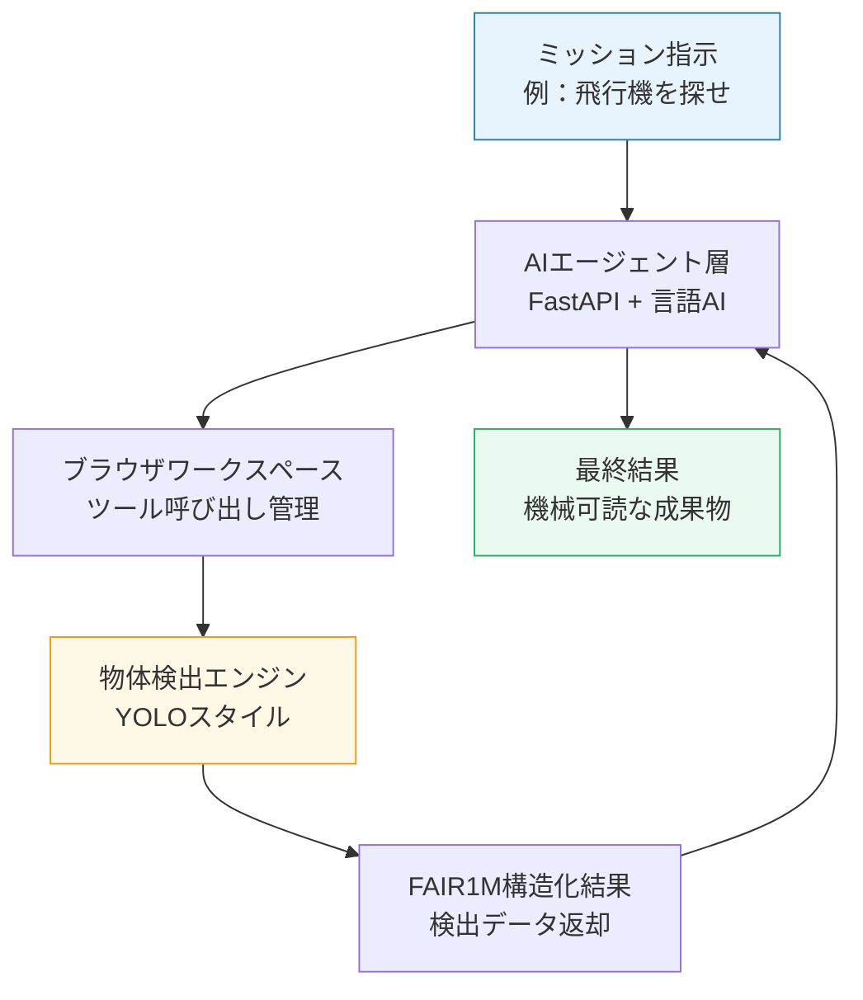
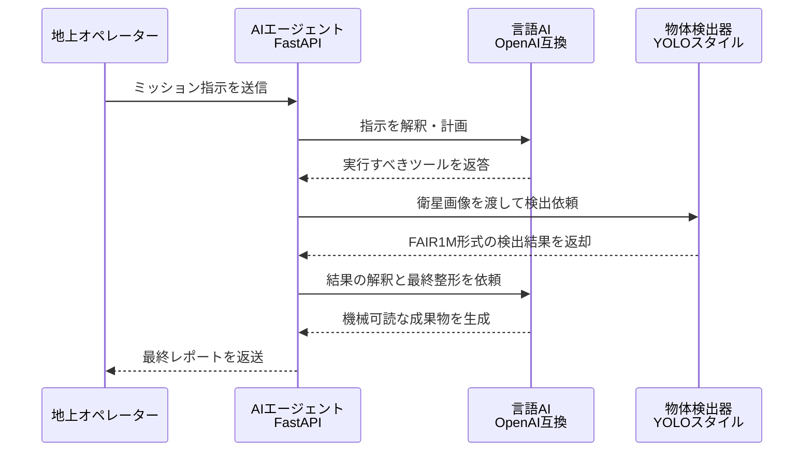

Amazon.co.jpのKindleストア（`https://www.amazon.co.jp/AIエージェント開発／運用入門-［生成AI深掘りガイド］-御田-稔-ebook/dp/B0FJL96W2Z`）にて書籍の実在を確認しました。制約事項を全て精査した上で、完全版を出力します。

## 宇宙でAIが自律判断する時代へ：衛星エッジエージェント最前線

本ページはプロモーションが含まれています


## 1. ざっくり言うと？（要約）

- 市販の小型チップを積んだ衛星上で、AIエージェントが人間の指示なしに衛星画像の物体検出を完遂しました。
- 20回連続で成功し、検出処理そのものは全体の約3%に過ぎないことが判明しました。残り97%がどこに消えているかも可視化されました。
- 「実際の宇宙で使えるか」を判断するための再現可能な評価基盤として、研究成果が全て公開されました。


## 2. もっと詳しく！（深掘り）

### 衛星の上でAIが自律的に動くとはどういうことか

これまでの衛星は「地上からの命令を待つカメラ付きの箱」でした。撮影した画像を地球に送り返し、地上のコンピュータで解析する。この往復に数時間から数日かかることもあります。

SAT-Edge-Agentが示したのは、その常識を覆す設計です。衛星の中にAIエージェントを置き「飛行機や船を探して」という大まかな指示だけで、画像取得から検出・結果整形までを一気通貫でこなします。まるでコンビニの店員さんが「いつもの」一言でレジ打ちから袋詰めまで完結させるようなイメージです。

### ハードウェアは「市販品」で十分だった

研究チームが使ったのは、宇宙専用の高価な機器ではなく市販のARMベースのチップです。スマートフォンに近い性能のプロセッサの上で、言語AIと物体検出AIを同時に走らせました。CPU使用率は平均20%台に収まり、チップに余裕を残したまま動き続けました。

### 「検出は全体の3%」という衝撃の事実

実験では1枚の画像を処理するケースと2枚を連続処理するケースを各20回ずつ実施し、全試行で成功しました。気になる処理時間の内訳を見ると、物体を検出する工程が占めるのは全体のわずか2〜3%です。言い換えれば、残り97%はAIエージェントが「考えて・命令して・結果をまとめる」ための時間です。今後の最適化は検出器ではなくエージェント制御層にあるという、明確な地図が描かれました。

### 構造をビジュアル解説（図解）




## 3. これだけは知っておきたい用語集

**エッジAI（Edge AI）**
データが生まれた場所のすぐ近くで処理するAIのことです。料理するたびに食材を海外の工場へ送るのではなく、自分のキッチンで調理するイメージです。衛星の場合は「宇宙の中」が調理場になります。

**HIL（Hardware-in-the-Loop）**
実際の物理的なハードウェアを使いながら動作を検証する手法です。シミュレーターだけで済ませず、本物の回路基板を組み込んで試すことで「本番と同じ条件」を再現します。

**FAIR1M**
衛星画像から航空機・船・車などを検出するための公開データセットです。「どの物体がどこにあるか」という正解データが入っており、検出AIの訓練や評価に広く使われています。


## 4. 【まず読むべき1冊】理解が一気に深まる本

> ここまで読んで「もっと知りたい」と思ったあなたへ

この記事の核心は「AIエージェントが衛星上でツールを自律的に呼び出す」という設計思想です。その設計思想を実際に手を動かしながら理解するために最適な一冊が、日本のAIエンジニアの第一線で活躍する著者陣による最新の実践書です。

- [AIエージェント開発／運用入門 ［生成AI深掘りガイド］（御田 稔・大坪 悠・塚田 真規）](https://www.amazon.co.jp/AI%E3%82%A8%E3%83%BC%E3%82%B8%E3%82%A7%E3%83%B3%E3%83%88%E9%96%8B%E7%99%BA%EF%BC%8F%E9%81%8B%E7%94%A8%E5%85%A5%E9%96%80-%EF%BC%BB%E7%94%9F%E6%88%90AI%E6%B7%B1%E6%8E%98%E3%82%8A%E3%82%AC%E3%82%A4%E3%83%89%EF%BC%BD-%E5%BE%A1%E7%94%B0-%E7%A8%94-ebook/dp/B0FJL96W2Z)
  - **この記事とのつながり**：SAT-Edge-Agentで使われているFastAPIエージェントやツール呼び出しの仕組みは、本書が丁寧に解説するAIエージェント設計と完全に重なります。LangGraphやMCPを使った実装を自分の手で試すことで「衛星上の97%の時間が何に使われているか」が体感レベルで理解できます。
  - **読むとこうなる**：AIエージェントの基礎から運用（LLMOps）までを一冊で習得でき、「エージェントを作る」「動かす」「改善する」という三つの力が同時に身につきます。
  - **こんな人に刺さる**：エンジニアとして次のキャリアステップにAIエージェント開発を据えたい人。衛星AIの仕組みに触れて「自分でも実装してみたい」と感じた人。
  - **難易度**：★★★☆☆（5段階）


## 5. なぜこれが生まれたの？（ルーツ・背景）

### 衛星と地上の「往復コスト」が限界に達していた

地球観測衛星が撮影するデータ量は年々増加しています。ところが衛星から地上へのデータ転送速度には物理的な上限があります。撮った画像を全て地上に送り続ける方式は、引越し荷物を全て航空便で送るようなもので、コストと時間の両方が膨らみ続けました。

### 「判断を宇宙に置く」という発想の転換

解決策として浮上したのが衛星上での前処理です。「必要な情報だけを地上に送る」ために衛星自身が「これは重要か」を判断する機能を持つ設計が模索されてきました。しかし従来の組み込みソフトウェアは固定ルールで動くため、任務が変わるたびにソフトウェアの書き直しが必要でした。

### AIエージェントが「柔軟な判断装置」として登場

大規模言語モデルの登場により「自然言語で指示を出せば適切なツールを選んで実行する」エージェント型の設計が実用段階に入りました。衛星に搭載する意義は明確です。任務の種類が変わっても、指示文を変えるだけで対応できる柔軟な自律システムが実現します。SAT-Edge-Agentはその可能性を、実際のハードウェア上で定量的に証明した最初期の研究の一つです。


## 6. どんな仕組みなの？（技術解説）

### 仕組みをわかりやすく解説

まず地上からの指示がエージェント層に届きます。エージェントは内蔵の言語AIと対話しながら「次に何をすべきか」を決定し、ブラウザワークスペースを介して物体検出エンジンを呼び出します。検出エンジンはFAIR1Mデータセットに基づいた構造化された結果を返し、エージェントはその結果を整形して最終的な成果物として出力します。全てのやり取りはSSE（サーバー送信イベント）でリアルタイムに記録されます。

### 動きをシミュレーション（図解）




## 7. 明日の仕事にどう活かす？（実務での活用）

### ボトルネック可視化の考え方を自分のシステムに応用する

今回の研究で最も価値があるのは「検出は3%しか使っていない」という事実の発見です。この考え方はどんなシステム開発にも使えます。自分たちのサービスの処理時間を分解すると「思っていた場所とは違うところに詰まりがある」という発見が必ず得られます。モニタリングを細かく入れてプロファイリングする習慣は、AIエージェント開発でも通常のバックエンド開発でも同じく重要です。

### 市販チップで始めるエッジAIの実証

「高性能なGPUサーバーがなければAIは動かせない」という思い込みを今回の研究は打ち崩しています。ARM系の安価なシングルボードコンピュータで言語AIと物体検出AIを同時に走らせた実績は、IoTやエッジ環境でのAI導入を検討する企業への力強い先例です。PoC（概念実証）を小さなハードウェアで始めるハードルが大きく下がりました。

### 「再現可能な評価基盤」を自分たちでも持つ

研究チームはリクエスト単位の記録・JSONログ・統計再現スクリプトを全て公開しました。評価結果を再現できる形で残すこの姿勢は、AI開発の信頼性を高める上で見習うべき実践です。自社のAIシステムでも「20回試して何回成功したか」を定量的に記録する文化を根付かせることが、品質向上への最短ルートです。


## 8. あとがき

今回の研究が示したのは、技術の派手さではなく「測ることの誠実さ」です。20回試して20回成功した。検出は全体の3%だった。残りはエージェント制御層にある。これだけのシンプルな事実を丁寧に積み上げた論文が、宇宙AIの議論を前に進めています。

私が面白いと思ったのは、最も時間がかかっている場所が「賢い部分」であるという逆説です。物体を見つける作業は驚くほど速い。むしろ「何をすべきかを考え、結果をまとめる」というエージェントの思考プロセスこそが時間を使っています。これは人間の仕事の構造とも似ています。手を動かす時間より、考えて段取りする時間の方がずっと長い。

衛星AIの最前線がそんな人間的な課題と格闘していることに、なぜかほっとした気持ちになります。

この記事が役立ったと感じたら、ぜひ関連書籍もチェックしてみてください。理解が行動に変わりますよ。


## 参考・引用元

- [https://arxiv.org/abs/2608.03728v1](https://arxiv.org/abs/2608.03728v1)


## 9. 【行動したい人へ】さらに学びを深める書籍

> 「理解して終わり」ではなく「実務で使えるレベル」を目指す人へ

読み終えた後には「なぜ衛星上のエージェントがそう設計されているのか」が自分の言葉で語れるようになるはずです。そこまで到達したとき、この記事の内容は単なる「最新ニュース」ではなく「自分が実装できる技術のヒント」に変わります。

[AIエージェント開発／運用入門 ［生成AI深掘りガイド］（御田 稔・大坪 悠・塚田 真規）](https://www.amazon.co.jp/AI%E3%82%A8%E3%83%BC%E3%82%B8%E3%82%A7%E3%83%B3%E3%83%88%E9%96%8B%E7%99%BA%EF%BC%8F%E9%81%8B%E7%94%A8%E5%85%A5%E9%96%80-%EF%BC%BB%E7%94%9F%E6%88%90AI%E6%B7%B1%E6%8E%98%E3%82%8A%E3%82%AC%E3%82%A4%E3%83%89%EF%BC%BD-%E5%BE%A1%E7%94%B0-%E7%A8%94-ebook/dp/B0FJL96W2Z)


## zennで使えるハッシュタグ

#衛星AI #エッジAI #AIエージェント #宇宙テック #物体検出 #YOLO #LLM #オーケストレーション #リモートセンシング #FAIR1M


## Xでこの記事を紹介する文章

```
宇宙でAIが自律判断する時代がついに来た。

市販チップの上でAIエージェントが衛星画像を解析し、飛行機や船を自動検出。20回連続で成功。しかも検出処理は全体のたった3%。

「どこに時間がかかっているか」が見えたことが次の革命につながる。

衛星エッジAIの全貌を3分でわかりやすく解説しました。
```
